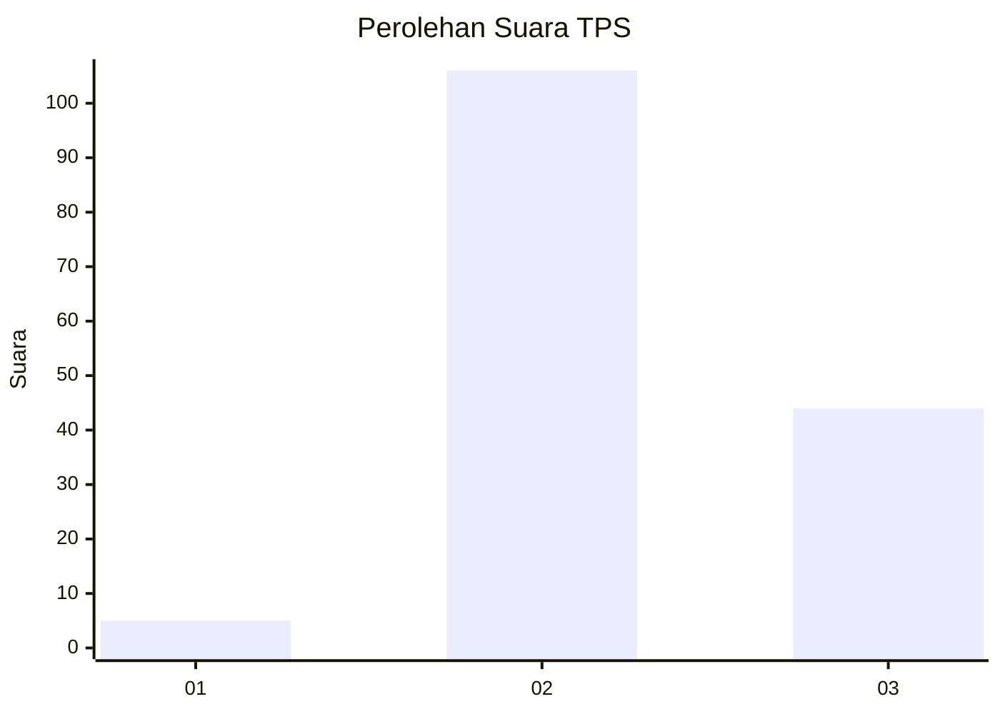
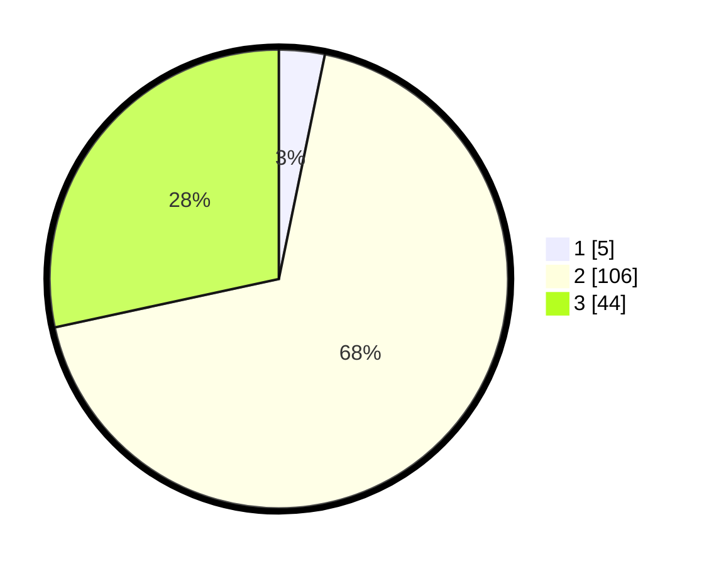

# Hasil

## Grafik

## Tabel

| No. | Nama Paslon    | Suara | Suara (raw) | Persentase |
|:--- |:-------------- | -----:| -----------:| ----------:|
| 1   | ANIES MUHAIMIN | 5     | [5][p-1]    | 3,23       |
| 2   | PRABOWO GIBRAN | 106   | [106][p-2]  | 68,39      |
| 3   | GANJAR MAHFUD  | 44    | [44][p-3]   | 28,39      |

[p-1]: https://github.com/gigit-pemilu/pemilu-2024-35-jawa-timur/blob/main/pilpres/hitung-suara/sub/35-jawa-timur/sub/10-banyuwangi/sub/23-tegalsari/sub/2002-karangdoro/sub/026-tps/sub/paslon-1.txt
[p-2]: https://github.com/gigit-pemilu/pemilu-2024-35-jawa-timur/blob/main/pilpres/hitung-suara/sub/35-jawa-timur/sub/10-banyuwangi/sub/23-tegalsari/sub/2002-karangdoro/sub/026-tps/sub/paslon-2.txt
[p-3]: https://github.com/gigit-pemilu/pemilu-2024-35-jawa-timur/blob/main/pilpres/hitung-suara/sub/35-jawa-timur/sub/10-banyuwangi/sub/23-tegalsari/sub/2002-karangdoro/sub/026-tps/sub/paslon-3.txt

## Foto C Plano

https://sirekap-obj-formc.kpu.go.id/9a89/pemilu/ppwp/35/10/23/20/02/3510232002026-20240217-174734--92180a09-5fb7-4f1e-a7ad-9457b4014811.jpg

https://sirekap-obj-formc.kpu.go.id/9a89/pemilu/ppwp/35/10/23/20/02/3510232002026-20240217-202359--4bc534f3-f765-450f-a294-f50bf35946a7.jpg

https://sirekap-obj-formc.kpu.go.id/9a89/pemilu/ppwp/35/10/23/20/02/3510232002026-20240217-202358--db62ac63-0158-47b8-ad08-42acd1105c70.jpg

## Metadata

| Key        | Value               |
| ---------- | ------------------- |
| Time Stamp | 2024-02-21 17:00:00 |

