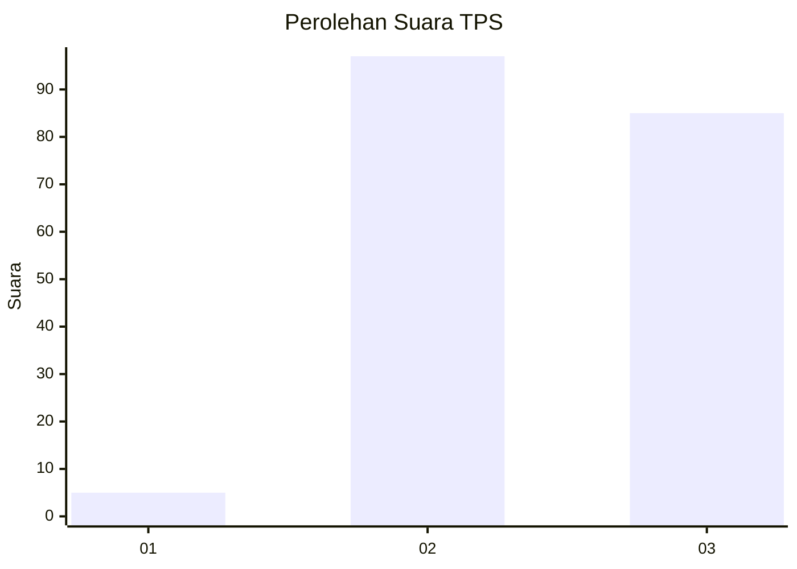
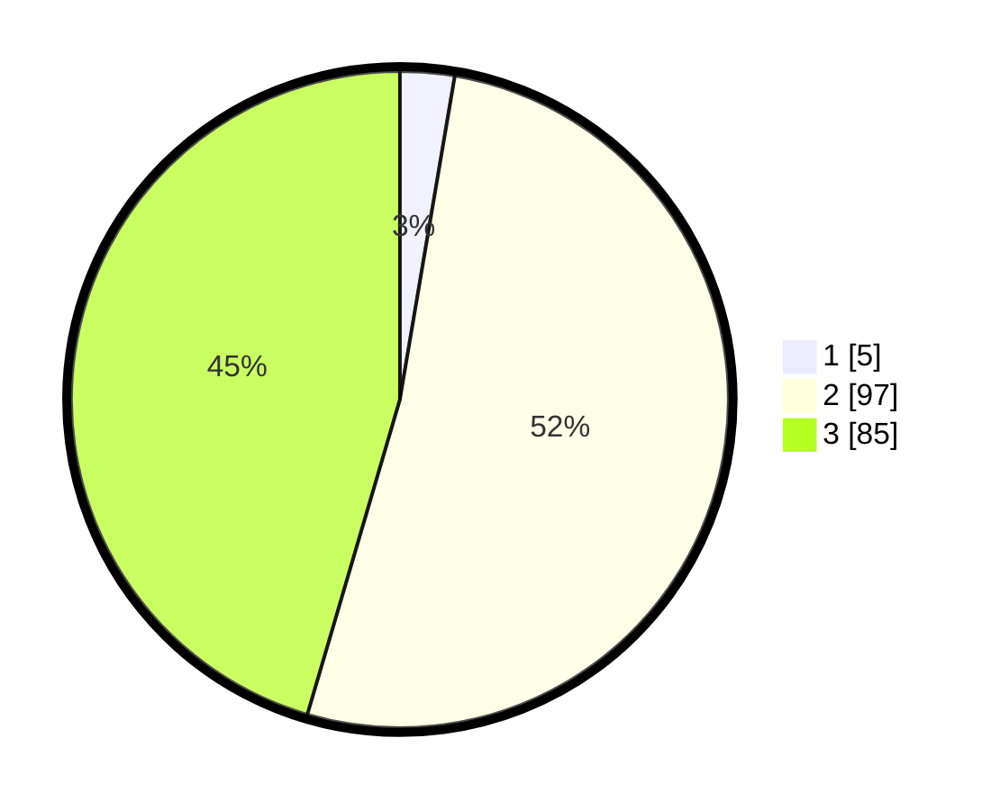

# Hasil

## Grafik

## Tabel

| No. | Nama Paslon    | Suara | Suara (raw) | Persentase |
|:--- |:-------------- | -----:| -----------:| ----------:|
| 1   | ANIES MUHAIMIN | 5     | [5][p-1]    | 2,67       |
| 2   | PRABOWO GIBRAN | 97    | [97][p-2]   | 51,87      |
| 3   | GANJAR MAHFUD  | 85    | [85][p-3]   | 45,45      |

[p-1]: https://github.com/gigit-pemilu/pemilu-2024-35-jawa-timur/blob/main/pilpres/hitung-suara/sub/35-jawa-timur/sub/10-banyuwangi/sub/23-tegalsari/sub/2005-karangmulyo/sub/008-tps/sub/paslon-1.txt
[p-2]: https://github.com/gigit-pemilu/pemilu-2024-35-jawa-timur/blob/main/pilpres/hitung-suara/sub/35-jawa-timur/sub/10-banyuwangi/sub/23-tegalsari/sub/2005-karangmulyo/sub/008-tps/sub/paslon-2.txt
[p-3]: https://github.com/gigit-pemilu/pemilu-2024-35-jawa-timur/blob/main/pilpres/hitung-suara/sub/35-jawa-timur/sub/10-banyuwangi/sub/23-tegalsari/sub/2005-karangmulyo/sub/008-tps/sub/paslon-3.txt

## Foto C Plano

https://sirekap-obj-formc.kpu.go.id/de6a/pemilu/ppwp/35/10/23/20/05/3510232005008-20240216-194711--ee5734c4-06de-41a4-98ba-5436126f6f3a.jpg

https://sirekap-obj-formc.kpu.go.id/de6a/pemilu/ppwp/35/10/23/20/05/3510232005008-20240216-194316--7ee0b281-ea19-42c3-8f26-8ab422c86105.jpg

https://sirekap-obj-formc.kpu.go.id/de6a/pemilu/ppwp/35/10/23/20/05/3510232005008-20240216-194529--8e62c531-3e65-4021-9e1f-ee337f22b49e.jpg

## Metadata

| Key        | Value               |
| ---------- | ------------------- |
| Time Stamp | 2024-02-24 22:31:28 |

