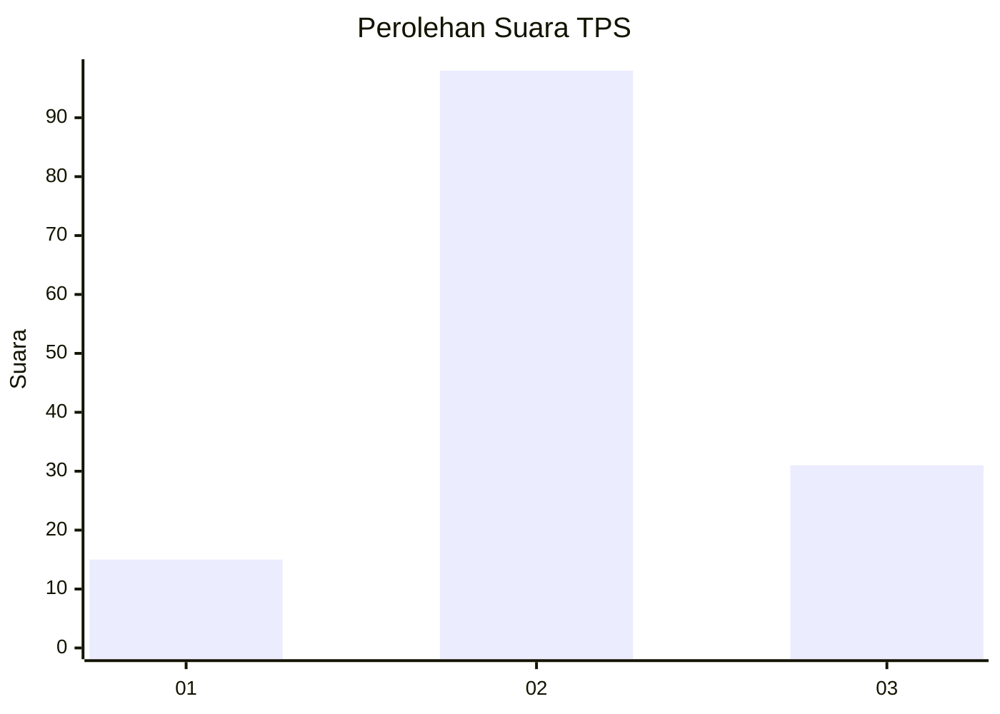
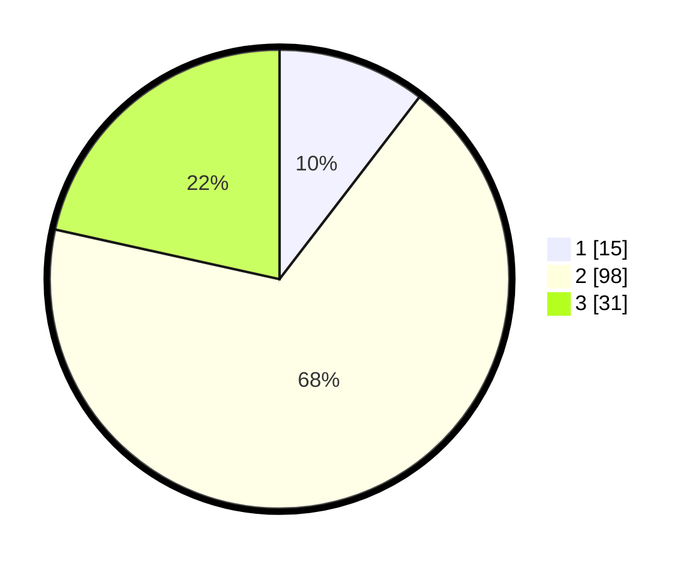

# Hasil

## Grafik

## Tabel

| No. | Nama Paslon    | Suara | Suara (raw) | Persentase |
|:--- |:-------------- | -----:| -----------:| ----------:|
| 1   | ANIES MUHAIMIN | 15    | [15][p-1]   | 10,42      |
| 2   | PRABOWO GIBRAN | 98    | [98][p-2]   | 68,06      |
| 3   | GANJAR MAHFUD  | 31    | [31][p-3]   | 21,53      |

[p-1]: https://github.com/gigit-pemilu/pemilu-2024-35-jawa-timur/blob/main/pilpres/hitung-suara/sub/35-jawa-timur/sub/10-banyuwangi/sub/23-tegalsari/sub/2005-karangmulyo/sub/015-tps/sub/paslon-1.txt
[p-2]: https://github.com/gigit-pemilu/pemilu-2024-35-jawa-timur/blob/main/pilpres/hitung-suara/sub/35-jawa-timur/sub/10-banyuwangi/sub/23-tegalsari/sub/2005-karangmulyo/sub/015-tps/sub/paslon-2.txt
[p-3]: https://github.com/gigit-pemilu/pemilu-2024-35-jawa-timur/blob/main/pilpres/hitung-suara/sub/35-jawa-timur/sub/10-banyuwangi/sub/23-tegalsari/sub/2005-karangmulyo/sub/015-tps/sub/paslon-3.txt

## Foto C Plano

https://sirekap-obj-formc.kpu.go.id/5b7b/pemilu/ppwp/35/10/23/20/05/3510232005015-20240214-155647--5c8a0c1b-59ce-476e-8397-4dd5c27331be.jpg

https://sirekap-obj-formc.kpu.go.id/5b7b/pemilu/ppwp/35/10/23/20/05/3510232005015-20240214-155651--13c7566c-4802-4b5d-a329-552afcbc0b1c.jpg

https://sirekap-obj-formc.kpu.go.id/5b7b/pemilu/ppwp/35/10/23/20/05/3510232005015-20240214-155657--59f05985-7d32-4b3e-9d9b-21abff686a51.jpg

## Metadata

| Key        | Value               |
| ---------- | ------------------- |
| Time Stamp | 2024-02-14 21:46:01 |

