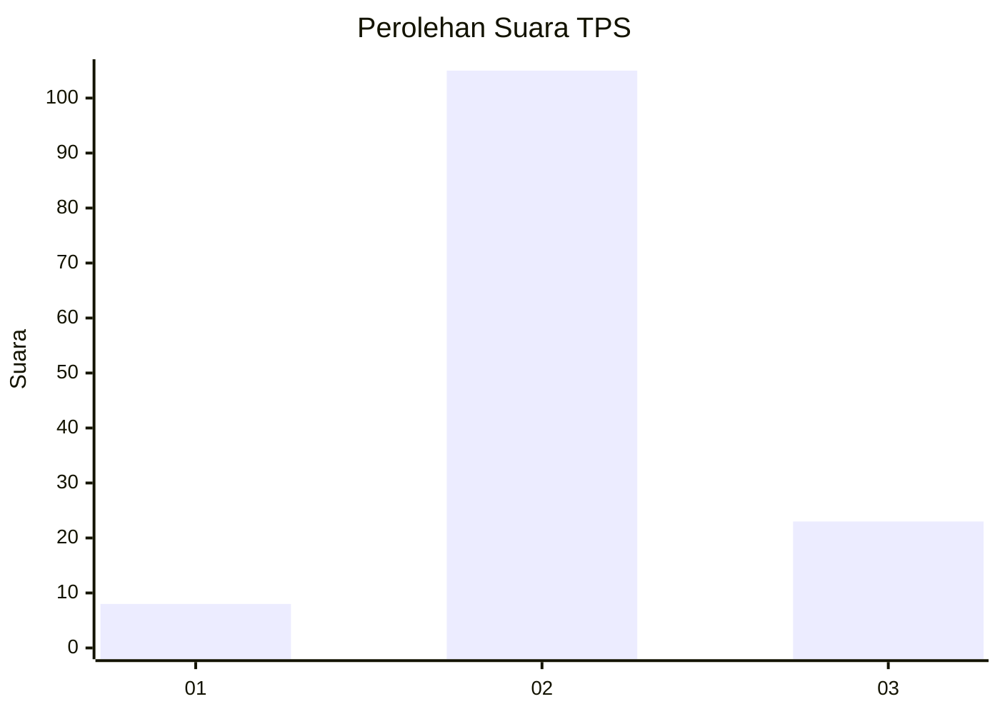

# Hasil

## Grafik

## Tabel

| No. | Nama Paslon    | Suara | Suara (raw) | Persentase |
|:--- |:-------------- | -----:| -----------:| ----------:|
| 1   | ANIES MUHAIMIN | 8     | [8][p-1]    | 5,88       |
| 2   | PRABOWO GIBRAN | 105   | [105][p-2]  | 77,21      |
| 3   | GANJAR MAHFUD  | 23    | [23][p-3]   | 16,91      |

[p-1]: https://github.com/gigit-pemilu/pemilu-2024-35-jawa-timur/blob/main/pilpres/hitung-suara/sub/35-jawa-timur/sub/10-banyuwangi/sub/23-tegalsari/sub/2006-tegalrejo/sub/008-tps/sub/paslon-1.txt
[p-2]: https://github.com/gigit-pemilu/pemilu-2024-35-jawa-timur/blob/main/pilpres/hitung-suara/sub/35-jawa-timur/sub/10-banyuwangi/sub/23-tegalsari/sub/2006-tegalrejo/sub/008-tps/sub/paslon-2.txt
[p-3]: https://github.com/gigit-pemilu/pemilu-2024-35-jawa-timur/blob/main/pilpres/hitung-suara/sub/35-jawa-timur/sub/10-banyuwangi/sub/23-tegalsari/sub/2006-tegalrejo/sub/008-tps/sub/paslon-3.txt

## Foto C Plano

https://sirekap-obj-formc.kpu.go.id/8a3f/pemilu/ppwp/35/10/23/20/06/3510232006008-20240215-003757--d2c0f43b-955d-4235-a16e-4d8161a99f5b.jpg

https://sirekap-obj-formc.kpu.go.id/8a3f/pemilu/ppwp/35/10/23/20/06/3510232006008-20240215-003856--b41987cf-b9ca-4d3d-887b-5b712a741bd1.jpg

https://sirekap-obj-formc.kpu.go.id/8a3f/pemilu/ppwp/35/10/23/20/06/3510232006008-20240215-003930--bd532653-3dcb-41dc-b5c7-69117bc98607.jpg

## Metadata

| Key        | Value               |
| ---------- | ------------------- |
| Time Stamp | 2024-02-25 15:00:00 |

