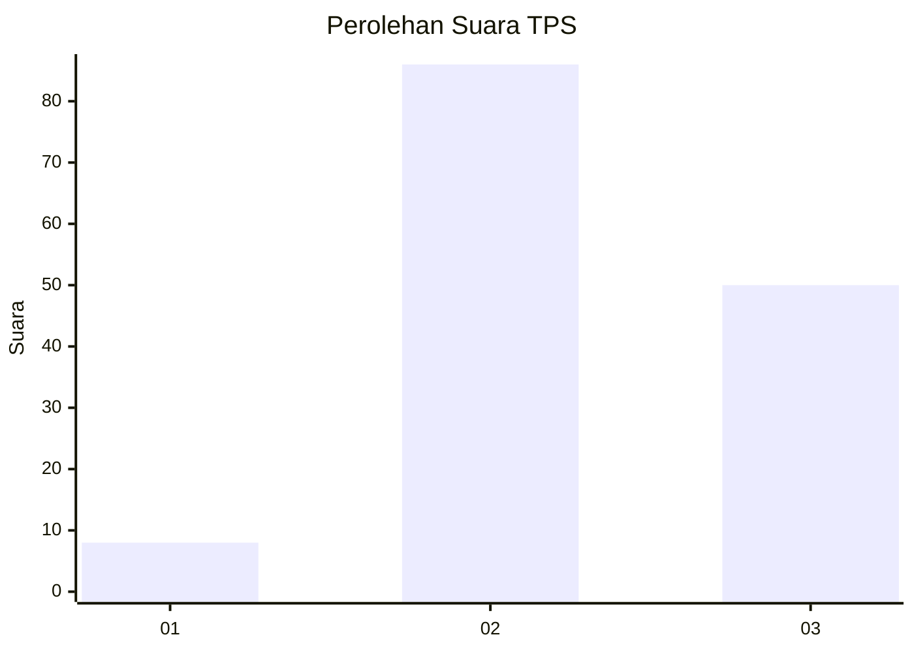
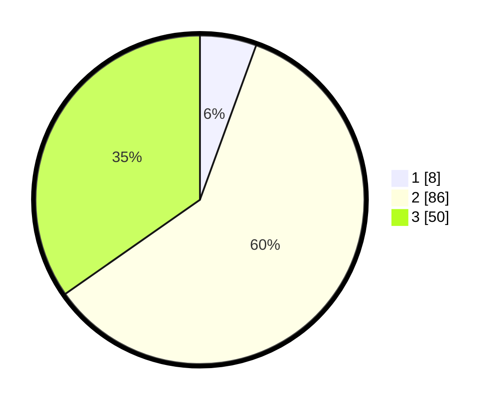

# Hasil

## Grafik

## Tabel

| No. | Nama Paslon    | Suara | Suara (raw) | Persentase |
|:--- |:-------------- | -----:| -----------:| ----------:|
| 1   | ANIES MUHAIMIN | 8     | [8][p-1]    | 5,56       |
| 2   | PRABOWO GIBRAN | 86    | [86][p-2]   | 59,72      |
| 3   | GANJAR MAHFUD  | 50    | [50][p-3]   | 34,72      |

[p-1]: https://github.com/gigit-pemilu/pemilu-2024-35-jawa-timur/blob/main/pilpres/hitung-suara/sub/35-jawa-timur/sub/10-banyuwangi/sub/23-tegalsari/sub/2006-tegalrejo/sub/017-tps/sub/paslon-1.txt
[p-2]: https://github.com/gigit-pemilu/pemilu-2024-35-jawa-timur/blob/main/pilpres/hitung-suara/sub/35-jawa-timur/sub/10-banyuwangi/sub/23-tegalsari/sub/2006-tegalrejo/sub/017-tps/sub/paslon-2.txt
[p-3]: https://github.com/gigit-pemilu/pemilu-2024-35-jawa-timur/blob/main/pilpres/hitung-suara/sub/35-jawa-timur/sub/10-banyuwangi/sub/23-tegalsari/sub/2006-tegalrejo/sub/017-tps/sub/paslon-3.txt

## Foto C Plano

https://sirekap-obj-formc.kpu.go.id/1a79/pemilu/ppwp/35/10/23/20/06/3510232006017-20240214-202508--c7601956-a3b5-40d6-b9a4-a94471191512.jpg

https://sirekap-obj-formc.kpu.go.id/1a79/pemilu/ppwp/35/10/23/20/06/3510232006017-20240214-202622--7909b39d-5650-4be5-a380-3e8077594ef1.jpg

https://sirekap-obj-formc.kpu.go.id/1a79/pemilu/ppwp/35/10/23/20/06/3510232006017-20240214-202709--b4028d77-99bd-46a3-a1d4-cc8bf7d22d12.jpg

## Metadata

| Key        | Value               |
| ---------- | ------------------- |
| Time Stamp | 2024-02-25 11:00:00 |

