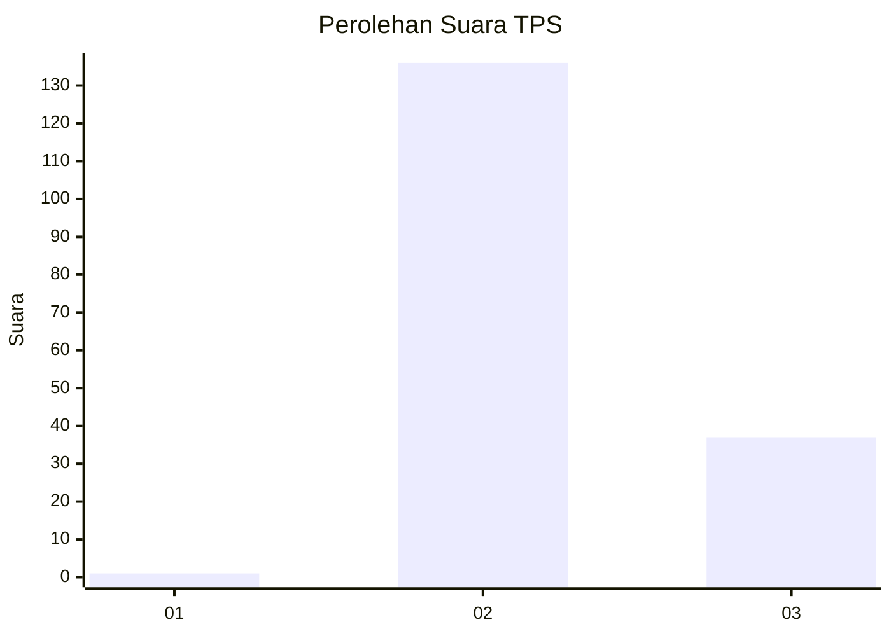
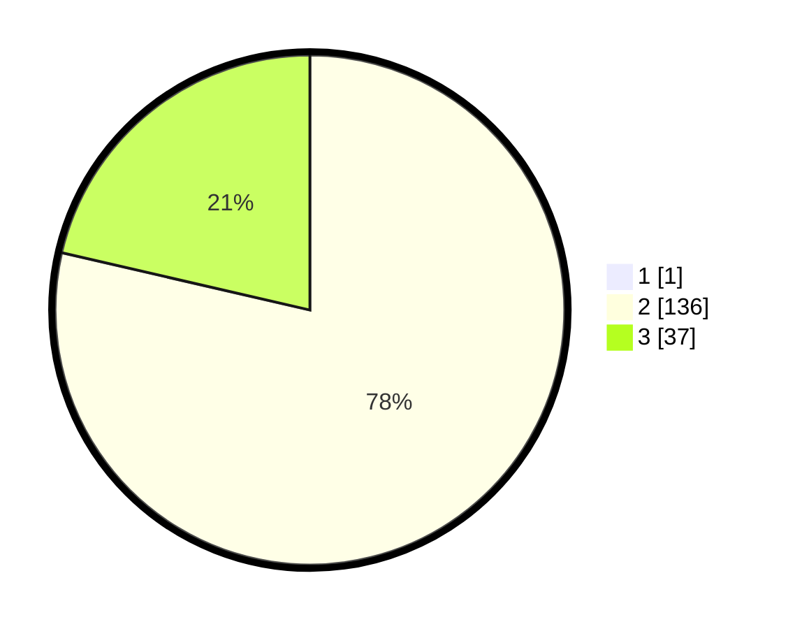

# Hasil

## Grafik

## Tabel

| No. | Nama Paslon    | Suara | Suara (raw) | Persentase |
|:--- |:-------------- | -----:| -----------:| ----------:|
| 1   | ANIES MUHAIMIN | 1     | [1][p-1]    | 0,57       |
| 2   | PRABOWO GIBRAN | 136   | [136][p-2]  | 78,16      |
| 3   | GANJAR MAHFUD  | 37    | [37][p-3]   | 21,26      |

[p-1]: https://github.com/gigit-pemilu/pemilu-2024/blob/main/pilpres/hitung-suara/sub/35-jawa-timur/sub/10-banyuwangi/sub/23-tegalsari/sub/2006-tegalrejo/sub/019-tps/sub/paslon-1.txt
[p-2]: https://github.com/gigit-pemilu/pemilu-2024/blob/main/pilpres/hitung-suara/sub/35-jawa-timur/sub/10-banyuwangi/sub/23-tegalsari/sub/2006-tegalrejo/sub/019-tps/sub/paslon-2.txt
[p-3]: https://github.com/gigit-pemilu/pemilu-2024/blob/main/pilpres/hitung-suara/sub/35-jawa-timur/sub/10-banyuwangi/sub/23-tegalsari/sub/2006-tegalrejo/sub/019-tps/sub/paslon-3.txt

## Foto C Plano

https://sirekap-obj-formc.kpu.go.id/4c87/pemilu/ppwp/35/10/23/20/06/3510232006019-20240216-092057--f6a8707e-86b2-456e-b49f-977c529e8523.jpg

https://sirekap-obj-formc.kpu.go.id/4c87/pemilu/ppwp/35/10/23/20/06/3510232006019-20240217-220816--66a190e1-c43f-4112-90b9-123d7831a6d3.jpg

https://sirekap-obj-formc.kpu.go.id/4c87/pemilu/ppwp/35/10/23/20/06/3510232006019-20240217-215331--c27ef31c-853d-4178-b22c-fa80c70e5c8e.jpg

## Metadata

| Key        | Value               |
| ---------- | ------------------- |
| Time Stamp | 2024-02-24 22:31:28 |

