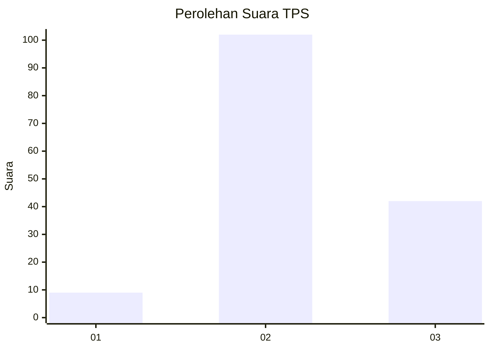

# Hasil

## Grafik

## Tabel

| No. | Nama Paslon    | Suara | Suara (raw) | Persentase |
|:--- |:-------------- | -----:| -----------:| ----------:|
| 1   | ANIES MUHAIMIN | 9     | [9][p-1]    | 5,88       |
| 2   | PRABOWO GIBRAN | 102   | [102][p-2]  | 66,67      |
| 3   | GANJAR MAHFUD  | 42    | [42][p-3]   | 27,45      |

[p-1]: https://github.com/gigit-pemilu/pemilu-2024-35-jawa-timur/blob/main/pilpres/hitung-suara/sub/35-jawa-timur/sub/10-banyuwangi/sub/23-tegalsari/sub/2006-tegalrejo/sub/023-tps/sub/paslon-1.txt
[p-2]: https://github.com/gigit-pemilu/pemilu-2024-35-jawa-timur/blob/main/pilpres/hitung-suara/sub/35-jawa-timur/sub/10-banyuwangi/sub/23-tegalsari/sub/2006-tegalrejo/sub/023-tps/sub/paslon-2.txt
[p-3]: https://github.com/gigit-pemilu/pemilu-2024-35-jawa-timur/blob/main/pilpres/hitung-suara/sub/35-jawa-timur/sub/10-banyuwangi/sub/23-tegalsari/sub/2006-tegalrejo/sub/023-tps/sub/paslon-3.txt

## Foto C Plano

https://sirekap-obj-formc.kpu.go.id/5133/pemilu/ppwp/35/10/23/20/06/3510232006023-20240215-023850--e5a767e3-4f1a-4b4b-998d-4e5da32db2ad.jpg

https://sirekap-obj-formc.kpu.go.id/5133/pemilu/ppwp/35/10/23/20/06/3510232006023-20240215-023335--7036889d-aff3-4b67-accd-66c4cd6405b6.jpg

https://sirekap-obj-formc.kpu.go.id/5133/pemilu/ppwp/35/10/23/20/06/3510232006023-20240215-024504--4deeeb04-d515-4839-b323-dc9fe2d4c388.jpg

## Metadata

| Key        | Value               |
| ---------- | ------------------- |
| Time Stamp | 2024-02-25 16:00:00 |

