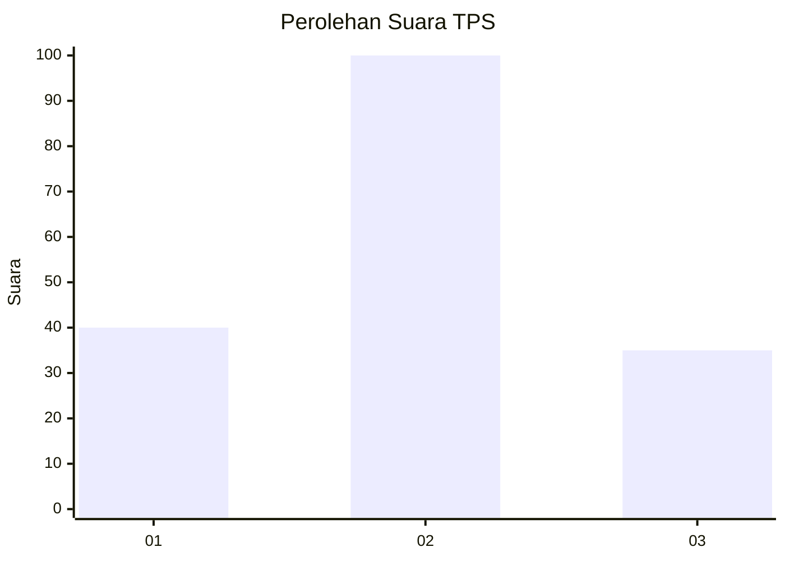
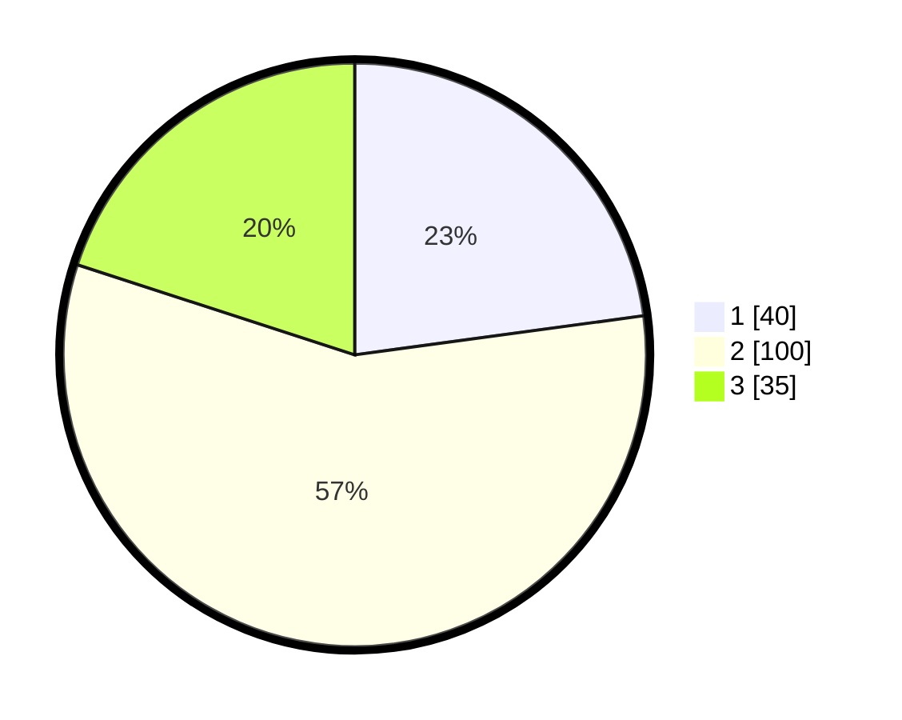

# Hasil

## Grafik

## Tabel

| No. | Nama Paslon    | Suara | Suara (raw) | Persentase |
|:--- |:-------------- | -----:| -----------:| ----------:|
| 1   | ANIES MUHAIMIN | 40    | [40][p-1]   | 22,86      |
| 2   | PRABOWO GIBRAN | 100   | [100][p-2]  | 57,14      |
| 3   | GANJAR MAHFUD  | 35    | [35][p-3]   | 20,00      |

[p-1]: https://github.com/gigit-pemilu/pemilu-2024/blob/main/pilpres/hitung-suara/sub/35-jawa-timur/sub/10-banyuwangi/sub/24-licin/sub/2004-banjar/sub/001-tps/sub/paslon-1.txt
[p-2]: https://github.com/gigit-pemilu/pemilu-2024/blob/main/pilpres/hitung-suara/sub/35-jawa-timur/sub/10-banyuwangi/sub/24-licin/sub/2004-banjar/sub/001-tps/sub/paslon-2.txt
[p-3]: https://github.com/gigit-pemilu/pemilu-2024/blob/main/pilpres/hitung-suara/sub/35-jawa-timur/sub/10-banyuwangi/sub/24-licin/sub/2004-banjar/sub/001-tps/sub/paslon-3.txt

## Foto C Plano

https://sirekap-obj-formc.kpu.go.id/1a75/pemilu/ppwp/35/10/24/20/04/3510242004001-20240216-202838--28c99753-68b7-44d4-b526-cb5bb5c462b7.jpg

https://sirekap-obj-formc.kpu.go.id/1a75/pemilu/ppwp/35/10/24/20/04/3510242004001-20240217-185158--fce8ad60-1083-4473-b47f-0301c72984b8.jpg

https://sirekap-obj-formc.kpu.go.id/1a75/pemilu/ppwp/35/10/24/20/04/3510242004001-20240217-185157--203c0cea-89df-43f4-b1fa-bbd25982a1f6.jpg

## Metadata

| Key        | Value               |
| ---------- | ------------------- |
| Time Stamp | 2024-02-24 22:31:28 |

