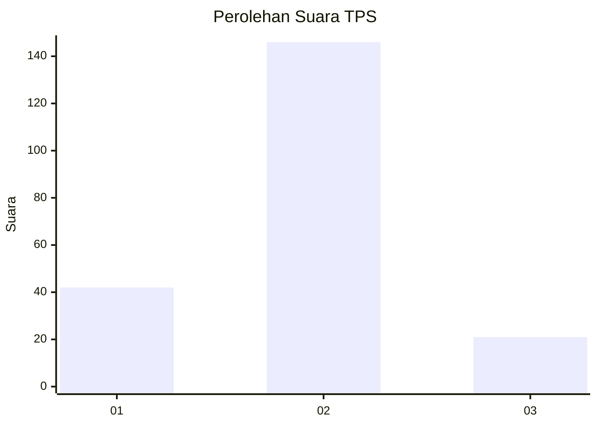

# Hasil

## Grafik

## Tabel

| No. | Nama Paslon    | Suara | Suara (raw) | Persentase |
|:--- |:-------------- | -----:| -----------:| ----------:|
| 1   | ANIES MUHAIMIN | 42    | [42][p-1]   | 20,10      |
| 2   | PRABOWO GIBRAN | 146   | [146][p-2]  | 69,86      |
| 3   | GANJAR MAHFUD  | 21    | [21][p-3]   | 10,05      |

[p-1]: https://github.com/gigit-pemilu/pemilu-2024/blob/main/pilpres/hitung-suara/sub/35-jawa-timur/sub/10-banyuwangi/sub/24-licin/sub/2005-segobang/sub/003-tps/sub/paslon-1.txt
[p-2]: https://github.com/gigit-pemilu/pemilu-2024/blob/main/pilpres/hitung-suara/sub/35-jawa-timur/sub/10-banyuwangi/sub/24-licin/sub/2005-segobang/sub/003-tps/sub/paslon-2.txt
[p-3]: https://github.com/gigit-pemilu/pemilu-2024/blob/main/pilpres/hitung-suara/sub/35-jawa-timur/sub/10-banyuwangi/sub/24-licin/sub/2005-segobang/sub/003-tps/sub/paslon-3.txt

## Foto C Plano

https://sirekap-obj-formc.kpu.go.id/373d/pemilu/ppwp/35/10/24/20/05/3510242005003-20240221-140130--52ef69cb-ce4f-4873-9c1d-9ec1c1533471.jpg

https://sirekap-obj-formc.kpu.go.id/373d/pemilu/ppwp/35/10/24/20/05/3510242005003-20240221-141623--25865e34-a8a4-42e2-bd62-99ed340b970a.jpg

https://sirekap-obj-formc.kpu.go.id/373d/pemilu/ppwp/35/10/24/20/05/3510242005003-20240221-141932--ba3c3afe-5d5e-4404-99f5-6d7eb41e6ec1.jpg

## Metadata

| Key        | Value               |
| ---------- | ------------------- |
| Time Stamp | 2024-02-21 15:00:00 |

## DATA PEMILIH TETAP

Jumlah pemilih dalam DPT: **0**.
 * L: **222**.
 * P: **550**.

## DATA PENGGUNA HAK PILIH

Jumlah pengguna hak pilih dalam DPT: **782**.
 * L: **222**.
 * P: **755**.

Jumlah pengguna hak pilih dalam DPTb: **553**.
 * L: **222**.
 * P: **757**.

Jumlah pengguna hak pilih dalam DPK: **5**.
 * L: **286**.
 * P: **255**.

Jumlah pengguna hak pilih: **202**.
 * L: **21**.
 * P: **420**.

## JUMLAH SUARA SAH DAN TIDAK SAH

JUMLAH SELURUH SUARA SAH: **209**.

JUMLAH SUARA TIDAK SAH: **5**.

JUMLAH SELURUH SUARA SAH DAN SUARA TIDAK SAH: **214**.

