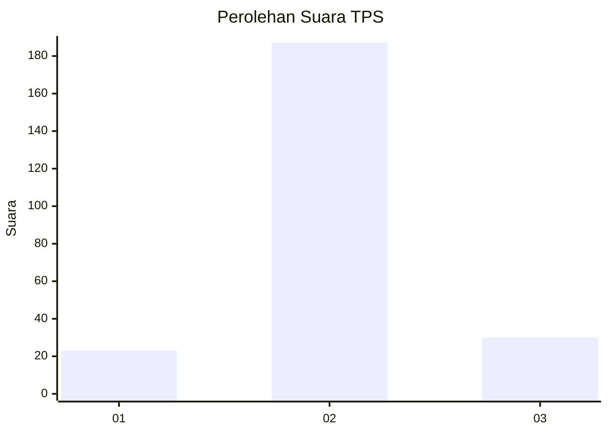
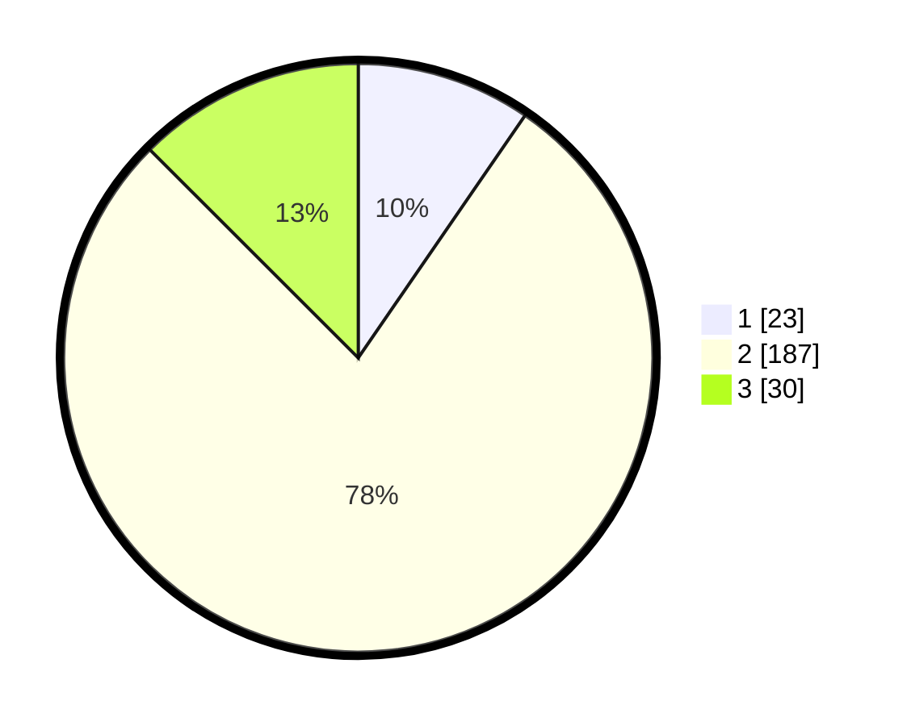

# Hasil

## Grafik

## Tabel

| No. | Nama Paslon    | Suara | Suara (raw) | Persentase |
|:--- |:-------------- | -----:| -----------:| ----------:|
| 1   | ANIES MUHAIMIN | 23    | [23][p-1]   | 9,58       |
| 2   | PRABOWO GIBRAN | 187   | [187][p-2]  | 77,92      |
| 3   | GANJAR MAHFUD  | 30    | [30][p-3]   | 12,50      |

[p-1]: https://github.com/gigit-pemilu/pemilu-2024/blob/main/pilpres/hitung-suara/sub/35-jawa-timur/sub/10-banyuwangi/sub/25-blimbingsari/sub/2001-blimbingsari/sub/002-tps/sub/paslon-1.txt
[p-2]: https://github.com/gigit-pemilu/pemilu-2024/blob/main/pilpres/hitung-suara/sub/35-jawa-timur/sub/10-banyuwangi/sub/25-blimbingsari/sub/2001-blimbingsari/sub/002-tps/sub/paslon-2.txt
[p-3]: https://github.com/gigit-pemilu/pemilu-2024/blob/main/pilpres/hitung-suara/sub/35-jawa-timur/sub/10-banyuwangi/sub/25-blimbingsari/sub/2001-blimbingsari/sub/002-tps/sub/paslon-3.txt

## Foto C Plano

https://sirekap-obj-formc.kpu.go.id/6de7/pemilu/ppwp/35/10/25/20/01/3510252001002-20240218-140849--1fce36e7-9c22-4167-aebf-c74f0e766bbe.jpg

https://sirekap-obj-formc.kpu.go.id/6de7/pemilu/ppwp/35/10/25/20/01/3510252001002-20240218-141008--1b8decd9-3ffa-4828-b183-dd8e540b7297.jpg

https://sirekap-obj-formc.kpu.go.id/6de7/pemilu/ppwp/35/10/25/20/01/3510252001002-20240220-064415--9548ee24-2b25-4f29-863b-e656f9a43a76.jpg

## Metadata

| Key        | Value               |
| ---------- | ------------------- |
| Time Stamp | 2024-02-25 16:00:00 |

