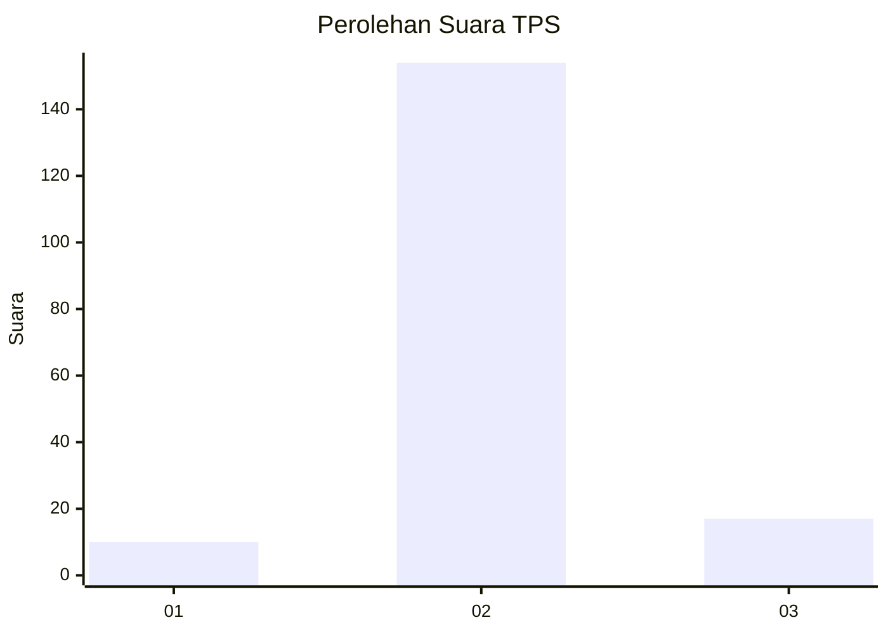
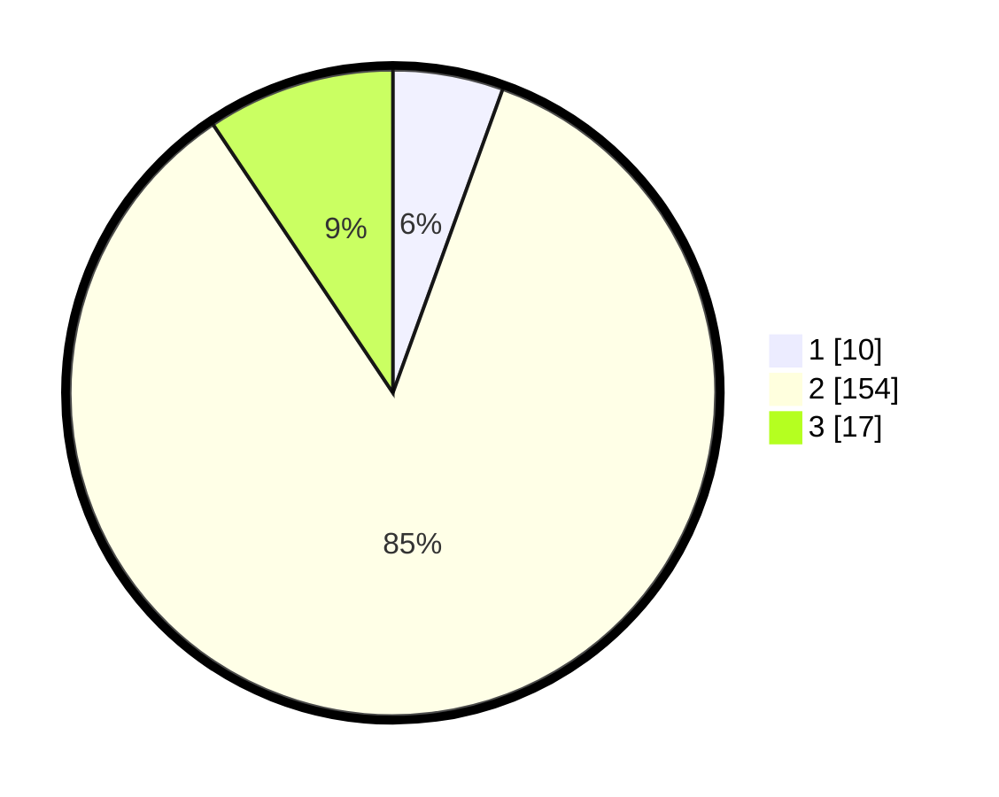

# Hasil

## Grafik

## Tabel

| No. | Nama Paslon    | Suara | Suara (raw) | Persentase |
|:--- |:-------------- | -----:| -----------:| ----------:|
| 1   | ANIES MUHAIMIN | 10    | [10][p-1]   | 5,52       |
| 2   | PRABOWO GIBRAN | 154   | [154][p-2]  | 85,08      |
| 3   | GANJAR MAHFUD  | 17    | [17][p-3]   | 9,39       |

[p-1]: https://github.com/gigit-pemilu/pemilu-2024-35-jawa-timur/blob/main/pilpres/hitung-suara/sub/35-jawa-timur/sub/10-banyuwangi/sub/25-blimbingsari/sub/2001-blimbingsari/sub/004-tps/sub/paslon-1.txt
[p-2]: https://github.com/gigit-pemilu/pemilu-2024-35-jawa-timur/blob/main/pilpres/hitung-suara/sub/35-jawa-timur/sub/10-banyuwangi/sub/25-blimbingsari/sub/2001-blimbingsari/sub/004-tps/sub/paslon-2.txt
[p-3]: https://github.com/gigit-pemilu/pemilu-2024-35-jawa-timur/blob/main/pilpres/hitung-suara/sub/35-jawa-timur/sub/10-banyuwangi/sub/25-blimbingsari/sub/2001-blimbingsari/sub/004-tps/sub/paslon-3.txt

## Foto C Plano

https://sirekap-obj-formc.kpu.go.id/684e/pemilu/ppwp/35/10/25/20/01/3510252001004-20240218-095755--a116f814-6c58-4523-becb-e70e78536ab5.jpg

https://sirekap-obj-formc.kpu.go.id/684e/pemilu/ppwp/35/10/25/20/01/3510252001004-20240218-095520--04ef2a1c-cf2a-4364-a4f5-c16cdfcfaa60.jpg

https://sirekap-obj-formc.kpu.go.id/684e/pemilu/ppwp/35/10/25/20/01/3510252001004-20240218-095633--837e0b4f-77ac-42d6-b788-d7e9561a5dcb.jpg

## Metadata

| Key        | Value               |
| ---------- | ------------------- |
| Time Stamp | 2024-02-24 22:31:28 |

