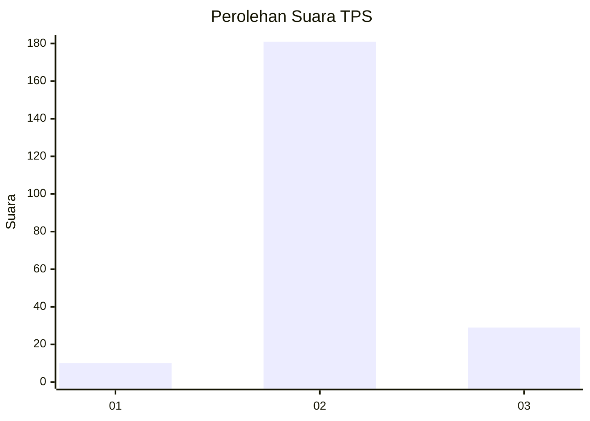
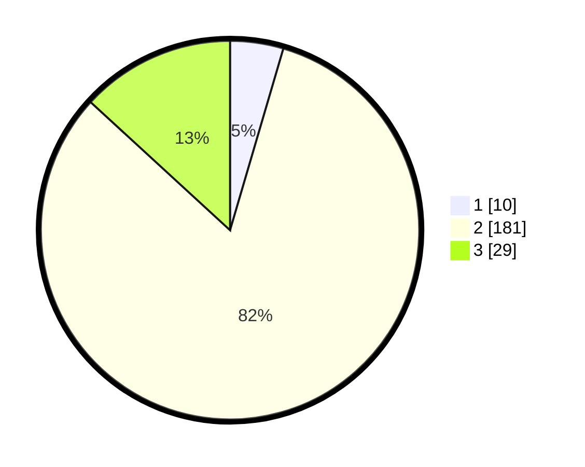

# Hasil

## Grafik

## Tabel

| No. | Nama Paslon    | Suara | Suara (raw) | Persentase |
|:--- |:-------------- | -----:| -----------:| ----------:|
| 1   | ANIES MUHAIMIN | 10    | [10][p-1]   | 4,55       |
| 2   | PRABOWO GIBRAN | 181   | [181][p-2]  | 82,27      |
| 3   | GANJAR MAHFUD  | 29    | [29][p-3]   | 13,18      |

[p-1]: https://github.com/gigit-pemilu/pemilu-2024-35-jawa-timur/blob/main/pilpres/hitung-suara/sub/35-jawa-timur/sub/10-banyuwangi/sub/25-blimbingsari/sub/2001-blimbingsari/sub/006-tps/sub/paslon-1.txt
[p-2]: https://github.com/gigit-pemilu/pemilu-2024-35-jawa-timur/blob/main/pilpres/hitung-suara/sub/35-jawa-timur/sub/10-banyuwangi/sub/25-blimbingsari/sub/2001-blimbingsari/sub/006-tps/sub/paslon-2.txt
[p-3]: https://github.com/gigit-pemilu/pemilu-2024-35-jawa-timur/blob/main/pilpres/hitung-suara/sub/35-jawa-timur/sub/10-banyuwangi/sub/25-blimbingsari/sub/2001-blimbingsari/sub/006-tps/sub/paslon-3.txt

## Foto C Plano

https://sirekap-obj-formc.kpu.go.id/7b29/pemilu/ppwp/35/10/25/20/01/3510252001006-20240217-201526--f3323120-e61a-47b8-9f99-d29dbe602564.jpg

https://sirekap-obj-formc.kpu.go.id/7b29/pemilu/ppwp/35/10/25/20/01/3510252001006-20240217-202216--fcb04cb1-75fe-4933-ab9f-8a996c2ea798.jpg

https://sirekap-obj-formc.kpu.go.id/7b29/pemilu/ppwp/35/10/25/20/01/3510252001006-20240217-193958--561b2d0e-1757-4642-8a03-cdba61e9b0fe.jpg

## Metadata

| Key        | Value               |
| ---------- | ------------------- |
| Time Stamp | 2024-02-24 22:31:28 |

