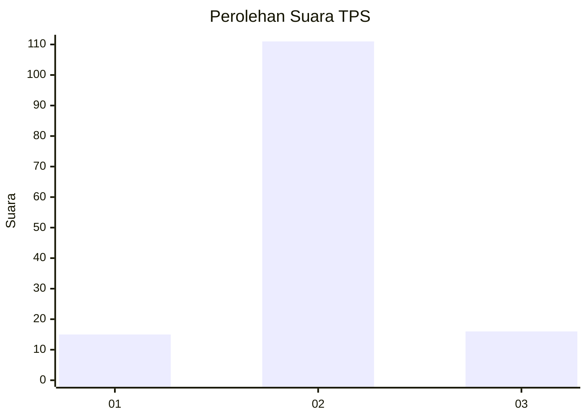
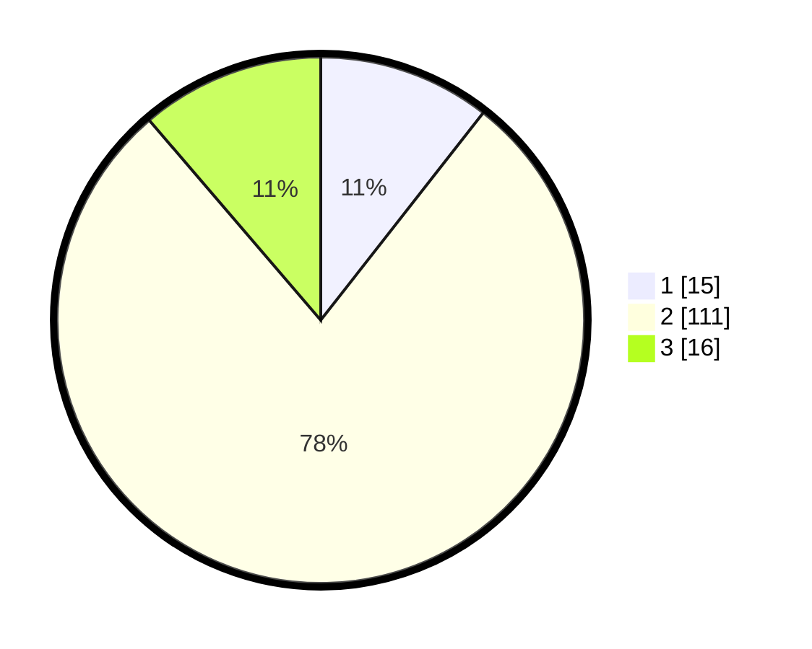

# Hasil

## Grafik

## Tabel

| No. | Nama Paslon    | Suara | Suara (raw) | Persentase |
|:--- |:-------------- | -----:| -----------:| ----------:|
| 1   | ANIES MUHAIMIN | 15    | [15][p-1]   | 10,56      |
| 2   | PRABOWO GIBRAN | 111   | [111][p-2]  | 78,17      |
| 3   | GANJAR MAHFUD  | 16    | [16][p-3]   | 11,27      |

[p-1]: https://github.com/gigit-pemilu/pemilu-2024-35-jawa-timur/blob/main/pilpres/hitung-suara/sub/35-jawa-timur/sub/10-banyuwangi/sub/25-blimbingsari/sub/2001-blimbingsari/sub/011-tps/sub/paslon-1.txt
[p-2]: https://github.com/gigit-pemilu/pemilu-2024-35-jawa-timur/blob/main/pilpres/hitung-suara/sub/35-jawa-timur/sub/10-banyuwangi/sub/25-blimbingsari/sub/2001-blimbingsari/sub/011-tps/sub/paslon-2.txt
[p-3]: https://github.com/gigit-pemilu/pemilu-2024-35-jawa-timur/blob/main/pilpres/hitung-suara/sub/35-jawa-timur/sub/10-banyuwangi/sub/25-blimbingsari/sub/2001-blimbingsari/sub/011-tps/sub/paslon-3.txt

## Foto C Plano

https://sirekap-obj-formc.kpu.go.id/1242/pemilu/ppwp/35/10/25/20/01/3510252001011-20240218-091722--0c8602c8-95ee-46b9-b4ed-60c2b9d3d633.jpg

https://sirekap-obj-formc.kpu.go.id/1242/pemilu/ppwp/35/10/25/20/01/3510252001011-20240218-091904--6722d1ab-d2cd-4a1e-915c-4cd621932d52.jpg

https://sirekap-obj-formc.kpu.go.id/1242/pemilu/ppwp/35/10/25/20/01/3510252001011-20240218-092054--1a8f8603-2326-446a-a21c-cef1bfc6e577.jpg

## Metadata

| Key        | Value               |
| ---------- | ------------------- |
| Time Stamp | 2024-02-19 21:00:00 |

## DATA PEMILIH TETAP

Jumlah pemilih dalam DPT: **681**.
 * L: **86**.
 * P: **95**.

## DATA PENGGUNA HAK PILIH

Jumlah pengguna hak pilih dalam DPT: **641**.
 * L: **62**.
 * P: **29**.

Jumlah pengguna hak pilih dalam DPTb: **555**.
 * L: **888**.
 * P: **500**.

Jumlah pengguna hak pilih dalam DPK: **1**.
 * L: **0**.
 * P: **6**.

Jumlah pengguna hak pilih: **142**.
 * L: **62**.
 * P: **80**.

## JUMLAH SUARA SAH DAN TIDAK SAH

JUMLAH SELURUH SUARA SAH: **142**.

JUMLAH SUARA TIDAK SAH: **0**.

JUMLAH SELURUH SUARA SAH DAN SUARA TIDAK SAH: **142**.

