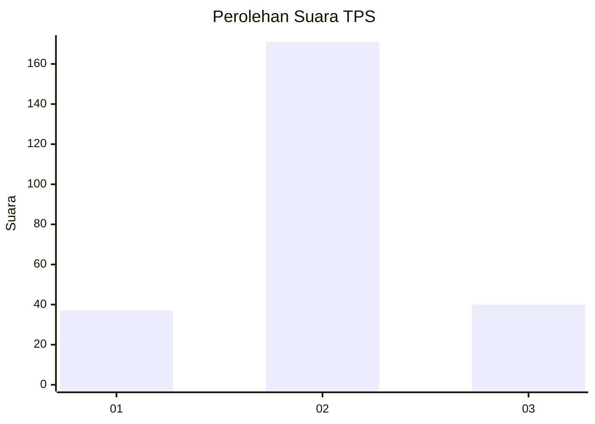
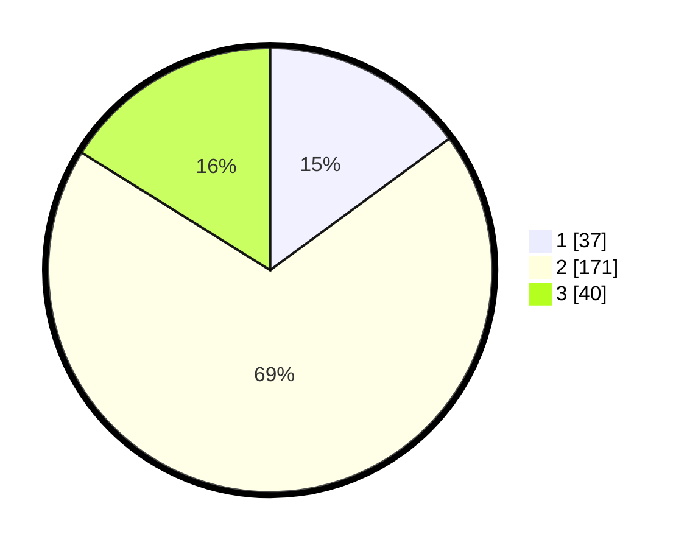

# Hasil

## Grafik

## Tabel

| No. | Nama Paslon    | Suara | Suara (raw) | Persentase |
|:--- |:-------------- | -----:| -----------:| ----------:|
| 1   | ANIES MUHAIMIN | 37    | [37][p-1]   | 14,92      |
| 2   | PRABOWO GIBRAN | 171   | [171][p-2]  | 68,95      |
| 3   | GANJAR MAHFUD  | 40    | [40][p-3]   | 16,13      |

[p-1]: https://github.com/gigit-pemilu/pemilu-2024/blob/main/pilpres/hitung-suara/sub/35-jawa-timur/sub/10-banyuwangi/sub/25-blimbingsari/sub/2006-patoman/sub/001-tps/sub/paslon-1.txt
[p-2]: https://github.com/gigit-pemilu/pemilu-2024/blob/main/pilpres/hitung-suara/sub/35-jawa-timur/sub/10-banyuwangi/sub/25-blimbingsari/sub/2006-patoman/sub/001-tps/sub/paslon-2.txt
[p-3]: https://github.com/gigit-pemilu/pemilu-2024/blob/main/pilpres/hitung-suara/sub/35-jawa-timur/sub/10-banyuwangi/sub/25-blimbingsari/sub/2006-patoman/sub/001-tps/sub/paslon-3.txt

## Foto C Plano

https://sirekap-obj-formc.kpu.go.id/ddc9/pemilu/ppwp/35/10/25/20/06/3510252006001-20240218-152822--7fe0ff80-cbc4-411c-a4c6-ea91974e9d50.jpg

https://sirekap-obj-formc.kpu.go.id/ddc9/pemilu/ppwp/35/10/25/20/06/3510252006001-20240218-152920--aec9a6b0-a198-434a-8579-53fe9b8dd85a.jpg

https://sirekap-obj-formc.kpu.go.id/ddc9/pemilu/ppwp/35/10/25/20/06/3510252006001-20240218-153005--d3cee840-b89e-4909-9ff5-6b2e1f3de77d.jpg

## Metadata

| Key        | Value               |
| ---------- | ------------------- |
| Time Stamp | 2024-02-24 22:31:28 |

