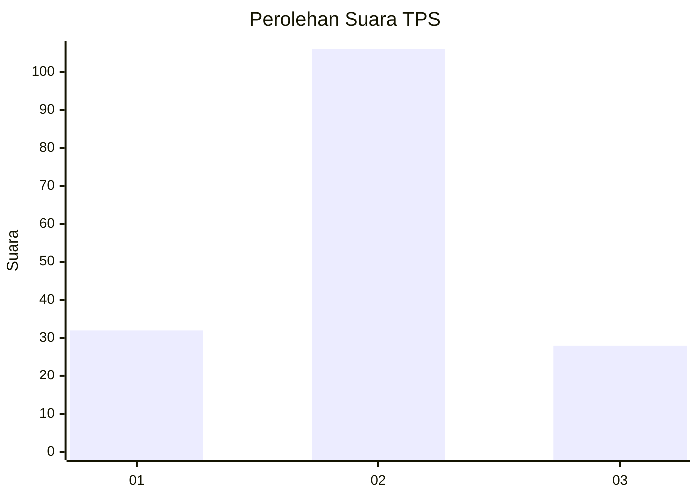

# Hasil

## Grafik

## Tabel

| No. | Nama Paslon    | Suara | Suara (raw) | Persentase |
|:--- |:-------------- | -----:| -----------:| ----------:|
| 1   | ANIES MUHAIMIN | 32    | [32][p-1]   | 19,28      |
| 2   | PRABOWO GIBRAN | 106   | [106][p-2]  | 63,86      |
| 3   | GANJAR MAHFUD  | 28    | [28][p-3]   | 16,87      |

[p-1]: https://github.com/gigit-pemilu/pemilu-2024/blob/main/pilpres/hitung-suara/sub/35-jawa-timur/sub/10-banyuwangi/sub/25-blimbingsari/sub/2008-karangrejo/sub/001-tps/sub/paslon-1.txt
[p-2]: https://github.com/gigit-pemilu/pemilu-2024/blob/main/pilpres/hitung-suara/sub/35-jawa-timur/sub/10-banyuwangi/sub/25-blimbingsari/sub/2008-karangrejo/sub/001-tps/sub/paslon-2.txt
[p-3]: https://github.com/gigit-pemilu/pemilu-2024/blob/main/pilpres/hitung-suara/sub/35-jawa-timur/sub/10-banyuwangi/sub/25-blimbingsari/sub/2008-karangrejo/sub/001-tps/sub/paslon-3.txt

## Foto C Plano

https://sirekap-obj-formc.kpu.go.id/4ee6/pemilu/ppwp/35/10/25/20/08/3510252008001-20240216-174630--4dea18b7-678c-45ef-9aef-632f8ec6e8d5.jpg

https://sirekap-obj-formc.kpu.go.id/4ee6/pemilu/ppwp/35/10/25/20/08/3510252008001-20240216-210948--875d3fdf-1968-4bf0-841b-cf366dcfc645.jpg

https://sirekap-obj-formc.kpu.go.id/4ee6/pemilu/ppwp/35/10/25/20/08/3510252008001-20240216-211405--e656c27e-620f-4f9a-a1f3-0a92ca2d918c.jpg

## Metadata

| Key        | Value               |
| ---------- | ------------------- |
| Time Stamp | 2024-02-16 22:01:00 |

