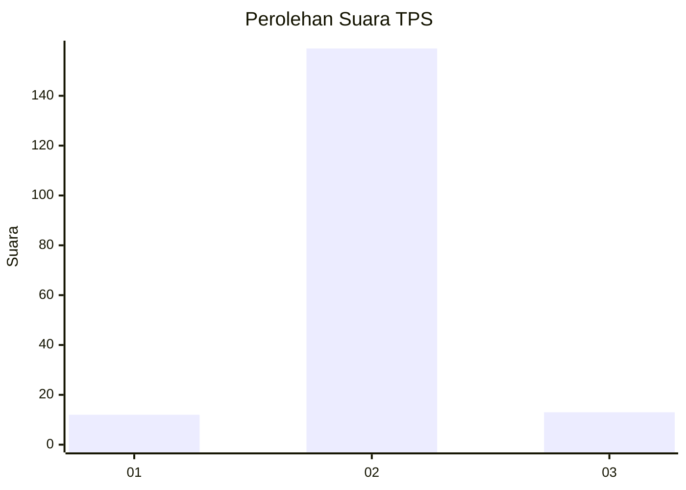
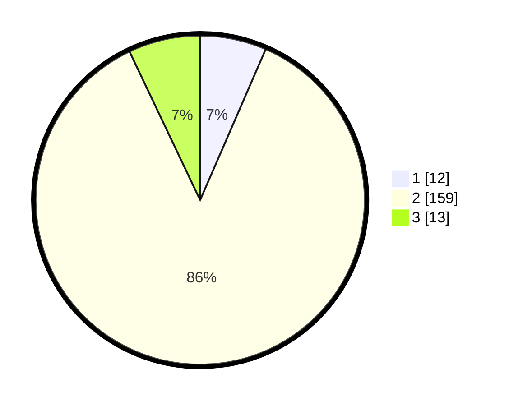

# Hasil

## Grafik

## Tabel

| No. | Nama Paslon    | Suara | Suara (raw) | Persentase |
|:--- |:-------------- | -----:| -----------:| ----------:|
| 1   | ANIES MUHAIMIN | 12    | [12][p-1]   | 6,52       |
| 2   | PRABOWO GIBRAN | 159   | [159][p-2]  | 86,41      |
| 3   | GANJAR MAHFUD  | 13    | [13][p-3]   | 7,07       |

[p-1]: https://github.com/gigit-pemilu/pemilu-2024-35-jawa-timur/blob/main/pilpres/hitung-suara/sub/35-jawa-timur/sub/10-banyuwangi/sub/25-blimbingsari/sub/2009-badean/sub/004-tps/sub/paslon-1.txt
[p-2]: https://github.com/gigit-pemilu/pemilu-2024-35-jawa-timur/blob/main/pilpres/hitung-suara/sub/35-jawa-timur/sub/10-banyuwangi/sub/25-blimbingsari/sub/2009-badean/sub/004-tps/sub/paslon-2.txt
[p-3]: https://github.com/gigit-pemilu/pemilu-2024-35-jawa-timur/blob/main/pilpres/hitung-suara/sub/35-jawa-timur/sub/10-banyuwangi/sub/25-blimbingsari/sub/2009-badean/sub/004-tps/sub/paslon-3.txt

## Foto C Plano

https://sirekap-obj-formc.kpu.go.id/f9fc/pemilu/ppwp/35/10/25/20/09/3510252009004-20240214-233818--c97ec65e-5fff-4a94-b125-642692722352.jpg

https://sirekap-obj-formc.kpu.go.id/f9fc/pemilu/ppwp/35/10/25/20/09/3510252009004-20240214-233928--782f75bd-4693-4f23-ab39-7273f310f181.jpg

https://sirekap-obj-formc.kpu.go.id/f9fc/pemilu/ppwp/35/10/25/20/09/3510252009004-20240214-234023--b1d93b75-4bae-4674-8e61-5bb91d88ac79.jpg

## Metadata

| Key        | Value               |
| ---------- | ------------------- |
| Time Stamp | 2024-02-24 22:31:28 |

