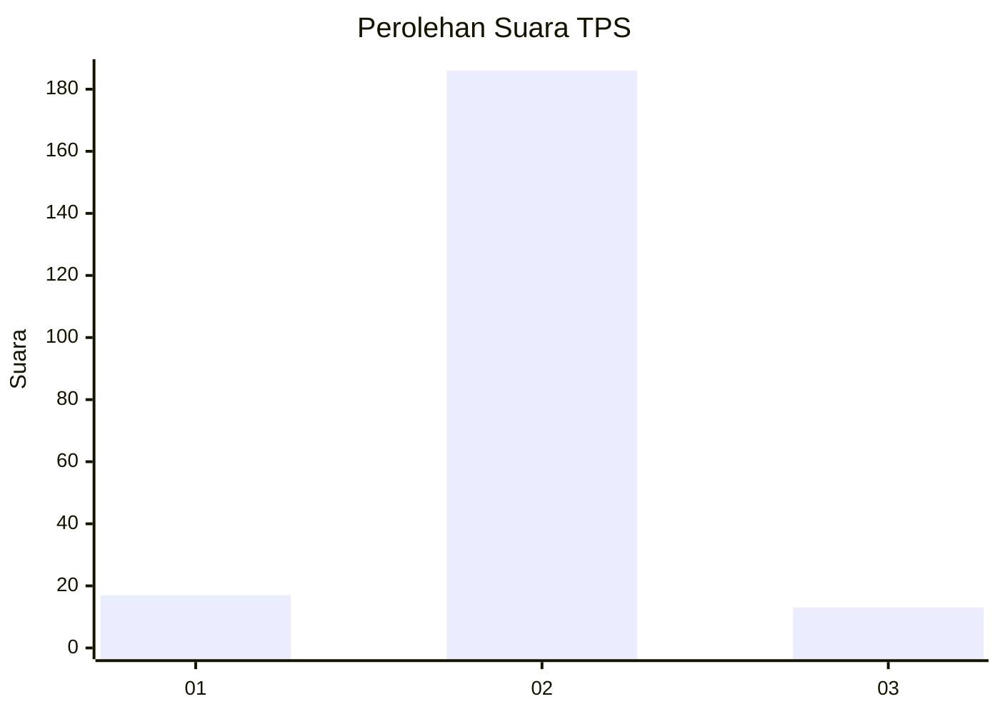
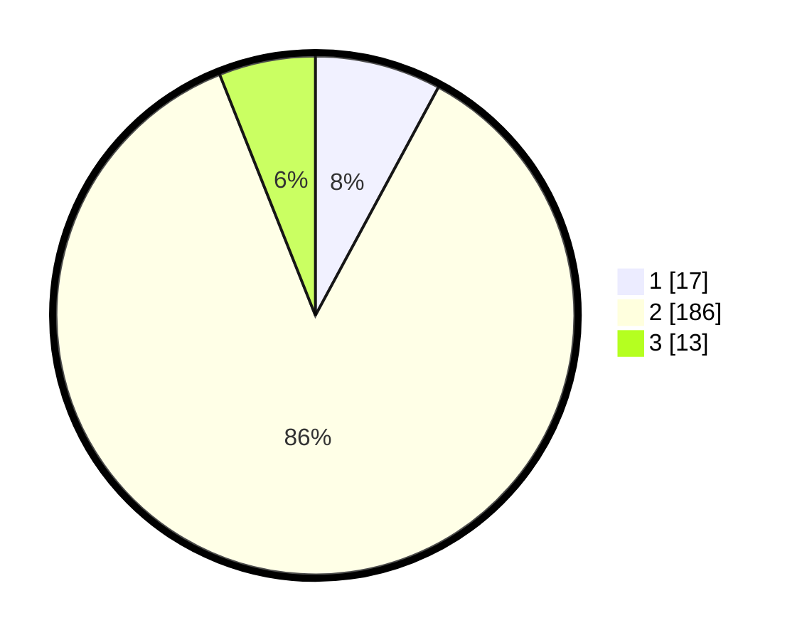

# Hasil

## Grafik

## Tabel

| No. | Nama Paslon    | Suara | Suara (raw) | Persentase |
|:--- |:-------------- | -----:| -----------:| ----------:|
| 1   | ANIES MUHAIMIN | 17    | [17][p-1]   | 7,87       |
| 2   | PRABOWO GIBRAN | 186   | [186][p-2]  | 86,11      |
| 3   | GANJAR MAHFUD  | 13    | [13][p-3]   | 6,02       |

[p-1]: https://github.com/gigit-pemilu/pemilu-2024/blob/main/pilpres/hitung-suara/sub/35-jawa-timur/sub/10-banyuwangi/sub/25-blimbingsari/sub/2009-badean/sub/009-tps/sub/paslon-1.txt
[p-2]: https://github.com/gigit-pemilu/pemilu-2024/blob/main/pilpres/hitung-suara/sub/35-jawa-timur/sub/10-banyuwangi/sub/25-blimbingsari/sub/2009-badean/sub/009-tps/sub/paslon-2.txt
[p-3]: https://github.com/gigit-pemilu/pemilu-2024/blob/main/pilpres/hitung-suara/sub/35-jawa-timur/sub/10-banyuwangi/sub/25-blimbingsari/sub/2009-badean/sub/009-tps/sub/paslon-3.txt

## Foto C Plano

https://sirekap-obj-formc.kpu.go.id/1c7c/pemilu/ppwp/35/10/25/20/09/3510252009009-20240218-212330--7a7732f0-44e5-4d13-a8f8-7c7359322c44.jpg

https://sirekap-obj-formc.kpu.go.id/1c7c/pemilu/ppwp/35/10/25/20/09/3510252009009-20240218-134059--d72825c5-a983-4d0f-8cf2-c0cd2ea20a84.jpg

https://sirekap-obj-formc.kpu.go.id/1c7c/pemilu/ppwp/35/10/25/20/09/3510252009009-20240218-134336--0e2a156a-e586-477e-ae98-f0a9705d27ed.jpg

## Metadata

| Key        | Value               |
| ---------- | ------------------- |
| Time Stamp | 2024-02-21 17:00:00 |

