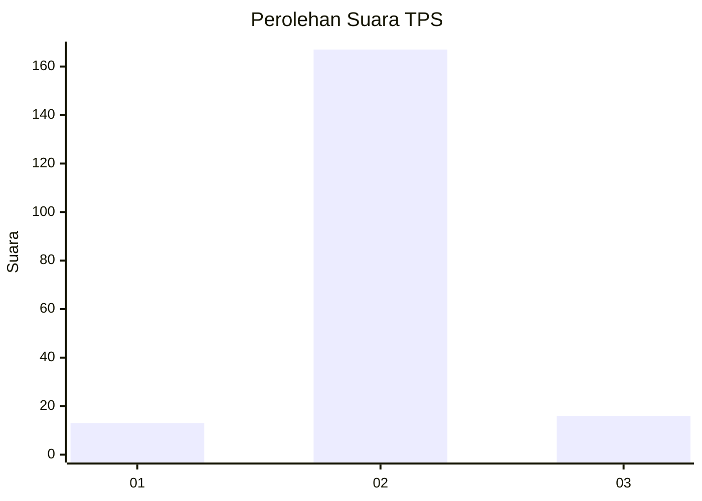
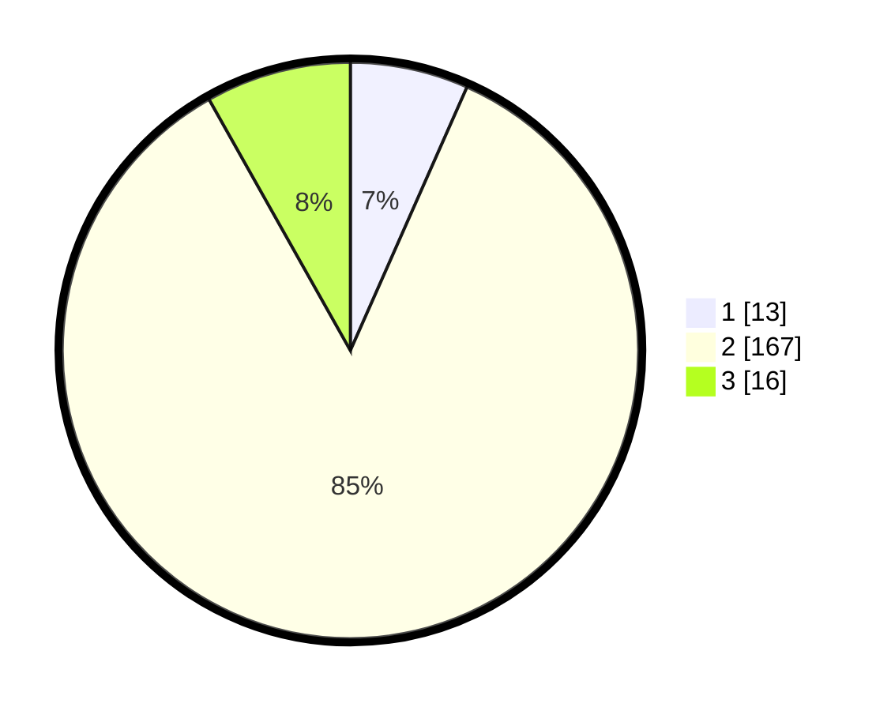

# Hasil

## Grafik

## Tabel

| No. | Nama Paslon    | Suara | Suara (raw) | Persentase |
|:--- |:-------------- | -----:| -----------:| ----------:|
| 1   | ANIES MUHAIMIN | 13    | [13][p-1]   | 6,63       |
| 2   | PRABOWO GIBRAN | 167   | [167][p-2]  | 85,20      |
| 3   | GANJAR MAHFUD  | 16    | [16][p-3]   | 8,16       |

[p-1]: https://github.com/gigit-pemilu/pemilu-2024/blob/main/pilpres/hitung-suara/sub/35-jawa-timur/sub/10-banyuwangi/sub/25-blimbingsari/sub/2009-badean/sub/019-tps/sub/paslon-1.txt
[p-2]: https://github.com/gigit-pemilu/pemilu-2024/blob/main/pilpres/hitung-suara/sub/35-jawa-timur/sub/10-banyuwangi/sub/25-blimbingsari/sub/2009-badean/sub/019-tps/sub/paslon-2.txt
[p-3]: https://github.com/gigit-pemilu/pemilu-2024/blob/main/pilpres/hitung-suara/sub/35-jawa-timur/sub/10-banyuwangi/sub/25-blimbingsari/sub/2009-badean/sub/019-tps/sub/paslon-3.txt

## Foto C Plano

https://sirekap-obj-formc.kpu.go.id/744d/pemilu/ppwp/35/10/25/20/09/3510252009019-20240214-211040--5e9b9137-10ef-42a1-bffd-214c7dc93ddc.jpg

https://sirekap-obj-formc.kpu.go.id/744d/pemilu/ppwp/35/10/25/20/09/3510252009019-20240214-211824--af7f9ea4-d2c4-4dab-ba0d-2a1d5043ceaa.jpg

https://sirekap-obj-formc.kpu.go.id/744d/pemilu/ppwp/35/10/25/20/09/3510252009019-20240214-212032--1f73d640-b3d9-448b-870d-733d9a1f9e4d.jpg

## Metadata

| Key        | Value               |
| ---------- | ------------------- |
| Time Stamp | 2024-02-24 22:31:28 |

