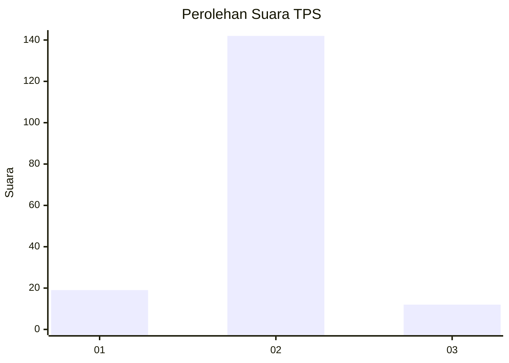
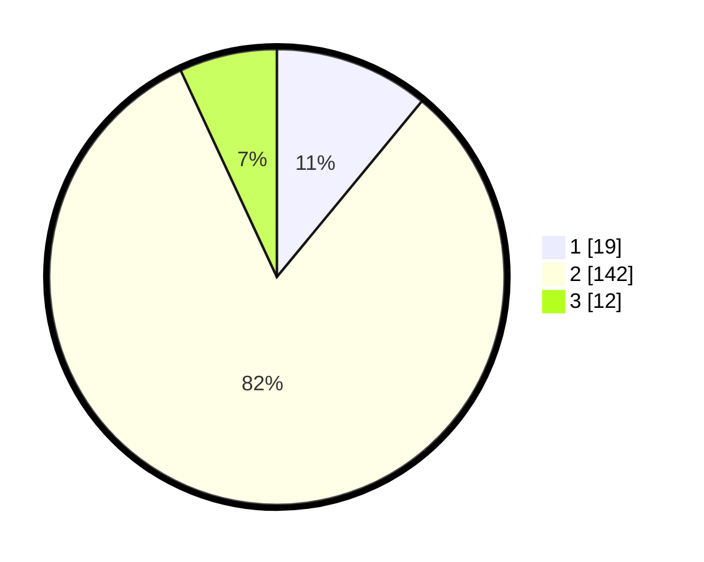

# Hasil

## Grafik

## Tabel

| No. | Nama Paslon    | Suara | Suara (raw) | Persentase |
|:--- |:-------------- | -----:| -----------:| ----------:|
| 1   | ANIES MUHAIMIN | 19    | [19][p-1]   | 10,98      |
| 2   | PRABOWO GIBRAN | 142   | [142][p-2]  | 82,08      |
| 3   | GANJAR MAHFUD  | 12    | [12][p-3]   | 6,94       |

[p-1]: https://github.com/gigit-pemilu/pemilu-2024-35-jawa-timur/blob/main/pilpres/hitung-suara/sub/35-jawa-timur/sub/10-banyuwangi/sub/25-blimbingsari/sub/2010-sukojati/sub/004-tps/sub/paslon-1.txt
[p-2]: https://github.com/gigit-pemilu/pemilu-2024-35-jawa-timur/blob/main/pilpres/hitung-suara/sub/35-jawa-timur/sub/10-banyuwangi/sub/25-blimbingsari/sub/2010-sukojati/sub/004-tps/sub/paslon-2.txt
[p-3]: https://github.com/gigit-pemilu/pemilu-2024-35-jawa-timur/blob/main/pilpres/hitung-suara/sub/35-jawa-timur/sub/10-banyuwangi/sub/25-blimbingsari/sub/2010-sukojati/sub/004-tps/sub/paslon-3.txt

## Foto C Plano

https://sirekap-obj-formc.kpu.go.id/fd98/pemilu/ppwp/35/10/25/20/10/3510252010004-20240216-195014--42e7dd32-a96c-4dd4-a1b9-2f69b35e6792.jpg

https://sirekap-obj-formc.kpu.go.id/fd98/pemilu/ppwp/35/10/25/20/10/3510252010004-20240216-210133--dabbd742-41a3-4bc9-a9a8-a94b26f03303.jpg

https://sirekap-obj-formc.kpu.go.id/fd98/pemilu/ppwp/35/10/25/20/10/3510252010004-20240216-211847--d59a79a8-7a64-4648-9b5d-cae7a7e4b7a3.jpg

## Metadata

| Key        | Value               |
| ---------- | ------------------- |
| Time Stamp | 2024-02-21 17:00:00 |

