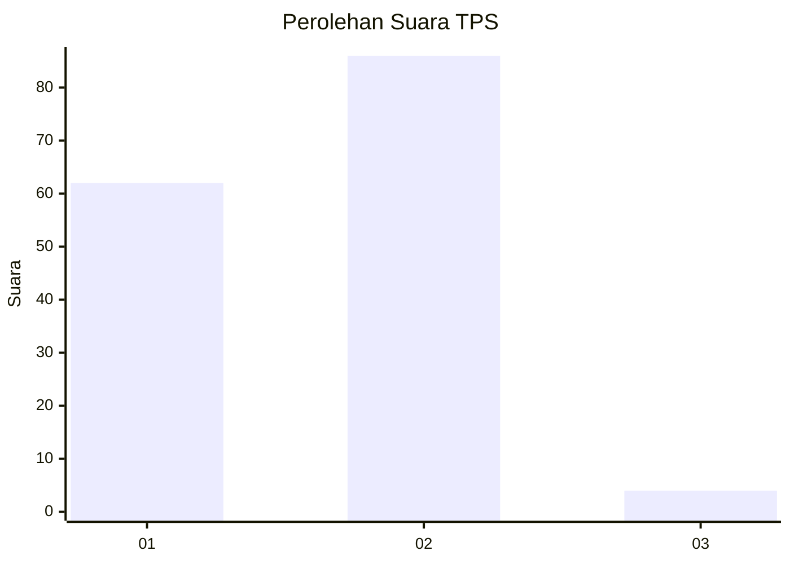
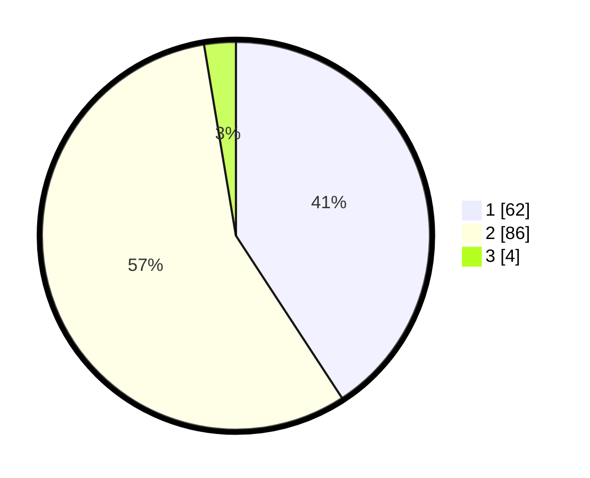

# Hasil

## Grafik

## Tabel

| No. | Nama Paslon    | Suara | Suara (raw) | Persentase |
|:--- |:-------------- | -----:| -----------:| ----------:|
| 1   | ANIES MUHAIMIN | 62    | [62][p-1]   | 40,79      |
| 2   | PRABOWO GIBRAN | 86    | [86][p-2]   | 56,58      |
| 3   | GANJAR MAHFUD  | 4     | [4][p-3]    | 2,63       |

[p-1]: https://github.com/gigit-pemilu/pemilu-2024/blob/main/pilpres/hitung-suara/sub/35-jawa-timur/sub/11-bondowoso/sub/01-maesan/sub/2001-sucolor/sub/004-tps/sub/paslon-1.txt
[p-2]: https://github.com/gigit-pemilu/pemilu-2024/blob/main/pilpres/hitung-suara/sub/35-jawa-timur/sub/11-bondowoso/sub/01-maesan/sub/2001-sucolor/sub/004-tps/sub/paslon-2.txt
[p-3]: https://github.com/gigit-pemilu/pemilu-2024/blob/main/pilpres/hitung-suara/sub/35-jawa-timur/sub/11-bondowoso/sub/01-maesan/sub/2001-sucolor/sub/004-tps/sub/paslon-3.txt

## Foto C Plano

https://sirekap-obj-formc.kpu.go.id/f341/pemilu/ppwp/35/11/01/20/01/3511012001004-20240215-035519--382a32ab-097f-462b-b4ec-3cb6badecb96.jpg

https://sirekap-obj-formc.kpu.go.id/f341/pemilu/ppwp/35/11/01/20/01/3511012001004-20240214-140943--02952634-d9bd-40c2-8216-ced3bbe5fc54.jpg

## Metadata

| Key        | Value               |
| ---------- | ------------------- |
| Time Stamp | 2024-02-24 22:31:28 |

