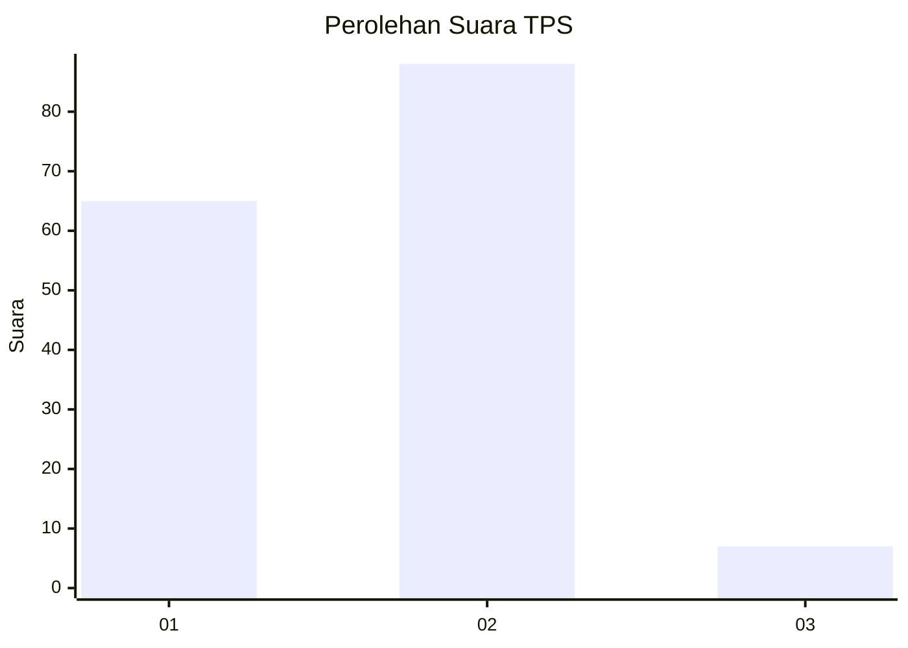
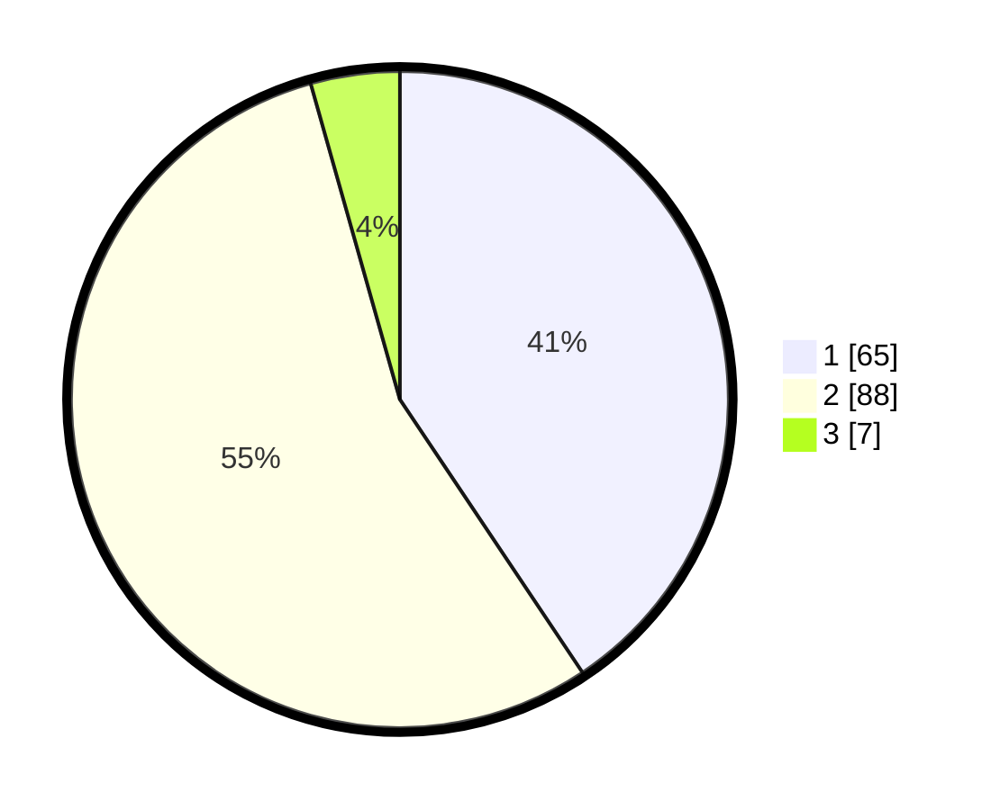

# Hasil

## Grafik

## Tabel

| No. | Nama Paslon    | Suara | Suara (raw) | Persentase |
|:--- |:-------------- | -----:| -----------:| ----------:|
| 1   | ANIES MUHAIMIN | 65    | [65][p-1]   | 40,63      |
| 2   | PRABOWO GIBRAN | 88    | [88][p-2]   | 55,00      |
| 3   | GANJAR MAHFUD  | 7     | [7][p-3]    | 4,38       |

[p-1]: https://github.com/gigit-pemilu/pemilu-2024/blob/main/pilpres/hitung-suara/sub/35-jawa-timur/sub/11-bondowoso/sub/01-maesan/sub/2001-sucolor/sub/005-tps/sub/paslon-1.txt
[p-2]: https://github.com/gigit-pemilu/pemilu-2024/blob/main/pilpres/hitung-suara/sub/35-jawa-timur/sub/11-bondowoso/sub/01-maesan/sub/2001-sucolor/sub/005-tps/sub/paslon-2.txt
[p-3]: https://github.com/gigit-pemilu/pemilu-2024/blob/main/pilpres/hitung-suara/sub/35-jawa-timur/sub/11-bondowoso/sub/01-maesan/sub/2001-sucolor/sub/005-tps/sub/paslon-3.txt

## Foto C Plano

https://sirekap-obj-formc.kpu.go.id/0bec/pemilu/ppwp/35/11/01/20/01/3511012001005-20240215-011437--e6079b4c-2e86-4b4a-912d-fab9b80635e3.jpg

https://sirekap-obj-formc.kpu.go.id/0bec/pemilu/ppwp/35/11/01/20/01/3511012001005-20240215-004730--21d58168-e578-4d2e-b2e1-96a5927cfe1c.jpg

https://sirekap-obj-formc.kpu.go.id/0bec/pemilu/ppwp/35/11/01/20/01/3511012001005-20240215-004852--cfc6589d-2102-4e6b-bfe4-cfa7daafbe03.jpg

## Metadata

| Key        | Value               |
| ---------- | ------------------- |
| Time Stamp | 2024-02-16 09:30:28 |

