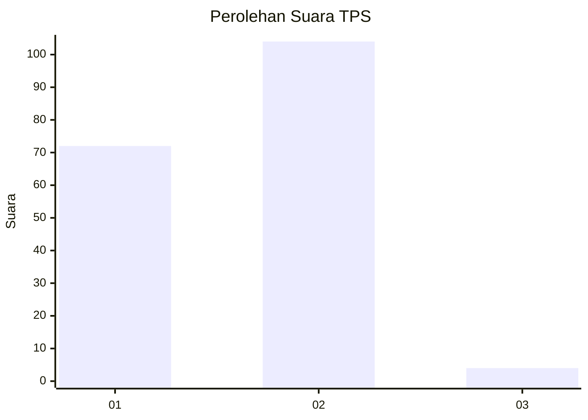
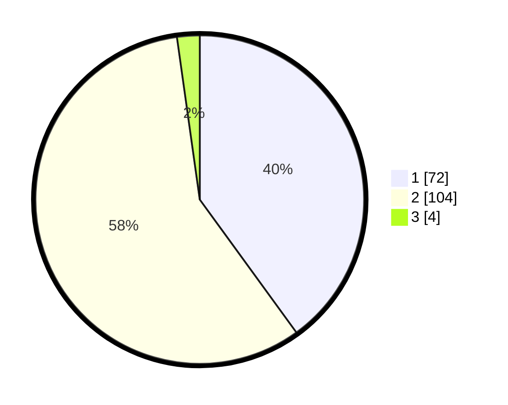

# Hasil

## Grafik

## Tabel

| No. | Nama Paslon    | Suara | Suara (raw) | Persentase |
|:--- |:-------------- | -----:| -----------:| ----------:|
| 1   | ANIES MUHAIMIN | 72    | [72][p-1]   | 40,00      |
| 2   | PRABOWO GIBRAN | 104   | [104][p-2]  | 57,78      |
| 3   | GANJAR MAHFUD  | 4     | [4][p-3]    | 2,22       |

[p-1]: https://github.com/gigit-pemilu/pemilu-2024/blob/main/pilpres/hitung-suara/sub/35-jawa-timur/sub/11-bondowoso/sub/01-maesan/sub/2001-sucolor/sub/008-tps/sub/paslon-1.txt
[p-2]: https://github.com/gigit-pemilu/pemilu-2024/blob/main/pilpres/hitung-suara/sub/35-jawa-timur/sub/11-bondowoso/sub/01-maesan/sub/2001-sucolor/sub/008-tps/sub/paslon-2.txt
[p-3]: https://github.com/gigit-pemilu/pemilu-2024/blob/main/pilpres/hitung-suara/sub/35-jawa-timur/sub/11-bondowoso/sub/01-maesan/sub/2001-sucolor/sub/008-tps/sub/paslon-3.txt

## Foto C Plano

https://sirekap-obj-formc.kpu.go.id/2a88/pemilu/ppwp/35/11/01/20/01/3511012001008-20240214-222641--2687bb29-bdff-41f8-b74d-984a457df0bf.jpg

https://sirekap-obj-formc.kpu.go.id/2a88/pemilu/ppwp/35/11/01/20/01/3511012001008-20240214-202908--cf3378ef-e637-464a-80c3-cc0af5b08f19.jpg

https://sirekap-obj-formc.kpu.go.id/2a88/pemilu/ppwp/35/11/01/20/01/3511012001008-20240214-222650--040771ec-43db-4d79-a860-a0ce6402cbaa.jpg

## Metadata

| Key        | Value               |
| ---------- | ------------------- |
| Time Stamp | 2024-02-19 21:00:00 |

