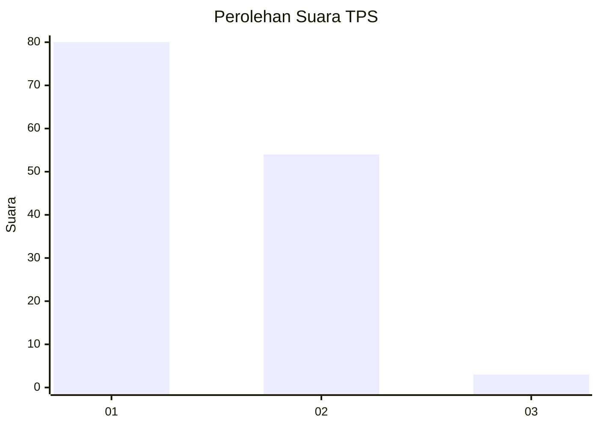
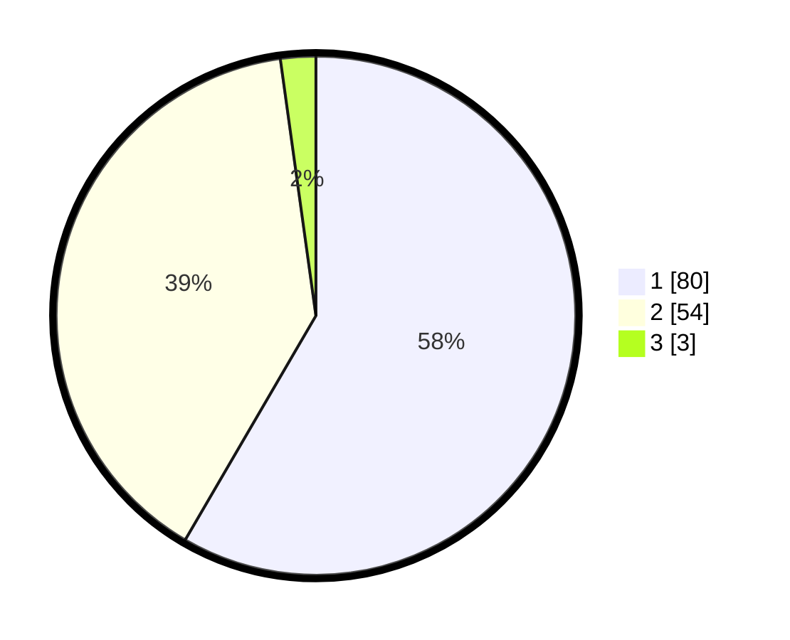

# Hasil

## Grafik

## Tabel

| No. | Nama Paslon    | Suara | Suara (raw) | Persentase |
|:--- |:-------------- | -----:| -----------:| ----------:|
| 1   | ANIES MUHAIMIN | 80    | [80][p-1]   | 58,39      |
| 2   | PRABOWO GIBRAN | 54    | [54][p-2]   | 39,42      |
| 3   | GANJAR MAHFUD  | 3     | [3][p-3]    | 2,19       |

[p-1]: https://github.com/gigit-pemilu/pemilu-2024/blob/main/pilpres/hitung-suara/sub/35-jawa-timur/sub/11-bondowoso/sub/01-maesan/sub/2001-sucolor/sub/009-tps/sub/paslon-1.txt
[p-2]: https://github.com/gigit-pemilu/pemilu-2024/blob/main/pilpres/hitung-suara/sub/35-jawa-timur/sub/11-bondowoso/sub/01-maesan/sub/2001-sucolor/sub/009-tps/sub/paslon-2.txt
[p-3]: https://github.com/gigit-pemilu/pemilu-2024/blob/main/pilpres/hitung-suara/sub/35-jawa-timur/sub/11-bondowoso/sub/01-maesan/sub/2001-sucolor/sub/009-tps/sub/paslon-3.txt

## Foto C Plano

https://sirekap-obj-formc.kpu.go.id/9a7d/pemilu/ppwp/35/11/01/20/01/3511012001009-20240215-020140--f3b1b56f-3ff6-453e-8253-278fbdead7aa.jpg

https://sirekap-obj-formc.kpu.go.id/9a7d/pemilu/ppwp/35/11/01/20/01/3511012001009-20240216-174042--a88410d4-83a6-45c4-80aa-edde1c73f6c9.jpg

https://sirekap-obj-formc.kpu.go.id/9a7d/pemilu/ppwp/35/11/01/20/01/3511012001009-20240216-174201--5d10101f-ca86-4f1e-bda7-1b9d5ae0de06.jpg

## Metadata

| Key        | Value               |
| ---------- | ------------------- |
| Time Stamp | 2024-02-16 21:01:00 |

## DATA PEMILIH TETAP

Jumlah pemilih dalam DPT: **191**.
 * L: **84**.
 * P: **107**.

## DATA PENGGUNA HAK PILIH

Jumlah pengguna hak pilih dalam DPT: **150**.
 * L: **69**.
 * P: **81**.

Jumlah pengguna hak pilih dalam DPTb: **0**.
 * L: **0**.
 * P: **0**.

Jumlah pengguna hak pilih dalam DPK: **0**.
 * L: **0**.
 * P: **0**.

Jumlah pengguna hak pilih: **150**.
 * L: **69**.
 * P: **81**.

## JUMLAH SUARA SAH DAN TIDAK SAH

JUMLAH SELURUH SUARA SAH: **137**.

JUMLAH SUARA TIDAK SAH: **13**.

JUMLAH SELURUH SUARA SAH DAN SUARA TIDAK SAH: **150**.

