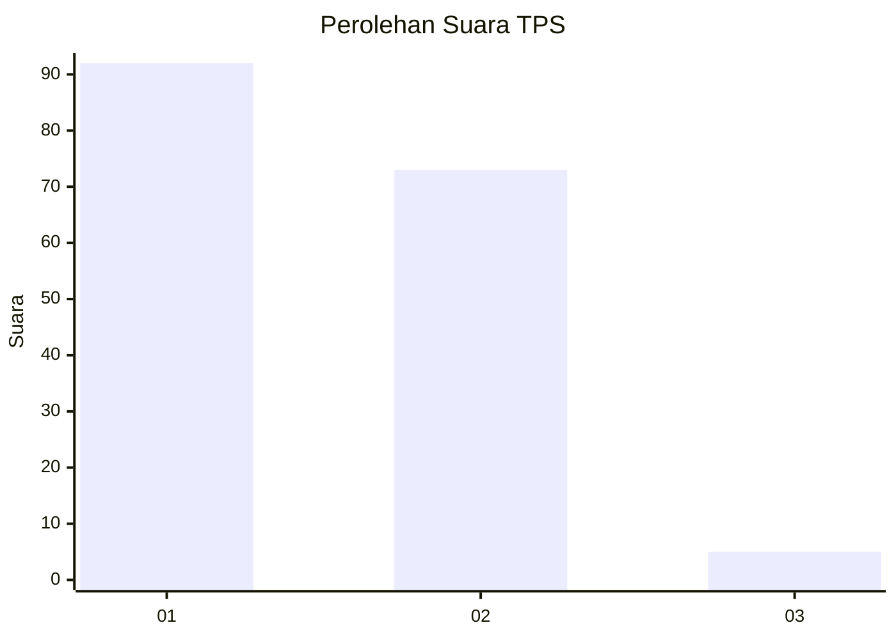
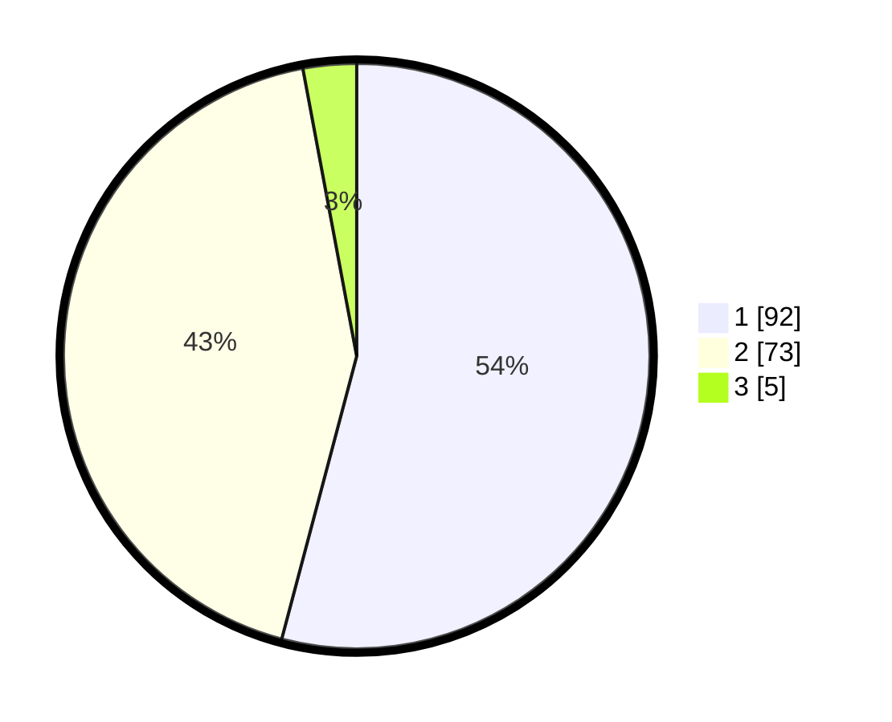

# Hasil

## Grafik

## Tabel

| No. | Nama Paslon    | Suara | Suara (raw) | Persentase |
|:--- |:-------------- | -----:| -----------:| ----------:|
| 1   | ANIES MUHAIMIN | 92    | [92][p-1]   | 54,12      |
| 2   | PRABOWO GIBRAN | 73    | [73][p-2]   | 42,94      |
| 3   | GANJAR MAHFUD  | 5     | [5][p-3]    | 2,94       |

[p-1]: https://github.com/gigit-pemilu/pemilu-2024-35-jawa-timur/blob/main/pilpres/hitung-suara/sub/35-jawa-timur/sub/11-bondowoso/sub/01-maesan/sub/2001-sucolor/sub/010-tps/sub/paslon-1.txt
[p-2]: https://github.com/gigit-pemilu/pemilu-2024-35-jawa-timur/blob/main/pilpres/hitung-suara/sub/35-jawa-timur/sub/11-bondowoso/sub/01-maesan/sub/2001-sucolor/sub/010-tps/sub/paslon-2.txt
[p-3]: https://github.com/gigit-pemilu/pemilu-2024-35-jawa-timur/blob/main/pilpres/hitung-suara/sub/35-jawa-timur/sub/11-bondowoso/sub/01-maesan/sub/2001-sucolor/sub/010-tps/sub/paslon-3.txt

## Foto C Plano

https://sirekap-obj-formc.kpu.go.id/7081/pemilu/ppwp/35/11/01/20/01/3511012001010-20240214-193116--cd336d8f-5309-402b-bfcd-bfb9cbdd27d9.jpg

https://sirekap-obj-formc.kpu.go.id/7081/pemilu/ppwp/35/11/01/20/01/3511012001010-20240214-193829--3a66def9-5001-46ff-983b-17e21d75ebbc.jpg

https://sirekap-obj-formc.kpu.go.id/7081/pemilu/ppwp/35/11/01/20/01/3511012001010-20240214-193212--39935f03-d8f3-49a0-be48-b1a70d46f3f0.jpg

## Metadata

| Key        | Value               |
| ---------- | ------------------- |
| Time Stamp | 2024-02-16 16:25:10 |

