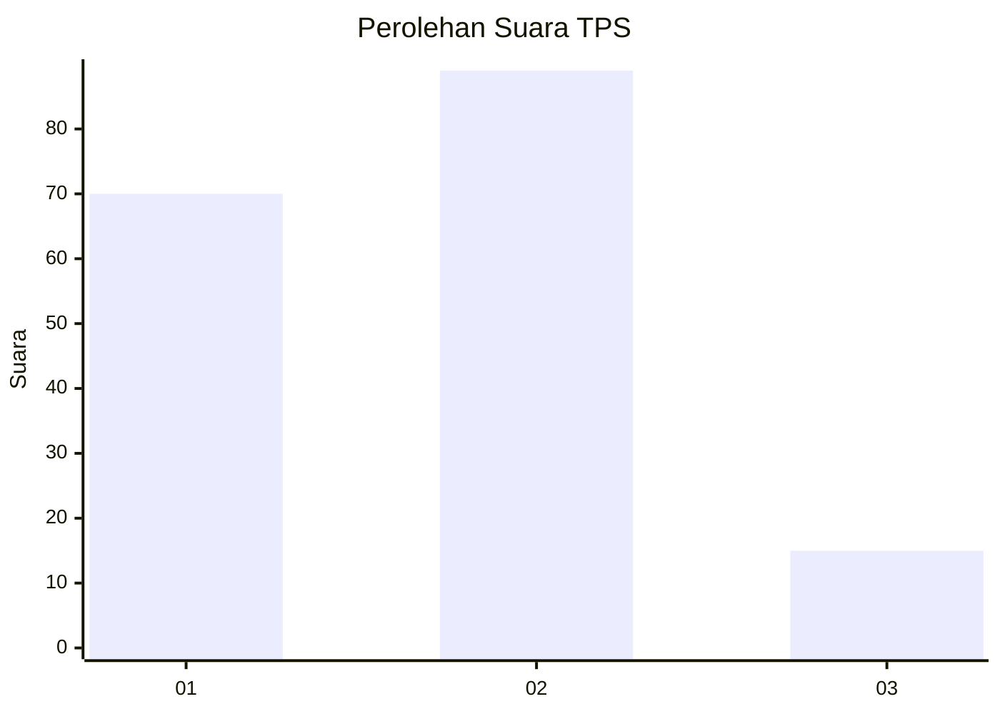

# Hasil

## Grafik

## Tabel

| No. | Nama Paslon    | Suara | Suara (raw) | Persentase |
|:--- |:-------------- | -----:| -----------:| ----------:|
| 1   | ANIES MUHAIMIN | 70    | [70][p-1]   | 40,23      |
| 2   | PRABOWO GIBRAN | 89    | [89][p-2]   | 51,15      |
| 3   | GANJAR MAHFUD  | 15    | [15][p-3]   | 8,62       |

[p-1]: https://github.com/gigit-pemilu/pemilu-2024-35-jawa-timur/blob/main/pilpres/hitung-suara/sub/35-jawa-timur/sub/11-bondowoso/sub/01-maesan/sub/2001-sucolor/sub/012-tps/sub/paslon-1.txt
[p-2]: https://github.com/gigit-pemilu/pemilu-2024-35-jawa-timur/blob/main/pilpres/hitung-suara/sub/35-jawa-timur/sub/11-bondowoso/sub/01-maesan/sub/2001-sucolor/sub/012-tps/sub/paslon-2.txt
[p-3]: https://github.com/gigit-pemilu/pemilu-2024-35-jawa-timur/blob/main/pilpres/hitung-suara/sub/35-jawa-timur/sub/11-bondowoso/sub/01-maesan/sub/2001-sucolor/sub/012-tps/sub/paslon-3.txt

## Foto C Plano

https://sirekap-obj-formc.kpu.go.id/c4d6/pemilu/ppwp/35/11/01/20/01/3511012001012-20240214-231713--4e09adf2-de69-4e78-bf8b-e2dd4439ba88.jpg

https://sirekap-obj-formc.kpu.go.id/c4d6/pemilu/ppwp/35/11/01/20/01/3511012001012-20240214-232701--59e9abf2-1f4f-4c3b-87ef-f89bf3c894b9.jpg

https://sirekap-obj-formc.kpu.go.id/c4d6/pemilu/ppwp/35/11/01/20/01/3511012001012-20240214-232744--58a54934-2af4-40e6-9b2d-2eb26779c615.jpg

## Metadata

| Key        | Value               |
| ---------- | ------------------- |
| Time Stamp | 2024-02-16 00:30:27 |

