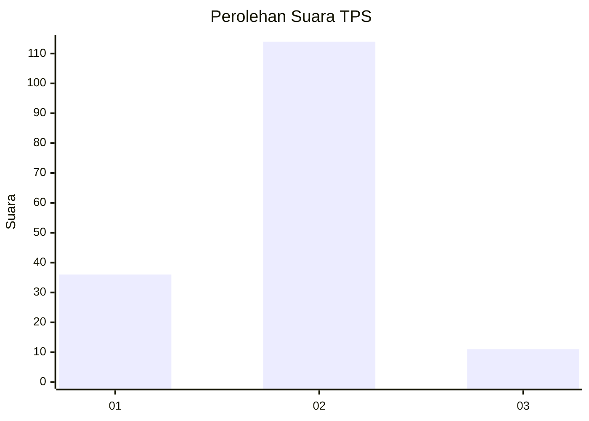
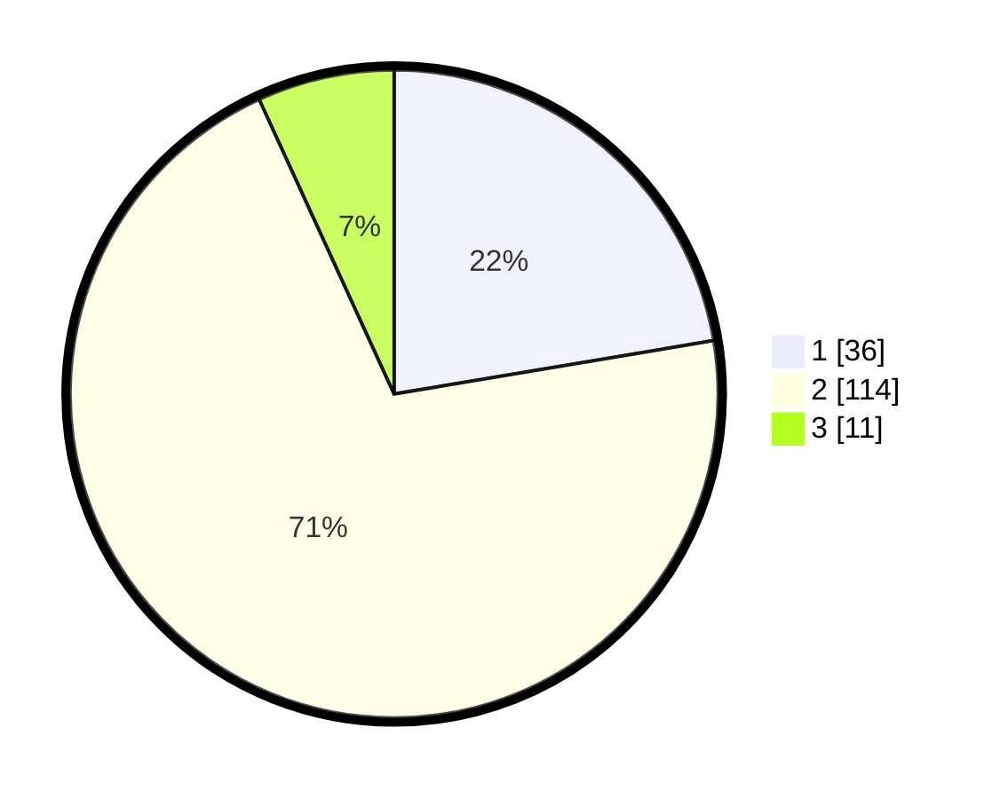

# Hasil

## Grafik

## Tabel

| No. | Nama Paslon    | Suara | Suara (raw) | Persentase |
|:--- |:-------------- | -----:| -----------:| ----------:|
| 1   | ANIES MUHAIMIN | 36    | [36][p-1]   | 22,36      |
| 2   | PRABOWO GIBRAN | 114   | [114][p-2]  | 70,81      |
| 3   | GANJAR MAHFUD  | 11    | [11][p-3]   | 6,83       |

[p-1]: https://github.com/gigit-pemilu/pemilu-2024-35-jawa-timur/blob/main/pilpres/hitung-suara/sub/35-jawa-timur/sub/11-bondowoso/sub/01-maesan/sub/2001-sucolor/sub/019-tps/sub/paslon-1.txt
[p-2]: https://github.com/gigit-pemilu/pemilu-2024-35-jawa-timur/blob/main/pilpres/hitung-suara/sub/35-jawa-timur/sub/11-bondowoso/sub/01-maesan/sub/2001-sucolor/sub/019-tps/sub/paslon-2.txt
[p-3]: https://github.com/gigit-pemilu/pemilu-2024-35-jawa-timur/blob/main/pilpres/hitung-suara/sub/35-jawa-timur/sub/11-bondowoso/sub/01-maesan/sub/2001-sucolor/sub/019-tps/sub/paslon-3.txt

## Foto C Plano

https://sirekap-obj-formc.kpu.go.id/8a11/pemilu/ppwp/35/11/01/20/01/3511012001019-20240214-202831--02fbc5bd-8a65-4899-b431-f0fdd0455c0d.jpg

https://sirekap-obj-formc.kpu.go.id/8a11/pemilu/ppwp/35/11/01/20/01/3511012001019-20240215-001846--2a662750-8ec8-45b7-baff-8c82ef8d8828.jpg

https://sirekap-obj-formc.kpu.go.id/8a11/pemilu/ppwp/35/11/01/20/01/3511012001019-20240215-001352--53d0e2c0-3b4b-4ca0-a68d-b0deaae97738.jpg

## Metadata

| Key        | Value               |
| ---------- | ------------------- |
| Time Stamp | 2024-02-15 15:00:29 |

