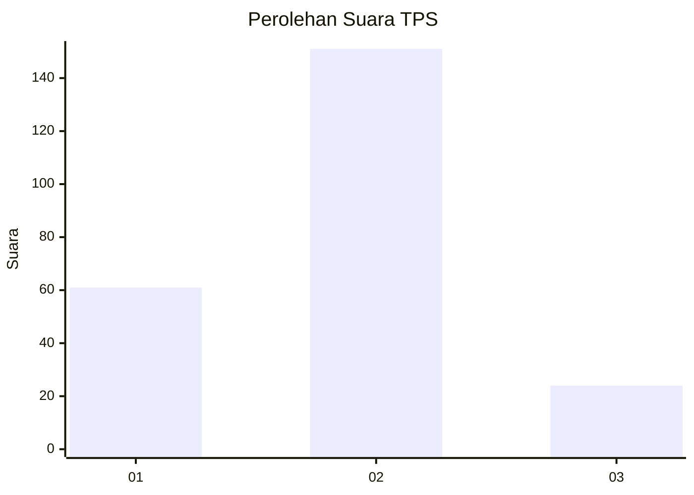
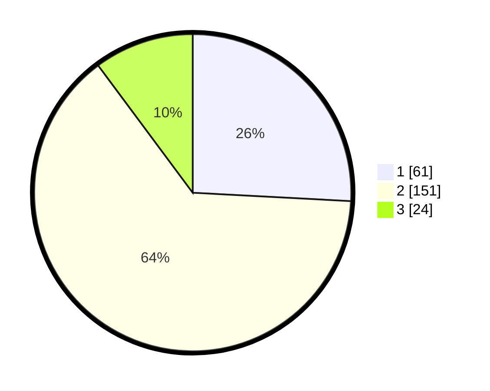

# Hasil

## Grafik

## Tabel

| No. | Nama Paslon    | Suara | Suara (raw) | Persentase |
|:--- |:-------------- | -----:| -----------:| ----------:|
| 1   | ANIES MUHAIMIN | 61    | [61][p-1]   | 25,85      |
| 2   | PRABOWO GIBRAN | 151   | [151][p-2]  | 63,98      |
| 3   | GANJAR MAHFUD  | 24    | [24][p-3]   | 10,17      |

[p-1]: https://github.com/gigit-pemilu/pemilu-2024/blob/main/pilpres/hitung-suara/sub/35-jawa-timur/sub/11-bondowoso/sub/01-maesan/sub/2002-pujer-baru/sub/005-tps/sub/paslon-1.txt
[p-2]: https://github.com/gigit-pemilu/pemilu-2024/blob/main/pilpres/hitung-suara/sub/35-jawa-timur/sub/11-bondowoso/sub/01-maesan/sub/2002-pujer-baru/sub/005-tps/sub/paslon-2.txt
[p-3]: https://github.com/gigit-pemilu/pemilu-2024/blob/main/pilpres/hitung-suara/sub/35-jawa-timur/sub/11-bondowoso/sub/01-maesan/sub/2002-pujer-baru/sub/005-tps/sub/paslon-3.txt

## Foto C Plano

https://sirekap-obj-formc.kpu.go.id/8754/pemilu/ppwp/35/11/01/20/02/3511012002005-20240215-210752--ccfa7e55-4a3d-46cf-af35-8d3856c8bb66.jpg

https://sirekap-obj-formc.kpu.go.id/8754/pemilu/ppwp/35/11/01/20/02/3511012002005-20240215-214240--681f395d-5dab-4711-bd7a-1dc6c5b31176.jpg

https://sirekap-obj-formc.kpu.go.id/8754/pemilu/ppwp/35/11/01/20/02/3511012002005-20240215-214358--37c5a894-5991-4d56-8a23-c394d402ea79.jpg

## Metadata

| Key        | Value               |
| ---------- | ------------------- |
| Time Stamp | 2024-02-24 22:31:28 |

