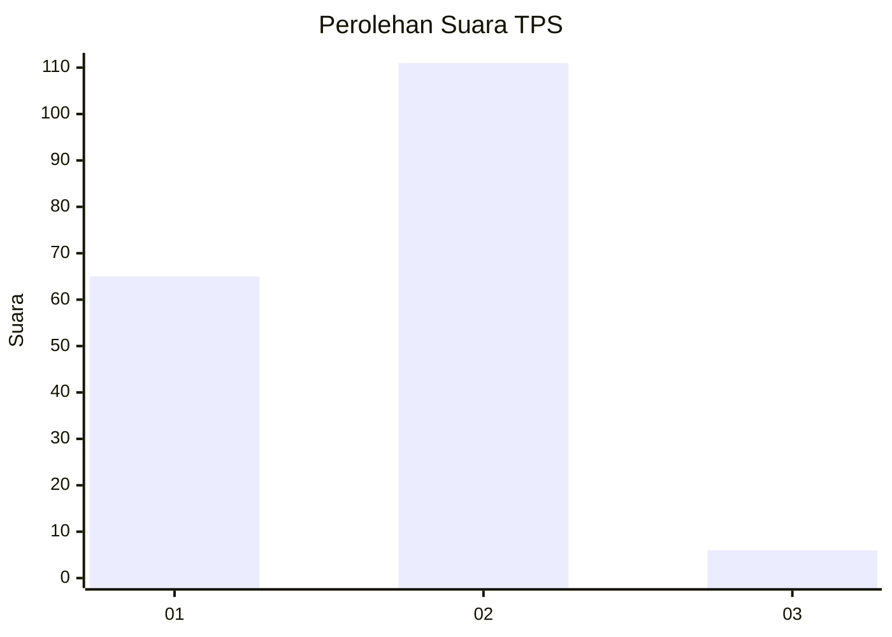
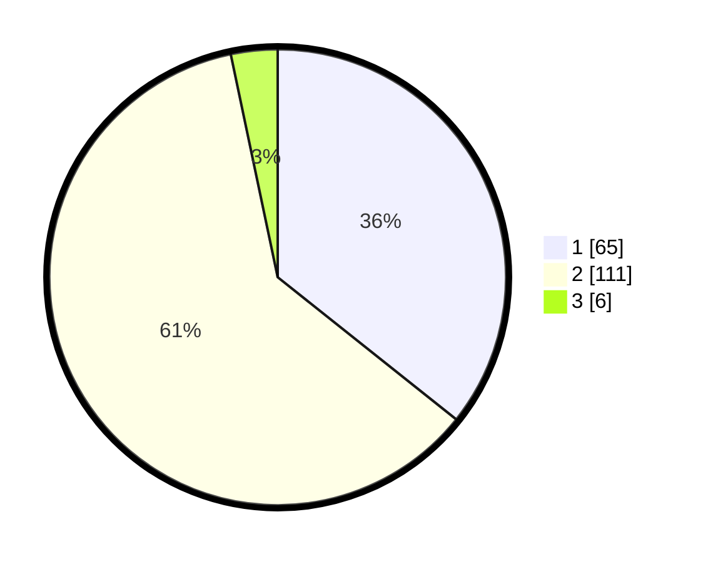

# Hasil

## Grafik

## Tabel

| No. | Nama Paslon    | Suara | Suara (raw) | Persentase |
|:--- |:-------------- | -----:| -----------:| ----------:|
| 1   | ANIES MUHAIMIN | 65    | [65][p-1]   | 35,71      |
| 2   | PRABOWO GIBRAN | 111   | [111][p-2]  | 60,99      |
| 3   | GANJAR MAHFUD  | 6     | [6][p-3]    | 3,30       |

[p-1]: https://github.com/gigit-pemilu/pemilu-2024-35-jawa-timur/blob/main/pilpres/hitung-suara/sub/35-jawa-timur/sub/11-bondowoso/sub/01-maesan/sub/2003-tanahwulan/sub/007-tps/sub/paslon-1.txt
[p-2]: https://github.com/gigit-pemilu/pemilu-2024-35-jawa-timur/blob/main/pilpres/hitung-suara/sub/35-jawa-timur/sub/11-bondowoso/sub/01-maesan/sub/2003-tanahwulan/sub/007-tps/sub/paslon-2.txt
[p-3]: https://github.com/gigit-pemilu/pemilu-2024-35-jawa-timur/blob/main/pilpres/hitung-suara/sub/35-jawa-timur/sub/11-bondowoso/sub/01-maesan/sub/2003-tanahwulan/sub/007-tps/sub/paslon-3.txt

## Foto C Plano

https://sirekap-obj-formc.kpu.go.id/7263/pemilu/ppwp/35/11/01/20/03/3511012003007-20240214-230835--de9bfccb-7d65-4d64-ba14-88d0f0838926.jpg

https://sirekap-obj-formc.kpu.go.id/7263/pemilu/ppwp/35/11/01/20/03/3511012003007-20240214-231122--42f8bebc-99b1-42ca-abb5-3678f5e01dc0.jpg

https://sirekap-obj-formc.kpu.go.id/7263/pemilu/ppwp/35/11/01/20/03/3511012003007-20240214-231334--0ab137c5-2779-44f7-8834-9036e97c0ee7.jpg

## Metadata

| Key        | Value               |
| ---------- | ------------------- |
| Time Stamp | 2024-02-19 22:00:00 |

