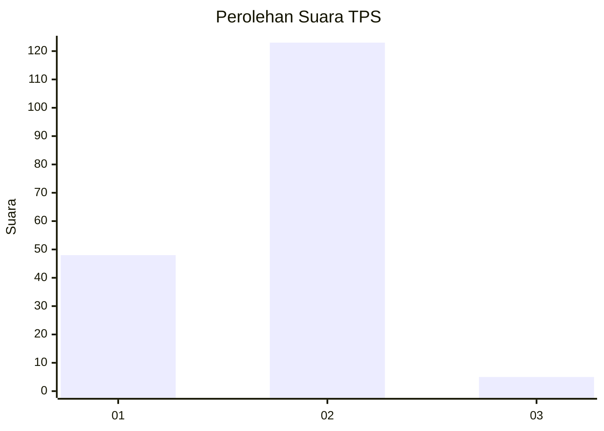
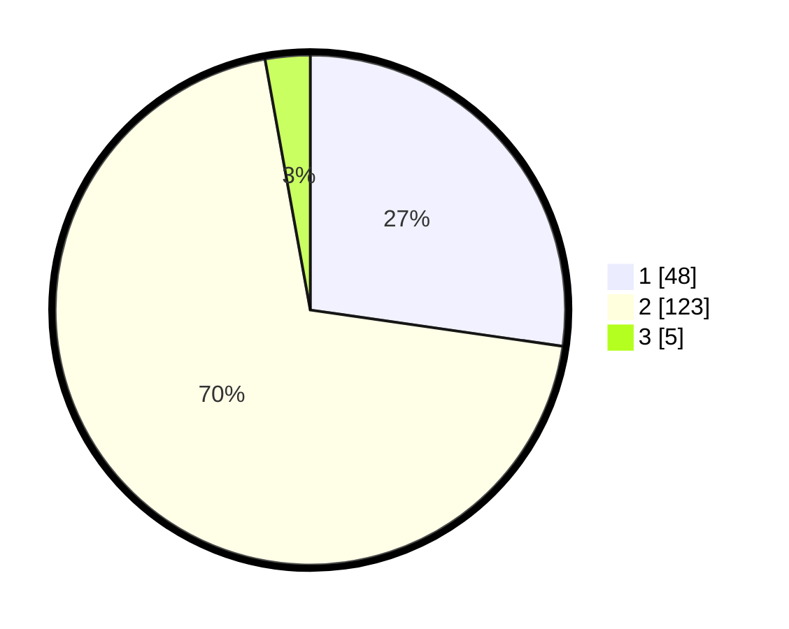

# Hasil

## Grafik

## Tabel

| No. | Nama Paslon    | Suara | Suara (raw) | Persentase |
|:--- |:-------------- | -----:| -----------:| ----------:|
| 1   | ANIES MUHAIMIN | 48    | [48][p-1]   | 27,27      |
| 2   | PRABOWO GIBRAN | 123   | [123][p-2]  | 69,89      |
| 3   | GANJAR MAHFUD  | 5     | [5][p-3]    | 2,84       |

[p-1]: https://github.com/gigit-pemilu/pemilu-2024/blob/main/pilpres/hitung-suara/sub/35-jawa-timur/sub/11-bondowoso/sub/01-maesan/sub/2003-tanahwulan/sub/012-tps/sub/paslon-1.txt
[p-2]: https://github.com/gigit-pemilu/pemilu-2024/blob/main/pilpres/hitung-suara/sub/35-jawa-timur/sub/11-bondowoso/sub/01-maesan/sub/2003-tanahwulan/sub/012-tps/sub/paslon-2.txt
[p-3]: https://github.com/gigit-pemilu/pemilu-2024/blob/main/pilpres/hitung-suara/sub/35-jawa-timur/sub/11-bondowoso/sub/01-maesan/sub/2003-tanahwulan/sub/012-tps/sub/paslon-3.txt

## Foto C Plano

https://sirekap-obj-formc.kpu.go.id/eda1/pemilu/ppwp/35/11/01/20/03/3511012003012-20240215-005836--8b87f528-272a-4059-9c04-f30c3d9cb0d8.jpg

https://sirekap-obj-formc.kpu.go.id/eda1/pemilu/ppwp/35/11/01/20/03/3511012003012-20240215-010018--66523bec-a39b-484d-8529-f7d5febe26ca.jpg

https://sirekap-obj-formc.kpu.go.id/eda1/pemilu/ppwp/35/11/01/20/03/3511012003012-20240215-010301--bec8fceb-9d69-48c5-92f4-cc052481f916.jpg

## Metadata

| Key        | Value               |
| ---------- | ------------------- |
| Time Stamp | 2024-02-16 16:25:10 |

