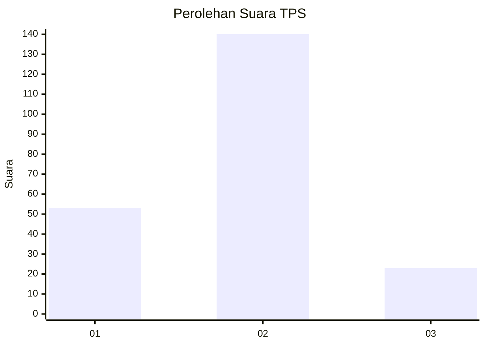
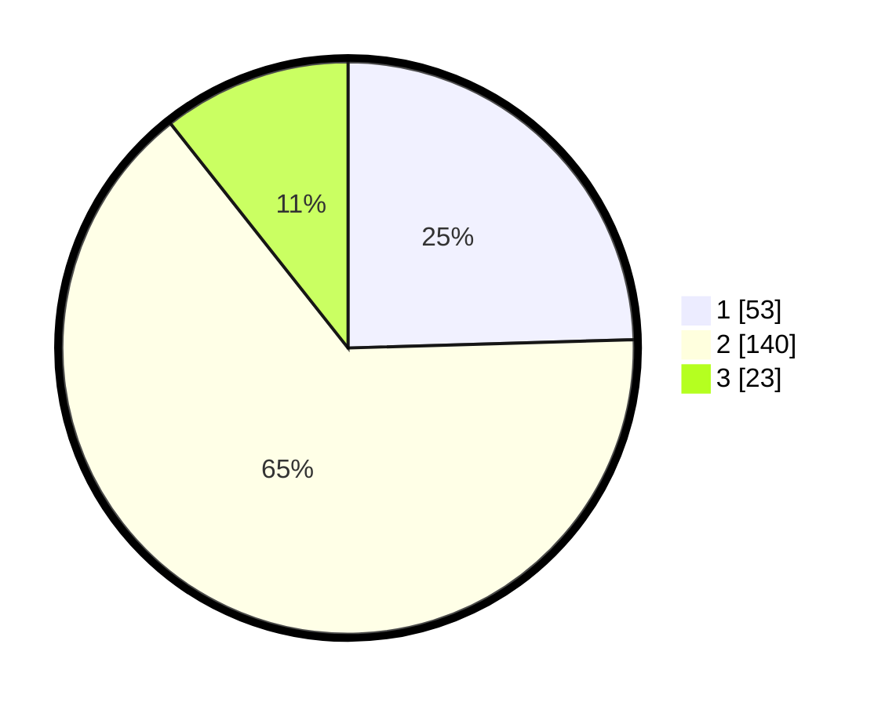

# Hasil

## Grafik

## Tabel

| No. | Nama Paslon    | Suara | Suara (raw) | Persentase |
|:--- |:-------------- | -----:| -----------:| ----------:|
| 1   | ANIES MUHAIMIN | 53    | [53][p-1]   | 24,54      |
| 2   | PRABOWO GIBRAN | 140   | [140][p-2]  | 64,81      |
| 3   | GANJAR MAHFUD  | 23    | [23][p-3]   | 10,65      |

[p-1]: https://github.com/gigit-pemilu/pemilu-2024/blob/main/pilpres/hitung-suara/sub/35-jawa-timur/sub/11-bondowoso/sub/01-maesan/sub/2007-sumber-pakem/sub/001-tps/sub/paslon-1.txt
[p-2]: https://github.com/gigit-pemilu/pemilu-2024/blob/main/pilpres/hitung-suara/sub/35-jawa-timur/sub/11-bondowoso/sub/01-maesan/sub/2007-sumber-pakem/sub/001-tps/sub/paslon-2.txt
[p-3]: https://github.com/gigit-pemilu/pemilu-2024/blob/main/pilpres/hitung-suara/sub/35-jawa-timur/sub/11-bondowoso/sub/01-maesan/sub/2007-sumber-pakem/sub/001-tps/sub/paslon-3.txt

## Foto C Plano

https://sirekap-obj-formc.kpu.go.id/e2dc/pemilu/ppwp/35/11/01/20/07/3511012007001-20240214-194826--009236b4-a111-49f6-a87c-7db8a29baa86.jpg

https://sirekap-obj-formc.kpu.go.id/e2dc/pemilu/ppwp/35/11/01/20/07/3511012007001-20240214-194830--4124a283-1927-4210-bfca-2ecfe21e03e7.jpg

https://sirekap-obj-formc.kpu.go.id/e2dc/pemilu/ppwp/35/11/01/20/07/3511012007001-20240214-194835--54d9ace5-a794-4913-8bf4-710e2b7c87f2.jpg

## Metadata

| Key        | Value               |
| ---------- | ------------------- |
| Time Stamp | 2024-02-24 22:31:28 |

