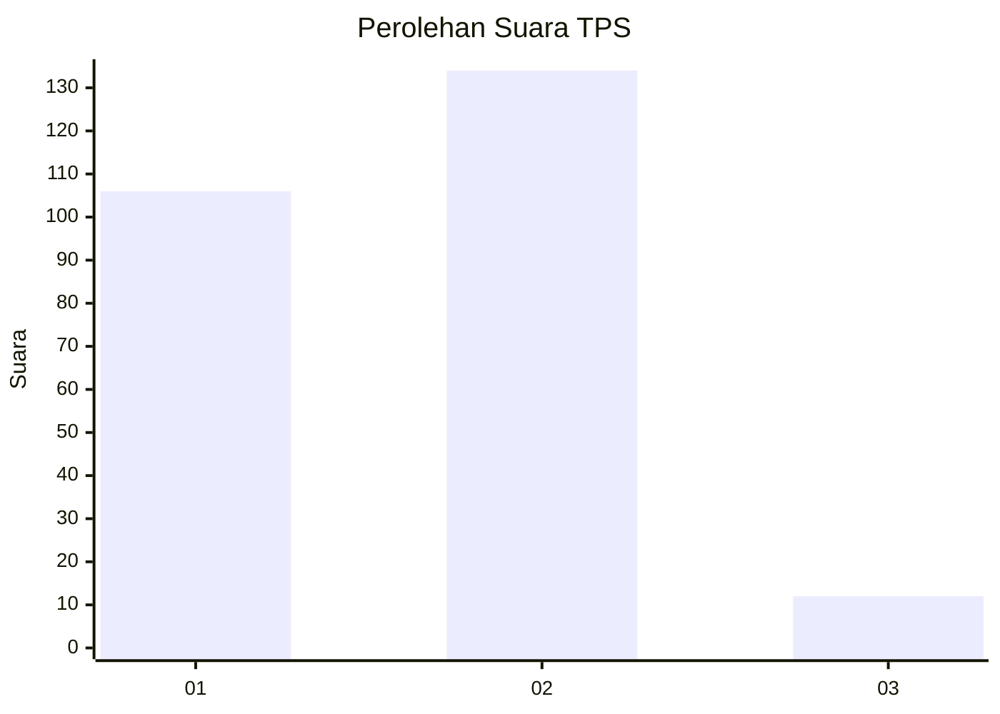
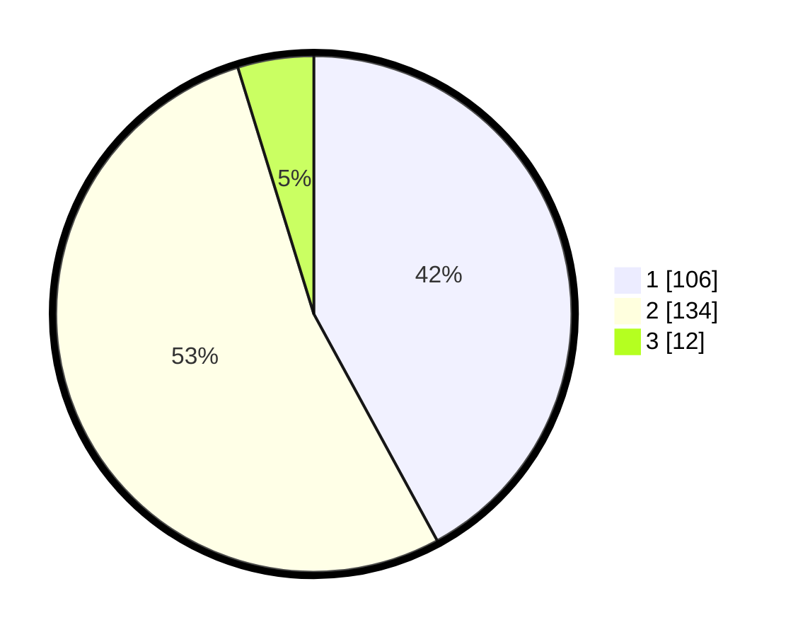

# Hasil

## Grafik

## Tabel

| No. | Nama Paslon    | Suara | Suara (raw) | Persentase |
|:--- |:-------------- | -----:| -----------:| ----------:|
| 1   | ANIES MUHAIMIN | 106   | [106][p-1]  | 42,06      |
| 2   | PRABOWO GIBRAN | 134   | [134][p-2]  | 53,17      |
| 3   | GANJAR MAHFUD  | 12    | [12][p-3]   | 4,76       |

[p-1]: https://github.com/gigit-pemilu/pemilu-2024/blob/main/pilpres/hitung-suara/sub/35-jawa-timur/sub/11-bondowoso/sub/01-maesan/sub/2007-sumber-pakem/sub/004-tps/sub/paslon-1.txt
[p-2]: https://github.com/gigit-pemilu/pemilu-2024/blob/main/pilpres/hitung-suara/sub/35-jawa-timur/sub/11-bondowoso/sub/01-maesan/sub/2007-sumber-pakem/sub/004-tps/sub/paslon-2.txt
[p-3]: https://github.com/gigit-pemilu/pemilu-2024/blob/main/pilpres/hitung-suara/sub/35-jawa-timur/sub/11-bondowoso/sub/01-maesan/sub/2007-sumber-pakem/sub/004-tps/sub/paslon-3.txt

## Foto C Plano

https://sirekap-obj-formc.kpu.go.id/af8b/pemilu/ppwp/35/11/01/20/07/3511012007004-20240215-033252--22c2a596-f712-4d10-9ca2-5d56ab1b4797.jpg

https://sirekap-obj-formc.kpu.go.id/af8b/pemilu/ppwp/35/11/01/20/07/3511012007004-20240215-033359--b909dc1b-2fe4-4125-aefb-f26cb9cbbcae.jpg

https://sirekap-obj-formc.kpu.go.id/af8b/pemilu/ppwp/35/11/01/20/07/3511012007004-20240215-033519--3cb09262-dc94-46e9-bb93-37d30fbaf4d1.jpg

## Metadata

| Key        | Value               |
| ---------- | ------------------- |
| Time Stamp | 2024-02-16 09:30:28 |

