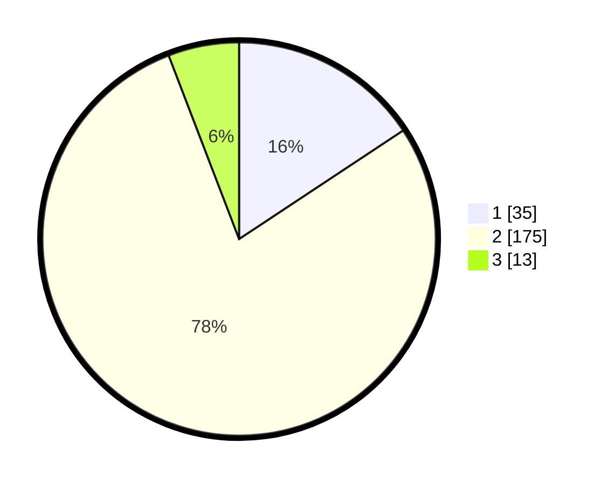

# Hasil

## Grafik

## Tabel

| No. | Nama Paslon    | Suara | Suara (raw) | Persentase |
|:--- |:-------------- | -----:| -----------:| ----------:|
| 1   | ANIES MUHAIMIN | 35    | [35][p-1]   | 15,70      |
| 2   | PRABOWO GIBRAN | 175   | [175][p-2]  | 78,48      |
| 3   | GANJAR MAHFUD  | 13    | [13][p-3]   | 5,83       |

[p-1]: https://github.com/gigit-pemilu/pemilu-2024-35-jawa-timur/blob/main/pilpres/hitung-suara/sub/35-jawa-timur/sub/11-bondowoso/sub/01-maesan/sub/2007-sumber-pakem/sub/005-tps/sub/paslon-1.txt
[p-2]: https://github.com/gigit-pemilu/pemilu-2024-35-jawa-timur/blob/main/pilpres/hitung-suara/sub/35-jawa-timur/sub/11-bondowoso/sub/01-maesan/sub/2007-sumber-pakem/sub/005-tps/sub/paslon-2.txt
[p-3]: https://github.com/gigit-pemilu/pemilu-2024-35-jawa-timur/blob/main/pilpres/hitung-suara/sub/35-jawa-timur/sub/11-bondowoso/sub/01-maesan/sub/2007-sumber-pakem/sub/005-tps/sub/paslon-3.txt

## Foto C Plano

https://sirekap-obj-formc.kpu.go.id/7da5/pemilu/ppwp/35/11/01/20/07/3511012007005-20240215-032317--d789739f-8031-4d03-bddf-7a1a3717d826.jpg

https://sirekap-obj-formc.kpu.go.id/7da5/pemilu/ppwp/35/11/01/20/07/3511012007005-20240215-033002--a101ba06-04fe-4d80-9083-bd4e610fec71.jpg

https://sirekap-obj-formc.kpu.go.id/7da5/pemilu/ppwp/35/11/01/20/07/3511012007005-20240215-032707--594ee1dd-7b63-4388-a38a-ea5a6ab25e74.jpg

## Metadata

| Key        | Value               |
| ---------- | ------------------- |
| Time Stamp | 2024-02-16 09:30:28 |

