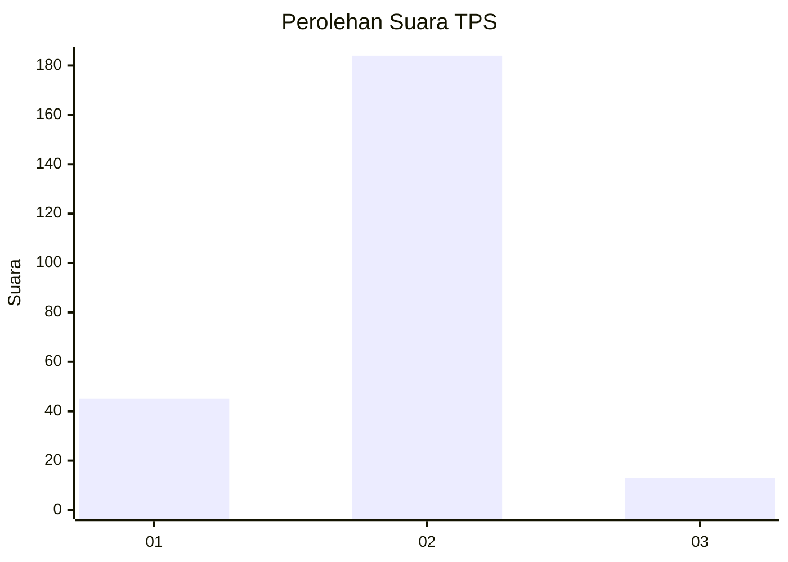
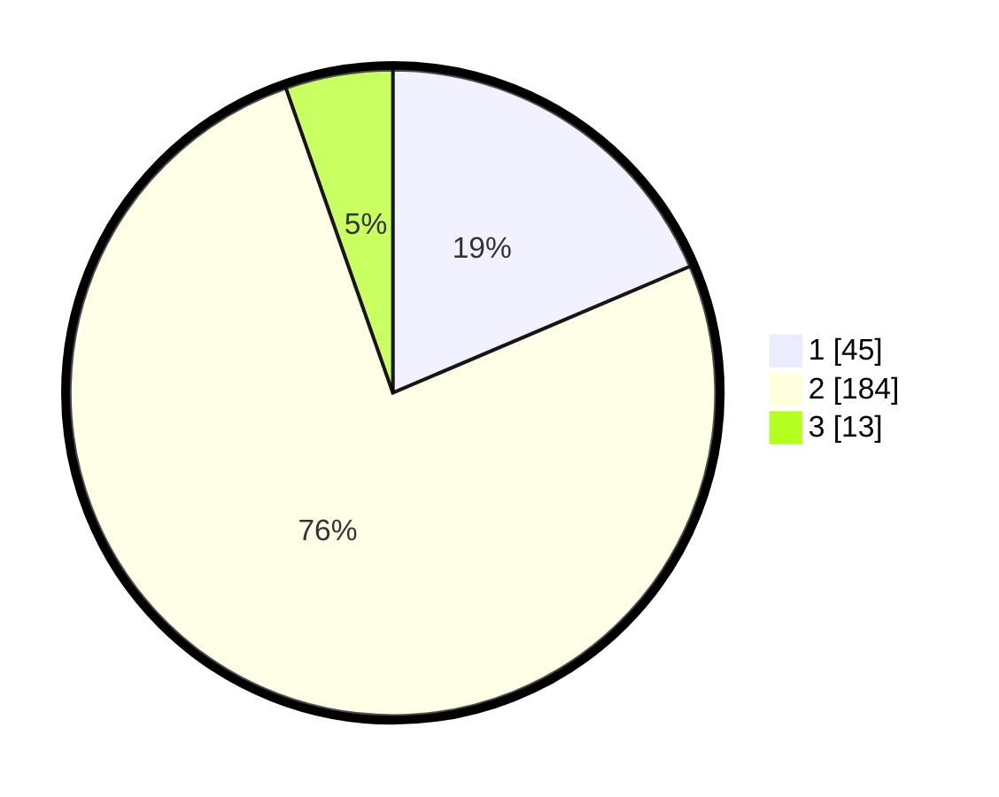

# Hasil

## Grafik

## Tabel

| No. | Nama Paslon    | Suara | Suara (raw) | Persentase |
|:--- |:-------------- | -----:| -----------:| ----------:|
| 1   | ANIES MUHAIMIN | 45    | [45][p-1]   | 18,60      |
| 2   | PRABOWO GIBRAN | 184   | [184][p-2]  | 76,03      |
| 3   | GANJAR MAHFUD  | 13    | [13][p-3]   | 5,37       |

[p-1]: https://github.com/gigit-pemilu/pemilu-2024/blob/main/pilpres/hitung-suara/sub/35-jawa-timur/sub/11-bondowoso/sub/01-maesan/sub/2007-sumber-pakem/sub/007-tps/sub/paslon-1.txt
[p-2]: https://github.com/gigit-pemilu/pemilu-2024/blob/main/pilpres/hitung-suara/sub/35-jawa-timur/sub/11-bondowoso/sub/01-maesan/sub/2007-sumber-pakem/sub/007-tps/sub/paslon-2.txt
[p-3]: https://github.com/gigit-pemilu/pemilu-2024/blob/main/pilpres/hitung-suara/sub/35-jawa-timur/sub/11-bondowoso/sub/01-maesan/sub/2007-sumber-pakem/sub/007-tps/sub/paslon-3.txt

## Foto C Plano

https://sirekap-obj-formc.kpu.go.id/f528/pemilu/ppwp/35/11/01/20/07/3511012007007-20240215-035215--90cb5394-315a-4870-a03e-400ffbbbc0b8.jpg

https://sirekap-obj-formc.kpu.go.id/f528/pemilu/ppwp/35/11/01/20/07/3511012007007-20240215-035251--07fcd7ab-14cf-4189-8930-75796ec36235.jpg

https://sirekap-obj-formc.kpu.go.id/f528/pemilu/ppwp/35/11/01/20/07/3511012007007-20240215-035430--e92cd51e-c101-4e76-bd99-bd901cb2a252.jpg

## Metadata

| Key        | Value               |
| ---------- | ------------------- |
| Time Stamp | 2024-02-16 09:30:28 |

