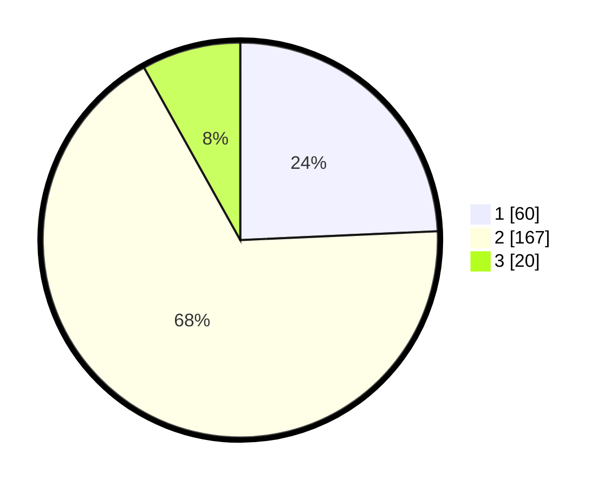

# Hasil

## Grafik

## Tabel

| No. | Nama Paslon    | Suara | Suara (raw) | Persentase |
|:--- |:-------------- | -----:| -----------:| ----------:|
| 1   | ANIES MUHAIMIN | 60    | [60][p-1]   | 24,29      |
| 2   | PRABOWO GIBRAN | 167   | [167][p-2]  | 67,61      |
| 3   | GANJAR MAHFUD  | 20    | [20][p-3]   | 8,10       |

[p-1]: https://github.com/gigit-pemilu/pemilu-2024/blob/main/pilpres/hitung-suara/sub/35-jawa-timur/sub/11-bondowoso/sub/01-maesan/sub/2007-sumber-pakem/sub/008-tps/sub/paslon-1.txt
[p-2]: https://github.com/gigit-pemilu/pemilu-2024/blob/main/pilpres/hitung-suara/sub/35-jawa-timur/sub/11-bondowoso/sub/01-maesan/sub/2007-sumber-pakem/sub/008-tps/sub/paslon-2.txt
[p-3]: https://github.com/gigit-pemilu/pemilu-2024/blob/main/pilpres/hitung-suara/sub/35-jawa-timur/sub/11-bondowoso/sub/01-maesan/sub/2007-sumber-pakem/sub/008-tps/sub/paslon-3.txt

## Foto C Plano

https://sirekap-obj-formc.kpu.go.id/a86d/pemilu/ppwp/35/11/01/20/07/3511012007008-20240218-054702--47b68832-db84-4962-801f-bdb5965c3dc2.jpg

https://sirekap-obj-formc.kpu.go.id/a86d/pemilu/ppwp/35/11/01/20/07/3511012007008-20240215-031853--8b9613b1-fb1f-4587-9b52-bd173d18f86a.jpg

https://sirekap-obj-formc.kpu.go.id/a86d/pemilu/ppwp/35/11/01/20/07/3511012007008-20240215-031935--ee9b806f-a0c7-4463-a75d-f162b311c63c.jpg

## Metadata

| Key        | Value               |
| ---------- | ------------------- |
| Time Stamp | 2024-02-19 06:16:00 |

