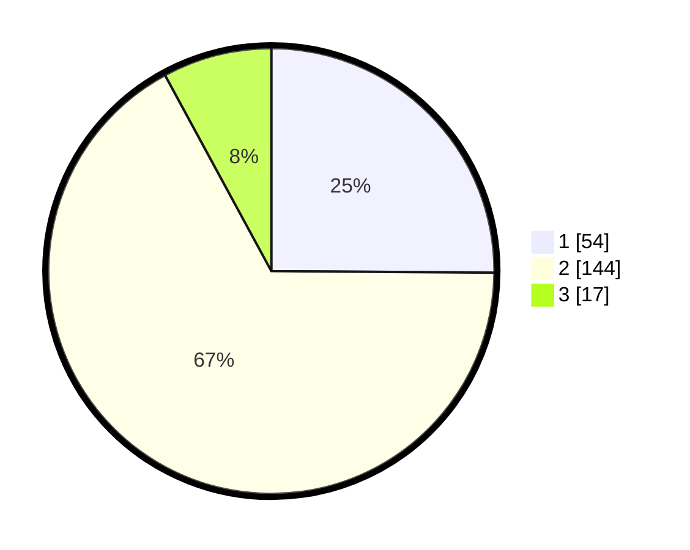

# Hasil

## Grafik

## Tabel

| No. | Nama Paslon    | Suara | Suara (raw) | Persentase |
|:--- |:-------------- | -----:| -----------:| ----------:|
| 1   | ANIES MUHAIMIN | 54    | [54][p-1]   | 25,12      |
| 2   | PRABOWO GIBRAN | 144   | [144][p-2]  | 66,98      |
| 3   | GANJAR MAHFUD  | 17    | [17][p-3]   | 7,91       |

[p-1]: https://github.com/gigit-pemilu/pemilu-2024/blob/main/pilpres/hitung-suara/sub/35-jawa-timur/sub/11-bondowoso/sub/01-maesan/sub/2008-sumbersari/sub/005-tps/sub/paslon-1.txt
[p-2]: https://github.com/gigit-pemilu/pemilu-2024/blob/main/pilpres/hitung-suara/sub/35-jawa-timur/sub/11-bondowoso/sub/01-maesan/sub/2008-sumbersari/sub/005-tps/sub/paslon-2.txt
[p-3]: https://github.com/gigit-pemilu/pemilu-2024/blob/main/pilpres/hitung-suara/sub/35-jawa-timur/sub/11-bondowoso/sub/01-maesan/sub/2008-sumbersari/sub/005-tps/sub/paslon-3.txt

## Foto C Plano

https://sirekap-obj-formc.kpu.go.id/d86e/pemilu/ppwp/35/11/01/20/08/3511012008005-20240214-222216--623bce56-5be3-4f66-8330-c916ec930241.jpg

https://sirekap-obj-formc.kpu.go.id/d86e/pemilu/ppwp/35/11/01/20/08/3511012008005-20240214-220835--2bf3fae3-22d5-44d6-862e-9d9bf6187fab.jpg

https://sirekap-obj-formc.kpu.go.id/d86e/pemilu/ppwp/35/11/01/20/08/3511012008005-20240214-220952--b82dddbc-4f4f-4107-854a-25070c6e714d.jpg

## Metadata

| Key        | Value               |
| ---------- | ------------------- |
| Time Stamp | 2024-02-24 22:31:28 |

