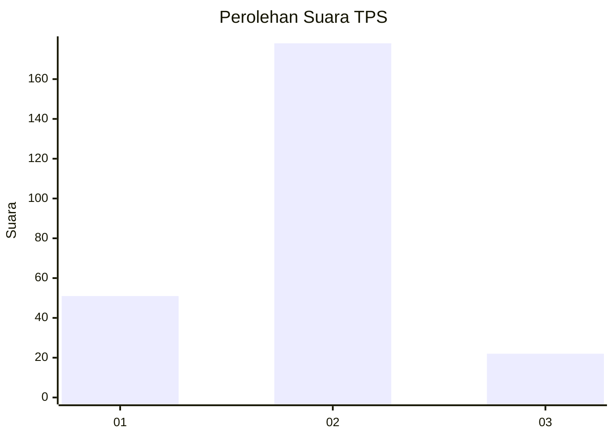

# Hasil

## Grafik

## Tabel

| No. | Nama Paslon    | Suara | Suara (raw) | Persentase |
|:--- |:-------------- | -----:| -----------:| ----------:|
| 1   | ANIES MUHAIMIN | 51    | [51][p-1]   | 20,32      |
| 2   | PRABOWO GIBRAN | 178   | [178][p-2]  | 70,92      |
| 3   | GANJAR MAHFUD  | 22    | [22][p-3]   | 8,76       |

[p-1]: https://github.com/gigit-pemilu/pemilu-2024/blob/main/pilpres/hitung-suara/sub/35-jawa-timur/sub/11-bondowoso/sub/01-maesan/sub/2008-sumbersari/sub/008-tps/sub/paslon-1.txt
[p-2]: https://github.com/gigit-pemilu/pemilu-2024/blob/main/pilpres/hitung-suara/sub/35-jawa-timur/sub/11-bondowoso/sub/01-maesan/sub/2008-sumbersari/sub/008-tps/sub/paslon-2.txt
[p-3]: https://github.com/gigit-pemilu/pemilu-2024/blob/main/pilpres/hitung-suara/sub/35-jawa-timur/sub/11-bondowoso/sub/01-maesan/sub/2008-sumbersari/sub/008-tps/sub/paslon-3.txt

## Foto C Plano

https://sirekap-obj-formc.kpu.go.id/d57f/pemilu/ppwp/35/11/01/20/08/3511012008008-20240214-210637--22cda818-a61c-461a-bbb7-b4d2df3ed531.jpg

https://sirekap-obj-formc.kpu.go.id/d57f/pemilu/ppwp/35/11/01/20/08/3511012008008-20240214-210650--eed6e6cd-b129-4c32-99fe-384e6e4b9c7f.jpg

https://sirekap-obj-formc.kpu.go.id/d57f/pemilu/ppwp/35/11/01/20/08/3511012008008-20240214-192814--85790d99-e864-4f7d-89fa-67c02bc94151.jpg

## Metadata

| Key        | Value               |
| ---------- | ------------------- |
| Time Stamp | 2024-02-16 16:25:10 |

