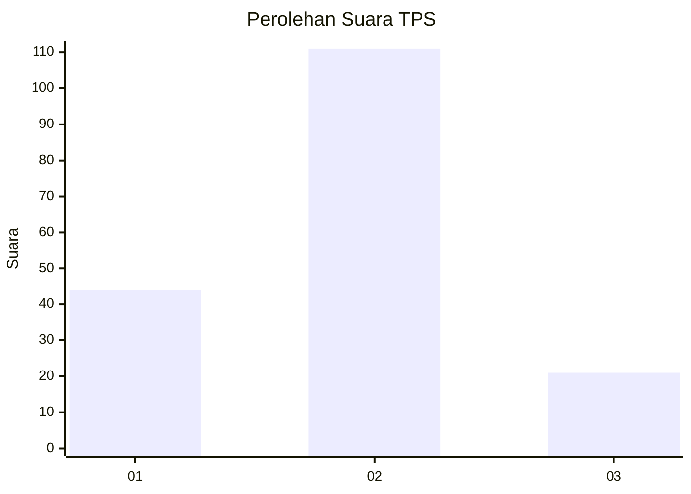
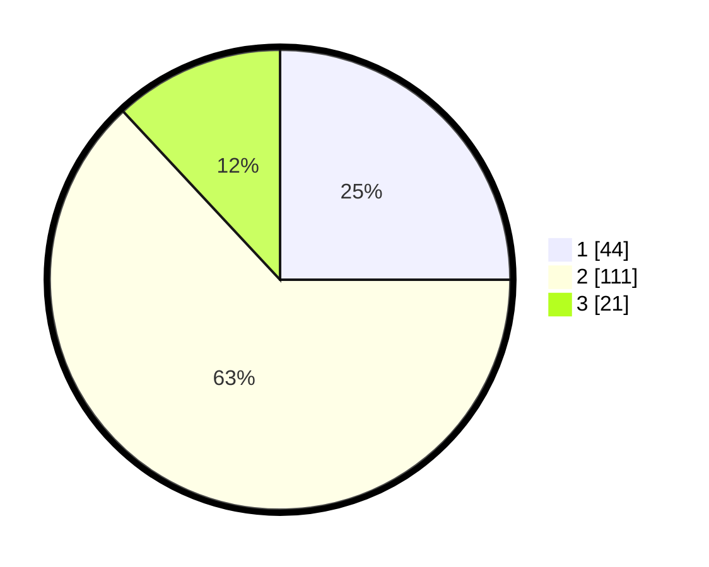

# Hasil

## Grafik

## Tabel

| No. | Nama Paslon    | Suara | Suara (raw) | Persentase |
|:--- |:-------------- | -----:| -----------:| ----------:|
| 1   | ANIES MUHAIMIN | 44    | [44][p-1]   | 25,00      |
| 2   | PRABOWO GIBRAN | 111   | [111][p-2]  | 63,07      |
| 3   | GANJAR MAHFUD  | 21    | [21][p-3]   | 11,93      |

[p-1]: https://github.com/gigit-pemilu/pemilu-2024-35-jawa-timur/blob/main/pilpres/hitung-suara/sub/35-jawa-timur/sub/11-bondowoso/sub/01-maesan/sub/2008-sumbersari/sub/010-tps/sub/paslon-1.txt
[p-2]: https://github.com/gigit-pemilu/pemilu-2024-35-jawa-timur/blob/main/pilpres/hitung-suara/sub/35-jawa-timur/sub/11-bondowoso/sub/01-maesan/sub/2008-sumbersari/sub/010-tps/sub/paslon-2.txt
[p-3]: https://github.com/gigit-pemilu/pemilu-2024-35-jawa-timur/blob/main/pilpres/hitung-suara/sub/35-jawa-timur/sub/11-bondowoso/sub/01-maesan/sub/2008-sumbersari/sub/010-tps/sub/paslon-3.txt

## Foto C Plano

https://sirekap-obj-formc.kpu.go.id/53b9/pemilu/ppwp/35/11/01/20/08/3511012008010-20240214-225028--8c988862-59c8-4609-b031-4f74d54001eb.jpg

https://sirekap-obj-formc.kpu.go.id/53b9/pemilu/ppwp/35/11/01/20/08/3511012008010-20240214-225127--c18809c9-0e47-4d85-83c8-1fe016a25114.jpg

https://sirekap-obj-formc.kpu.go.id/53b9/pemilu/ppwp/35/11/01/20/08/3511012008010-20240214-225245--261cc7b9-21f0-4a70-b7cb-bc1d98f30c41.jpg

## Metadata

| Key        | Value               |
| ---------- | ------------------- |
| Time Stamp | 2024-02-16 09:30:28 |

