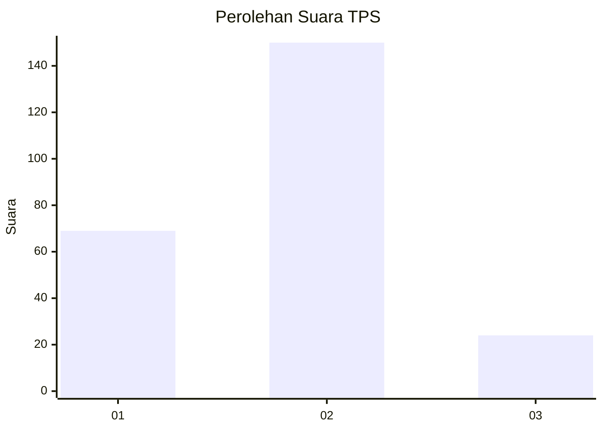
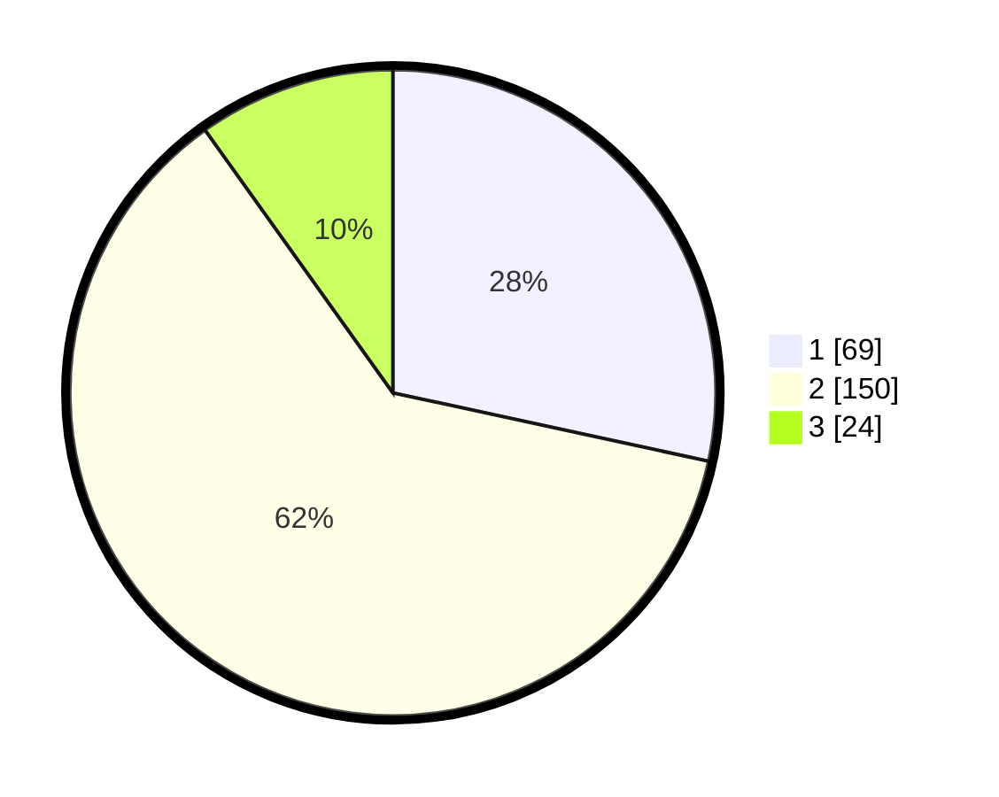

# Hasil

## Grafik

## Tabel

| No. | Nama Paslon    | Suara | Suara (raw) | Persentase |
|:--- |:-------------- | -----:| -----------:| ----------:|
| 1   | ANIES MUHAIMIN | 69    | [69][p-1]   | 28,40      |
| 2   | PRABOWO GIBRAN | 150   | [150][p-2]  | 61,73      |
| 3   | GANJAR MAHFUD  | 24    | [24][p-3]   | 9,88       |

[p-1]: https://github.com/gigit-pemilu/pemilu-2024-35-jawa-timur/blob/main/pilpres/hitung-suara/sub/35-jawa-timur/sub/11-bondowoso/sub/01-maesan/sub/2008-sumbersari/sub/013-tps/sub/paslon-1.txt
[p-2]: https://github.com/gigit-pemilu/pemilu-2024-35-jawa-timur/blob/main/pilpres/hitung-suara/sub/35-jawa-timur/sub/11-bondowoso/sub/01-maesan/sub/2008-sumbersari/sub/013-tps/sub/paslon-2.txt
[p-3]: https://github.com/gigit-pemilu/pemilu-2024-35-jawa-timur/blob/main/pilpres/hitung-suara/sub/35-jawa-timur/sub/11-bondowoso/sub/01-maesan/sub/2008-sumbersari/sub/013-tps/sub/paslon-3.txt

## Foto C Plano

https://sirekap-obj-formc.kpu.go.id/467d/pemilu/ppwp/35/11/01/20/08/3511012008013-20240219-204240--53afbede-7966-49d9-8750-0e0e65516cd3.jpg

https://sirekap-obj-formc.kpu.go.id/467d/pemilu/ppwp/35/11/01/20/08/3511012008013-20240219-122719--bc208c0f-cdf7-4b4d-95bf-1ab7f6249c20.jpg

https://sirekap-obj-formc.kpu.go.id/467d/pemilu/ppwp/35/11/01/20/08/3511012008013-20240219-122853--9f8e0a16-4c6b-4872-9945-3f17636b032c.jpg

## Metadata

| Key        | Value               |
| ---------- | ------------------- |
| Time Stamp | 2024-02-24 22:31:28 |

