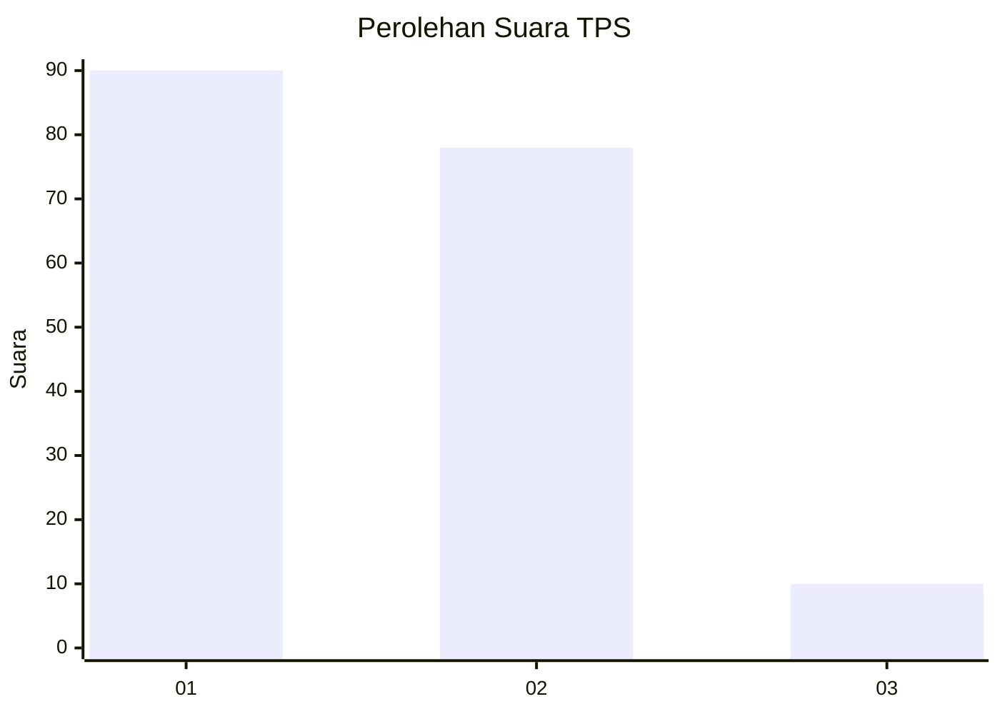
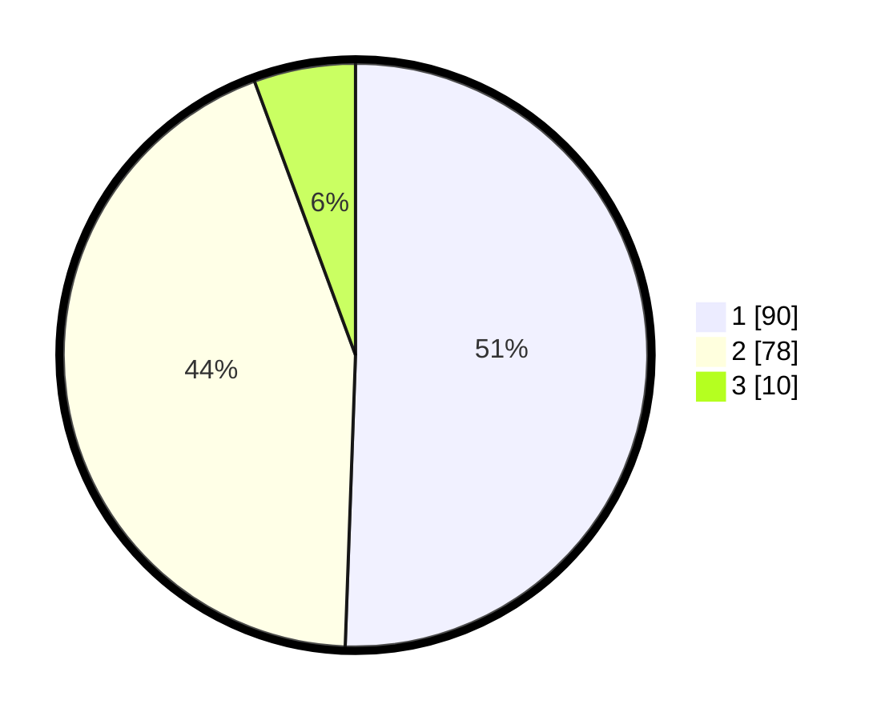

# Hasil

## Grafik

## Tabel

| No. | Nama Paslon    | Suara | Suara (raw) | Persentase |
|:--- |:-------------- | -----:| -----------:| ----------:|
| 1   | ANIES MUHAIMIN | 90    | [90][p-1]   | 50,56      |
| 2   | PRABOWO GIBRAN | 78    | [78][p-2]   | 43,82      |
| 3   | GANJAR MAHFUD  | 10    | [10][p-3]   | 5,62       |

[p-1]: https://github.com/gigit-pemilu/pemilu-2024/blob/main/pilpres/hitung-suara/sub/35-jawa-timur/sub/11-bondowoso/sub/01-maesan/sub/2008-sumbersari/sub/015-tps/sub/paslon-1.txt
[p-2]: https://github.com/gigit-pemilu/pemilu-2024/blob/main/pilpres/hitung-suara/sub/35-jawa-timur/sub/11-bondowoso/sub/01-maesan/sub/2008-sumbersari/sub/015-tps/sub/paslon-2.txt
[p-3]: https://github.com/gigit-pemilu/pemilu-2024/blob/main/pilpres/hitung-suara/sub/35-jawa-timur/sub/11-bondowoso/sub/01-maesan/sub/2008-sumbersari/sub/015-tps/sub/paslon-3.txt

## Foto C Plano

https://sirekap-obj-formc.kpu.go.id/7808/pemilu/ppwp/35/11/01/20/08/3511012008015-20240216-185141--e19eff02-a211-4711-808a-1d065b642072.jpg

https://sirekap-obj-formc.kpu.go.id/7808/pemilu/ppwp/35/11/01/20/08/3511012008015-20240215-003701--be32c9aa-fa44-40a0-92ea-06fa7705fbea.jpg

https://sirekap-obj-formc.kpu.go.id/7808/pemilu/ppwp/35/11/01/20/08/3511012008015-20240215-003709--d160dcd7-6e55-47c0-9290-c91e0b2cdcec.jpg

## Metadata

| Key        | Value               |
| ---------- | ------------------- |
| Time Stamp | 2024-02-16 21:01:00 |

