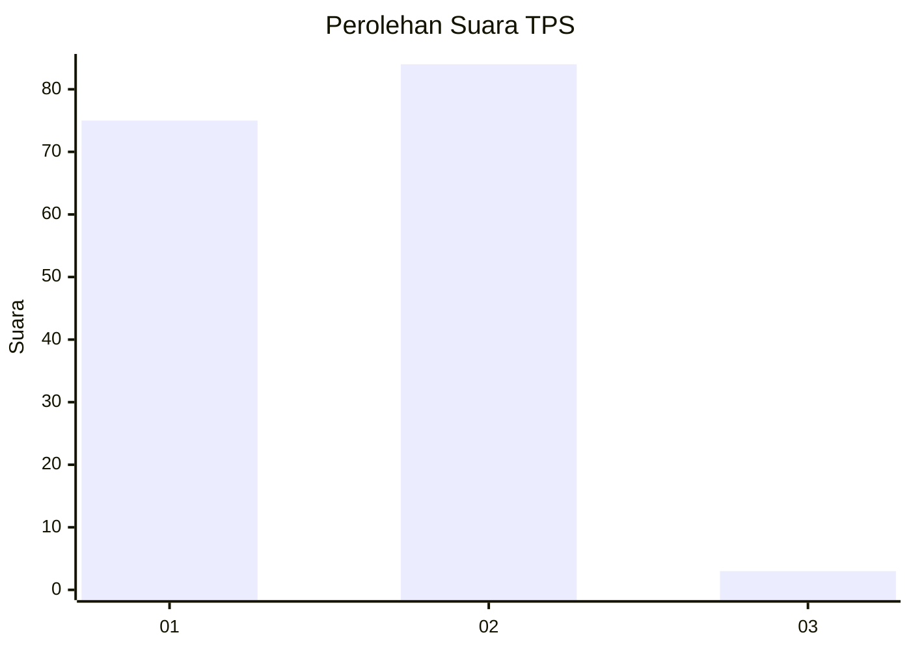
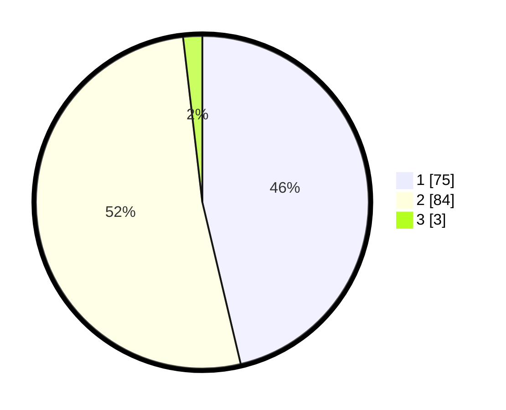

# Hasil

## Grafik

## Tabel

| No. | Nama Paslon    | Suara | Suara (raw) | Persentase |
|:--- |:-------------- | -----:| -----------:| ----------:|
| 1   | ANIES MUHAIMIN | 75    | [75][p-1]   | 46,30      |
| 2   | PRABOWO GIBRAN | 84    | [84][p-2]   | 51,85      |
| 3   | GANJAR MAHFUD  | 3     | [3][p-3]    | 1,85       |

[p-1]: https://github.com/gigit-pemilu/pemilu-2024-35-jawa-timur/blob/main/pilpres/hitung-suara/sub/35-jawa-timur/sub/11-bondowoso/sub/01-maesan/sub/2008-sumbersari/sub/020-tps/sub/paslon-1.txt
[p-2]: https://github.com/gigit-pemilu/pemilu-2024-35-jawa-timur/blob/main/pilpres/hitung-suara/sub/35-jawa-timur/sub/11-bondowoso/sub/01-maesan/sub/2008-sumbersari/sub/020-tps/sub/paslon-2.txt
[p-3]: https://github.com/gigit-pemilu/pemilu-2024-35-jawa-timur/blob/main/pilpres/hitung-suara/sub/35-jawa-timur/sub/11-bondowoso/sub/01-maesan/sub/2008-sumbersari/sub/020-tps/sub/paslon-3.txt

## Foto C Plano

https://sirekap-obj-formc.kpu.go.id/d38c/pemilu/ppwp/35/11/01/20/08/3511012008020-20240214-212718--8f54aa88-57ac-4a5e-b236-b490b061edad.jpg

https://sirekap-obj-formc.kpu.go.id/d38c/pemilu/ppwp/35/11/01/20/08/3511012008020-20240214-212730--ef5aca63-6433-450b-8d68-666ab38ea6fe.jpg

https://sirekap-obj-formc.kpu.go.id/d38c/pemilu/ppwp/35/11/01/20/08/3511012008020-20240214-212744--6b5784f5-19a8-4659-b660-ffb5c9d4e824.jpg

## Metadata

| Key        | Value               |
| ---------- | ------------------- |
| Time Stamp | 2024-02-16 10:00:28 |

