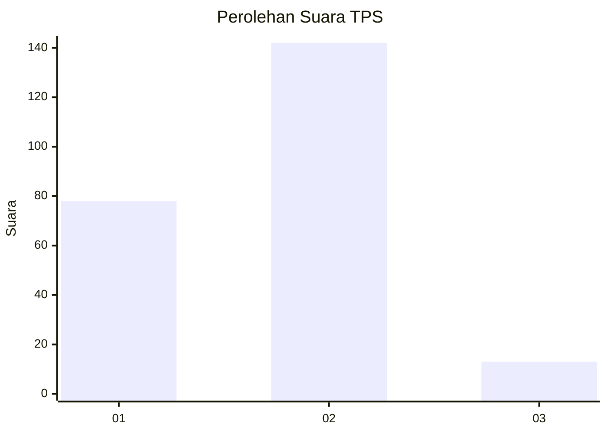
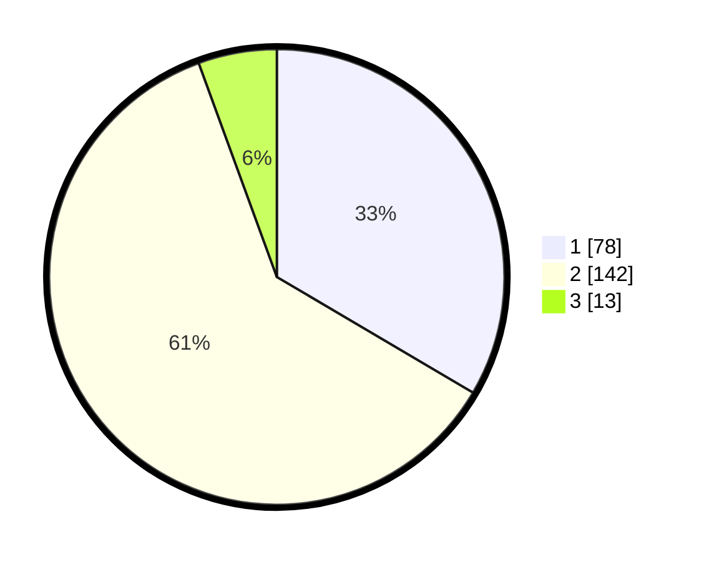

# Hasil

## Grafik

## Tabel

| No. | Nama Paslon    | Suara | Suara (raw) | Persentase |
|:--- |:-------------- | -----:| -----------:| ----------:|
| 1   | ANIES MUHAIMIN | 78    | [78][p-1]   | 33,48      |
| 2   | PRABOWO GIBRAN | 142   | [142][p-2]  | 60,94      |
| 3   | GANJAR MAHFUD  | 13    | [13][p-3]   | 5,58       |

[p-1]: https://github.com/gigit-pemilu/pemilu-2024/blob/main/pilpres/hitung-suara/sub/35-jawa-timur/sub/11-bondowoso/sub/01-maesan/sub/2009-sumber-anyar/sub/010-tps/sub/paslon-1.txt
[p-2]: https://github.com/gigit-pemilu/pemilu-2024/blob/main/pilpres/hitung-suara/sub/35-jawa-timur/sub/11-bondowoso/sub/01-maesan/sub/2009-sumber-anyar/sub/010-tps/sub/paslon-2.txt
[p-3]: https://github.com/gigit-pemilu/pemilu-2024/blob/main/pilpres/hitung-suara/sub/35-jawa-timur/sub/11-bondowoso/sub/01-maesan/sub/2009-sumber-anyar/sub/010-tps/sub/paslon-3.txt

## Foto C Plano

https://sirekap-obj-formc.kpu.go.id/30a9/pemilu/ppwp/35/11/01/20/09/3511012009010-20240214-235738--dec2eff5-2813-4c72-9b5c-f47efe4d5c35.jpg

https://sirekap-obj-formc.kpu.go.id/30a9/pemilu/ppwp/35/11/01/20/09/3511012009010-20240214-235855--fd1b8490-5dbb-4c85-9b20-509e99618158.jpg

https://sirekap-obj-formc.kpu.go.id/30a9/pemilu/ppwp/35/11/01/20/09/3511012009010-20240215-000100--80b6ac77-366e-4723-ae92-5af240a93f13.jpg

## Metadata

| Key        | Value               |
| ---------- | ------------------- |
| Time Stamp | 2024-02-24 22:31:28 |

