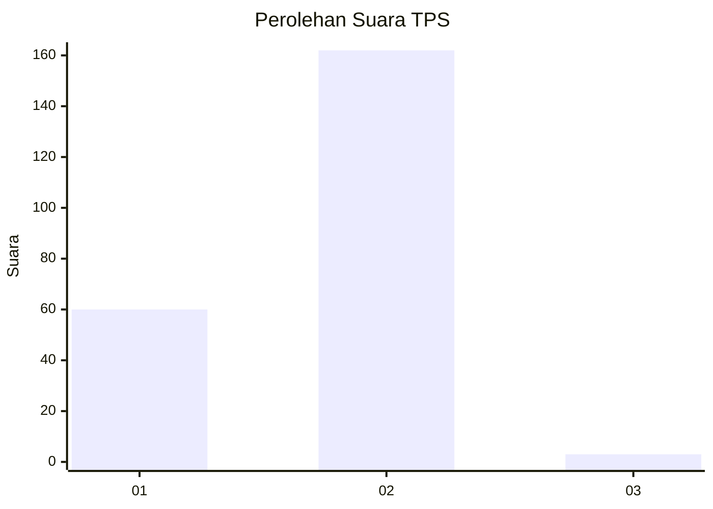
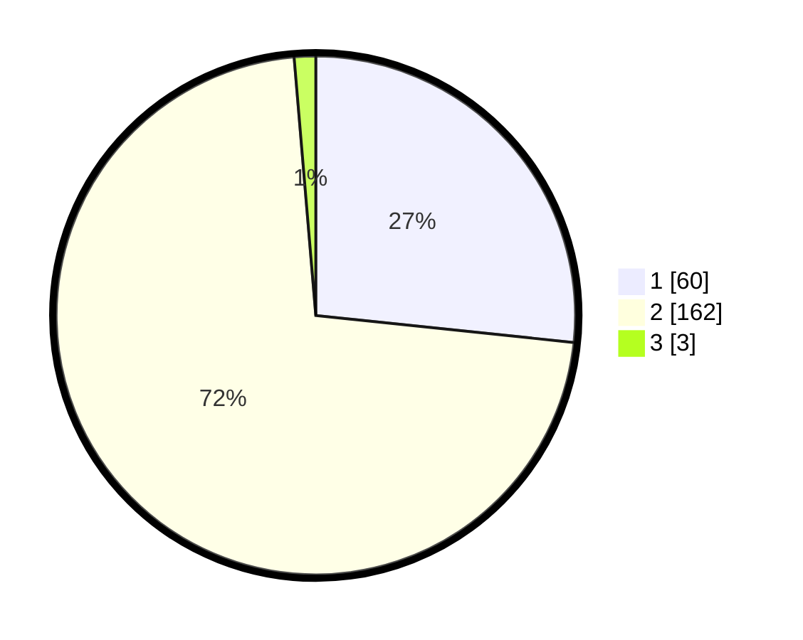

# Hasil

## Grafik

## Tabel

| No. | Nama Paslon    | Suara | Suara (raw) | Persentase |
|:--- |:-------------- | -----:| -----------:| ----------:|
| 1   | ANIES MUHAIMIN | 60    | [60][p-1]   | 26,67      |
| 2   | PRABOWO GIBRAN | 162   | [162][p-2]  | 72,00      |
| 3   | GANJAR MAHFUD  | 3     | [3][p-3]    | 1,33       |

[p-1]: https://github.com/gigit-pemilu/pemilu-2024/blob/main/pilpres/hitung-suara/sub/35-jawa-timur/sub/11-bondowoso/sub/01-maesan/sub/2011-pakuniran/sub/004-tps/sub/paslon-1.txt
[p-2]: https://github.com/gigit-pemilu/pemilu-2024/blob/main/pilpres/hitung-suara/sub/35-jawa-timur/sub/11-bondowoso/sub/01-maesan/sub/2011-pakuniran/sub/004-tps/sub/paslon-2.txt
[p-3]: https://github.com/gigit-pemilu/pemilu-2024/blob/main/pilpres/hitung-suara/sub/35-jawa-timur/sub/11-bondowoso/sub/01-maesan/sub/2011-pakuniran/sub/004-tps/sub/paslon-3.txt

## Foto C Plano

https://sirekap-obj-formc.kpu.go.id/d9b7/pemilu/ppwp/35/11/01/20/11/3511012011004-20240214-141850--228f1bc4-9adc-4dbb-8628-04e8615186a3.jpg

https://sirekap-obj-formc.kpu.go.id/d9b7/pemilu/ppwp/35/11/01/20/11/3511012011004-20240214-141300--56d74c9a-d5ed-498a-bc47-2673c94d8999.jpg

https://sirekap-obj-formc.kpu.go.id/d9b7/pemilu/ppwp/35/11/01/20/11/3511012011004-20240214-141414--f003c7d2-3624-4354-a790-2077aecfb253.jpg

## Metadata

| Key        | Value               |
| ---------- | ------------------- |
| Time Stamp | 2024-02-24 22:31:28 |

