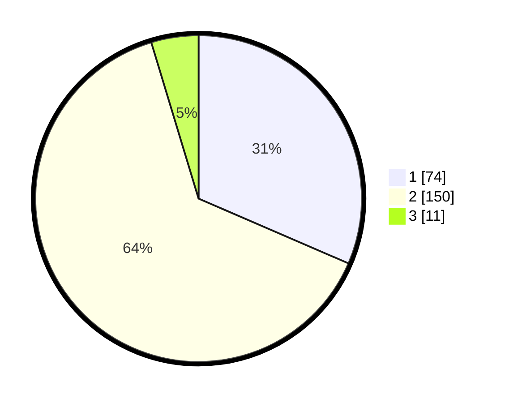

# Hasil

## Grafik

## Tabel

| No. | Nama Paslon    | Suara | Suara (raw) | Persentase |
|:--- |:-------------- | -----:| -----------:| ----------:|
| 1   | ANIES MUHAIMIN | 74    | [74][p-1]   | 31,49      |
| 2   | PRABOWO GIBRAN | 150   | [150][p-2]  | 63,83      |
| 3   | GANJAR MAHFUD  | 11    | [11][p-3]   | 4,68       |

[p-1]: https://github.com/gigit-pemilu/pemilu-2024/blob/main/pilpres/hitung-suara/sub/35-jawa-timur/sub/11-bondowoso/sub/01-maesan/sub/2011-pakuniran/sub/005-tps/sub/paslon-1.txt
[p-2]: https://github.com/gigit-pemilu/pemilu-2024/blob/main/pilpres/hitung-suara/sub/35-jawa-timur/sub/11-bondowoso/sub/01-maesan/sub/2011-pakuniran/sub/005-tps/sub/paslon-2.txt
[p-3]: https://github.com/gigit-pemilu/pemilu-2024/blob/main/pilpres/hitung-suara/sub/35-jawa-timur/sub/11-bondowoso/sub/01-maesan/sub/2011-pakuniran/sub/005-tps/sub/paslon-3.txt

## Foto C Plano

https://sirekap-obj-formc.kpu.go.id/1fe0/pemilu/ppwp/35/11/01/20/11/3511012011005-20240215-203932--c1d8b92e-f693-4000-802b-9596e31f1b1e.jpg

https://sirekap-obj-formc.kpu.go.id/1fe0/pemilu/ppwp/35/11/01/20/11/3511012011005-20240215-133755--4897a5b2-ad6c-4109-9758-5610b80b861b.jpg

https://sirekap-obj-formc.kpu.go.id/1fe0/pemilu/ppwp/35/11/01/20/11/3511012011005-20240216-110334--0e21879c-db96-474e-a8ef-d74a5e5ec4bd.jpg

## Metadata

| Key        | Value               |
| ---------- | ------------------- |
| Time Stamp | 2024-02-25 11:00:00 |

