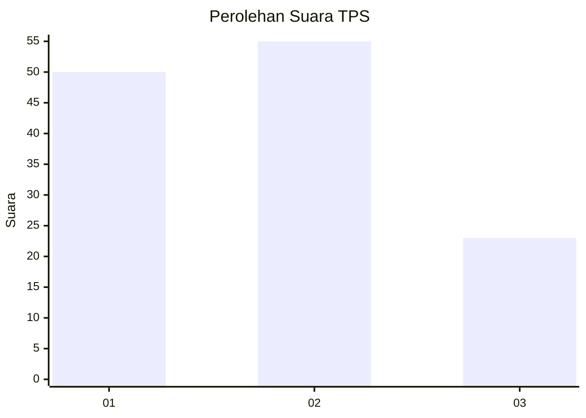
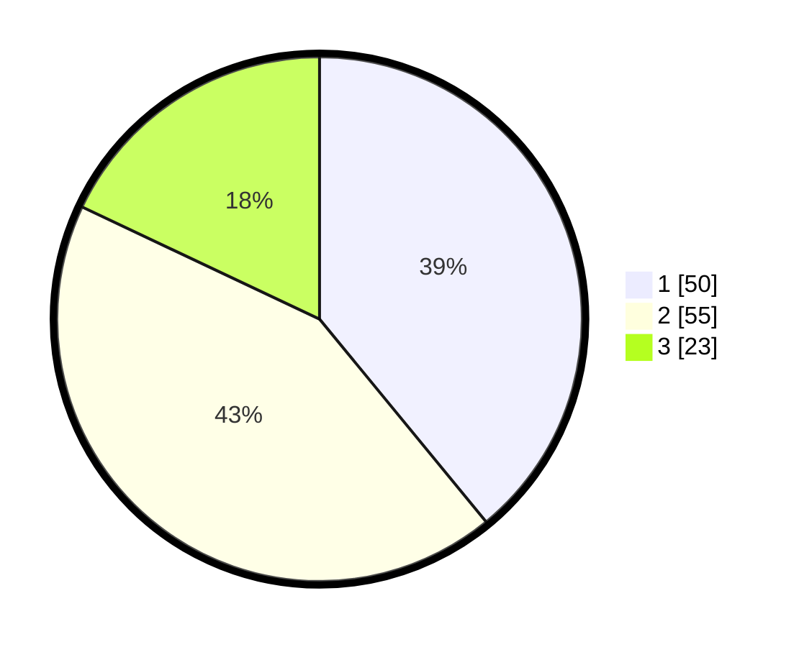

# Hasil

## Grafik

## Tabel

| No. | Nama Paslon    | Suara | Suara (raw) | Persentase |
|:--- |:-------------- | -----:| -----------:| ----------:|
| 1   | ANIES MUHAIMIN | 50    | [50][p-1]   | 39,06      |
| 2   | PRABOWO GIBRAN | 55    | [55][p-2]   | 42,97      |
| 3   | GANJAR MAHFUD  | 23    | [23][p-3]   | 17,97      |

[p-1]: https://github.com/gigit-pemilu/pemilu-2024-35-jawa-timur/blob/main/pilpres/hitung-suara/sub/35-jawa-timur/sub/11-bondowoso/sub/01-maesan/sub/2012-gunungsari/sub/012-tps/sub/paslon-1.txt
[p-2]: https://github.com/gigit-pemilu/pemilu-2024-35-jawa-timur/blob/main/pilpres/hitung-suara/sub/35-jawa-timur/sub/11-bondowoso/sub/01-maesan/sub/2012-gunungsari/sub/012-tps/sub/paslon-2.txt
[p-3]: https://github.com/gigit-pemilu/pemilu-2024-35-jawa-timur/blob/main/pilpres/hitung-suara/sub/35-jawa-timur/sub/11-bondowoso/sub/01-maesan/sub/2012-gunungsari/sub/012-tps/sub/paslon-3.txt

## Foto C Plano

https://sirekap-obj-formc.kpu.go.id/5565/pemilu/ppwp/35/11/01/20/12/3511012012012-20240215-114635--7760348e-164a-4992-b755-3c76e1aecb9c.jpg

https://sirekap-obj-formc.kpu.go.id/5565/pemilu/ppwp/35/11/01/20/12/3511012012012-20240215-142737--f3ee9b13-41c2-46f5-b3ed-c6d7b5f68ccf.jpg

https://sirekap-obj-formc.kpu.go.id/5565/pemilu/ppwp/35/11/01/20/12/3511012012012-20240215-120427--54a05878-365e-4198-9dad-ce71824feb85.jpg

## Metadata

| Key        | Value               |
| ---------- | ------------------- |
| Time Stamp | 2024-02-16 01:00:27 |

