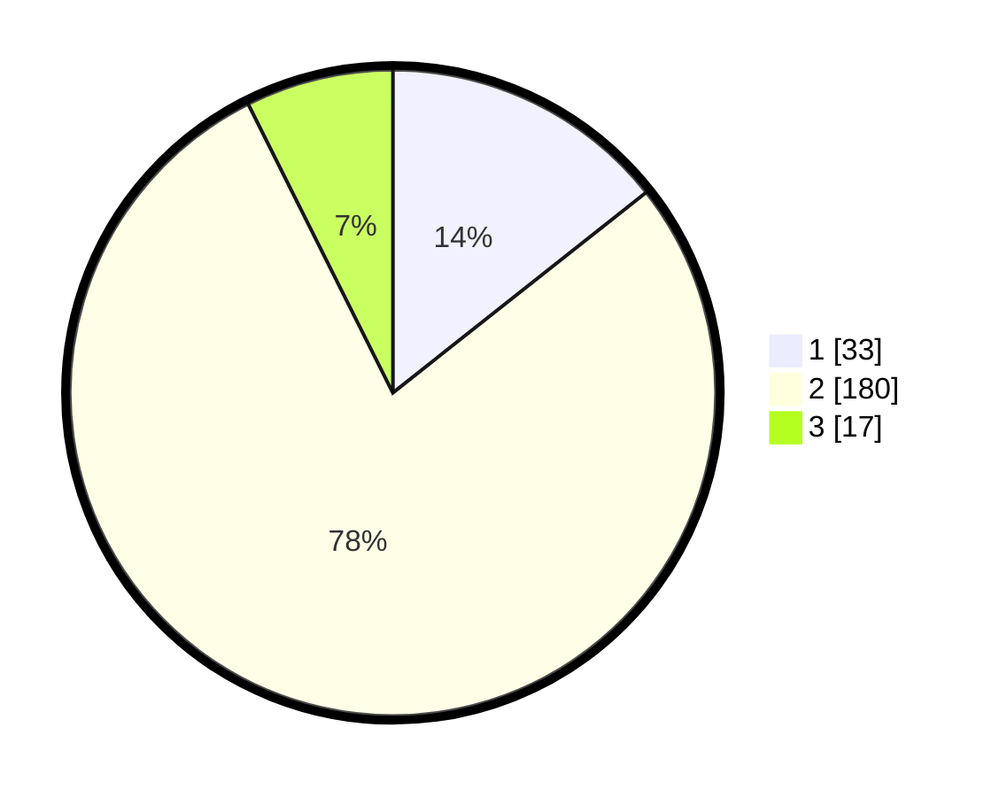

# Hasil

## Grafik

## Tabel

| No. | Nama Paslon    | Suara | Suara (raw) | Persentase |
|:--- |:-------------- | -----:| -----------:| ----------:|
| 1   | ANIES MUHAIMIN | 33    | [33][p-1]   | 14,35      |
| 2   | PRABOWO GIBRAN | 180   | [180][p-2]  | 78,26      |
| 3   | GANJAR MAHFUD  | 17    | [17][p-3]   | 7,39       |

[p-1]: https://github.com/gigit-pemilu/pemilu-2024/blob/main/pilpres/hitung-suara/sub/35-jawa-timur/sub/11-bondowoso/sub/02-tamanan/sub/2001-sukosari/sub/001-tps/sub/paslon-1.txt
[p-2]: https://github.com/gigit-pemilu/pemilu-2024/blob/main/pilpres/hitung-suara/sub/35-jawa-timur/sub/11-bondowoso/sub/02-tamanan/sub/2001-sukosari/sub/001-tps/sub/paslon-2.txt
[p-3]: https://github.com/gigit-pemilu/pemilu-2024/blob/main/pilpres/hitung-suara/sub/35-jawa-timur/sub/11-bondowoso/sub/02-tamanan/sub/2001-sukosari/sub/001-tps/sub/paslon-3.txt

## Foto C Plano

https://sirekap-obj-formc.kpu.go.id/50cc/pemilu/ppwp/35/11/02/20/01/3511022001001-20240218-105936--7cfc4f3e-40a5-4afc-b786-e4474dbd1b95.jpg

https://sirekap-obj-formc.kpu.go.id/50cc/pemilu/ppwp/35/11/02/20/01/3511022001001-20240218-104846--8727e2b2-af8a-431f-95ff-a1253bf5d9c7.jpg

https://sirekap-obj-formc.kpu.go.id/50cc/pemilu/ppwp/35/11/02/20/01/3511022001001-20240218-105200--74f3919a-600a-4205-a431-311f6382e817.jpg

## Metadata

| Key        | Value               |
| ---------- | ------------------- |
| Time Stamp | 2024-02-19 06:16:00 |

