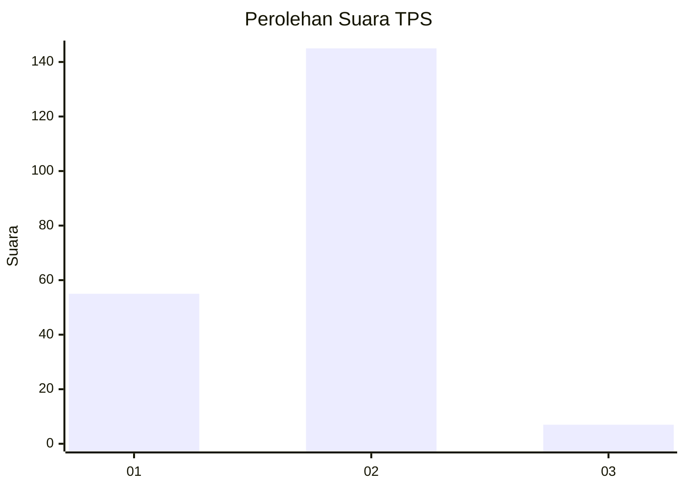
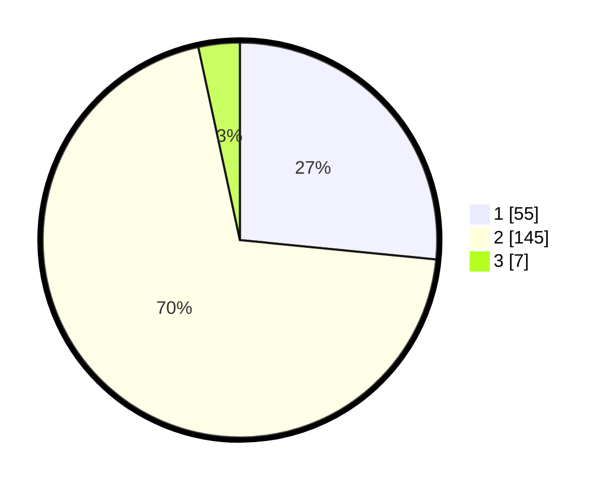

# Hasil

## Grafik

## Tabel

| No. | Nama Paslon    | Suara | Suara (raw) | Persentase |
|:--- |:-------------- | -----:| -----------:| ----------:|
| 1   | ANIES MUHAIMIN | 55    | [55][p-1]   | 26,57      |
| 2   | PRABOWO GIBRAN | 145   | [145][p-2]  | 70,05      |
| 3   | GANJAR MAHFUD  | 7     | [7][p-3]    | 3,38       |

[p-1]: https://github.com/gigit-pemilu/pemilu-2024-35-jawa-timur/blob/main/pilpres/hitung-suara/sub/35-jawa-timur/sub/11-bondowoso/sub/02-tamanan/sub/2004-kemirian/sub/006-tps/sub/paslon-1.txt
[p-2]: https://github.com/gigit-pemilu/pemilu-2024-35-jawa-timur/blob/main/pilpres/hitung-suara/sub/35-jawa-timur/sub/11-bondowoso/sub/02-tamanan/sub/2004-kemirian/sub/006-tps/sub/paslon-2.txt
[p-3]: https://github.com/gigit-pemilu/pemilu-2024-35-jawa-timur/blob/main/pilpres/hitung-suara/sub/35-jawa-timur/sub/11-bondowoso/sub/02-tamanan/sub/2004-kemirian/sub/006-tps/sub/paslon-3.txt

## Foto C Plano

https://sirekap-obj-formc.kpu.go.id/ec9c/pemilu/ppwp/35/11/02/20/04/3511022004006-20240216-211017--d5da8da8-24ec-4553-b1d3-cf69ecafc3e3.jpg

https://sirekap-obj-formc.kpu.go.id/ec9c/pemilu/ppwp/35/11/02/20/04/3511022004006-20240216-211115--a90124ba-d93b-4758-9e00-2465fd2c01e9.jpg

https://sirekap-obj-formc.kpu.go.id/ec9c/pemilu/ppwp/35/11/02/20/04/3511022004006-20240216-211211--2817c6db-f7f0-442e-accd-a54c6b57db95.jpg

## Metadata

| Key        | Value               |
| ---------- | ------------------- |
| Time Stamp | 2024-02-24 22:31:28 |

