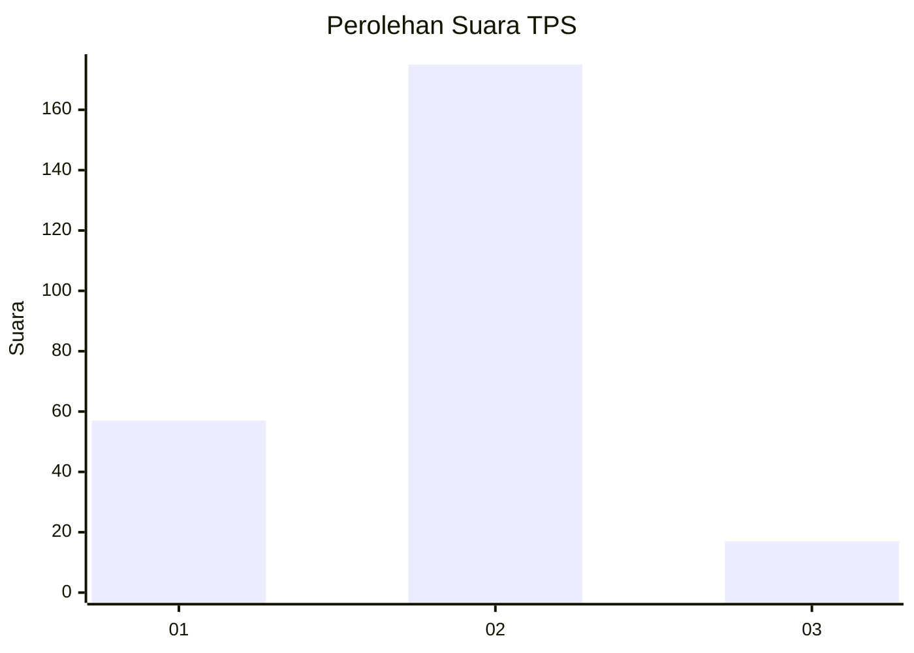

# Hasil

## Grafik

## Tabel

| No. | Nama Paslon    | Suara | Suara (raw) | Persentase |
|:--- |:-------------- | -----:| -----------:| ----------:|
| 1   | ANIES MUHAIMIN | 57    | [57][p-1]   | 22,89      |
| 2   | PRABOWO GIBRAN | 175   | [175][p-2]  | 70,28      |
| 3   | GANJAR MAHFUD  | 17    | [17][p-3]   | 6,83       |

[p-1]: https://github.com/gigit-pemilu/pemilu-2024-35-jawa-timur/blob/main/pilpres/hitung-suara/sub/35-jawa-timur/sub/11-bondowoso/sub/02-tamanan/sub/2007-kalianyar/sub/006-tps/sub/paslon-1.txt
[p-2]: https://github.com/gigit-pemilu/pemilu-2024-35-jawa-timur/blob/main/pilpres/hitung-suara/sub/35-jawa-timur/sub/11-bondowoso/sub/02-tamanan/sub/2007-kalianyar/sub/006-tps/sub/paslon-2.txt
[p-3]: https://github.com/gigit-pemilu/pemilu-2024-35-jawa-timur/blob/main/pilpres/hitung-suara/sub/35-jawa-timur/sub/11-bondowoso/sub/02-tamanan/sub/2007-kalianyar/sub/006-tps/sub/paslon-3.txt

## Foto C Plano

https://sirekap-obj-formc.kpu.go.id/299f/pemilu/ppwp/35/11/02/20/07/3511022007006-20240216-200142--e2f3fcb9-c6ea-45a6-8b4e-6160768013de.jpg

https://sirekap-obj-formc.kpu.go.id/299f/pemilu/ppwp/35/11/02/20/07/3511022007006-20240216-200253--79d4929f-67c0-49f2-982b-34684c917f2b.jpg

https://sirekap-obj-formc.kpu.go.id/299f/pemilu/ppwp/35/11/02/20/07/3511022007006-20240216-200628--a1c92432-ed68-4127-a266-213d5d671769.jpg

## Metadata

| Key        | Value               |
| ---------- | ------------------- |
| Time Stamp | 2024-02-25 13:00:00 |

