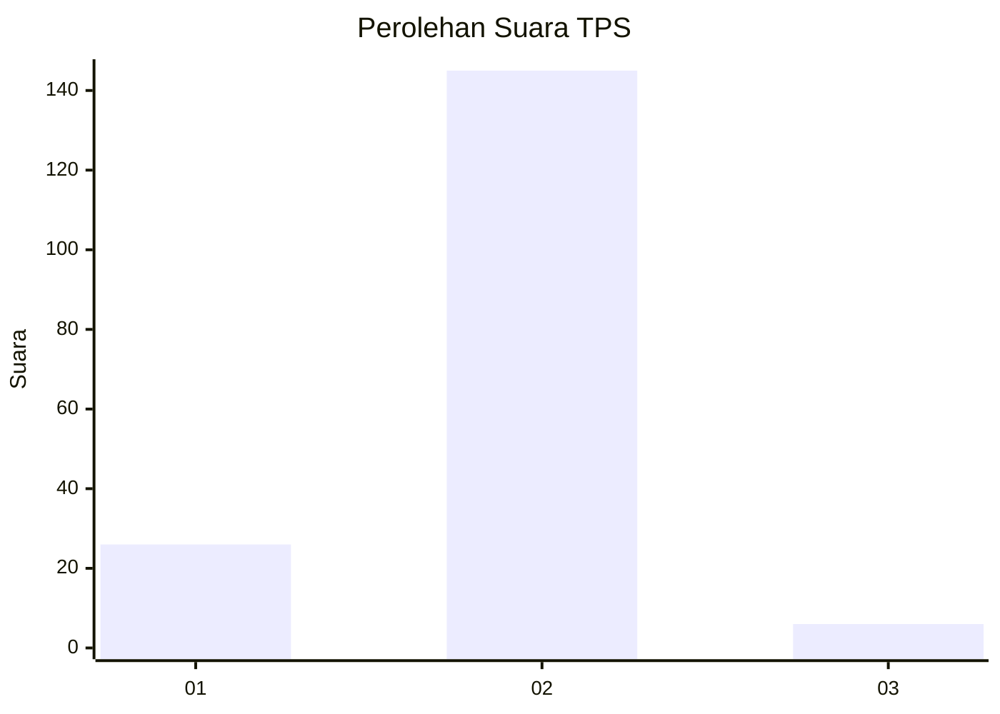
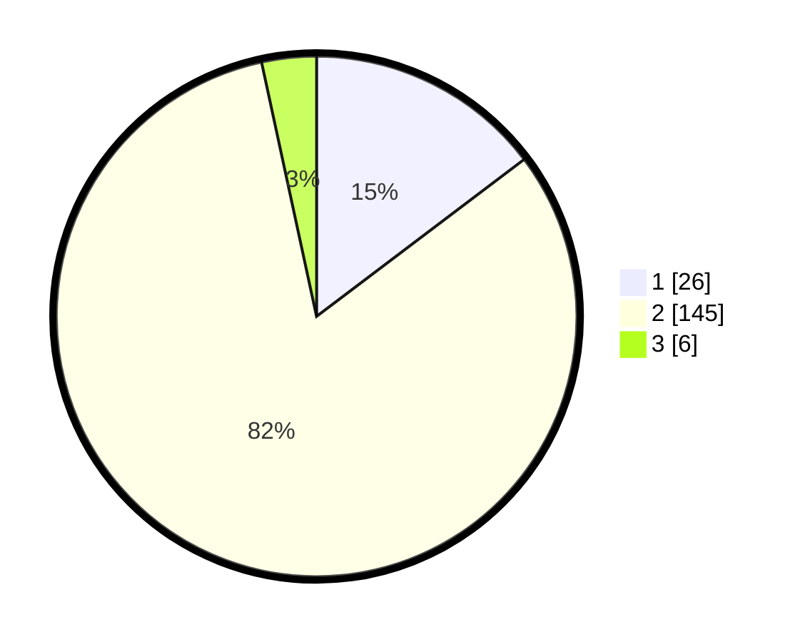

# Hasil

## Grafik

## Tabel

| No. | Nama Paslon    | Suara | Suara (raw) | Persentase |
|:--- |:-------------- | -----:| -----------:| ----------:|
| 1   | ANIES MUHAIMIN | 26    | [26][p-1]   | 14,69      |
| 2   | PRABOWO GIBRAN | 145   | [145][p-2]  | 81,92      |
| 3   | GANJAR MAHFUD  | 6     | [6][p-3]    | 3,39       |

[p-1]: https://github.com/gigit-pemilu/pemilu-2024/blob/main/pilpres/hitung-suara/sub/35-jawa-timur/sub/11-bondowoso/sub/02-tamanan/sub/2007-kalianyar/sub/009-tps/sub/paslon-1.txt
[p-2]: https://github.com/gigit-pemilu/pemilu-2024/blob/main/pilpres/hitung-suara/sub/35-jawa-timur/sub/11-bondowoso/sub/02-tamanan/sub/2007-kalianyar/sub/009-tps/sub/paslon-2.txt
[p-3]: https://github.com/gigit-pemilu/pemilu-2024/blob/main/pilpres/hitung-suara/sub/35-jawa-timur/sub/11-bondowoso/sub/02-tamanan/sub/2007-kalianyar/sub/009-tps/sub/paslon-3.txt

## Foto C Plano

https://sirekap-obj-formc.kpu.go.id/5b4a/pemilu/ppwp/35/11/02/20/07/3511022007009-20240214-223052--3012c159-9c50-4f9c-afdb-78aee2cac4c5.jpg

https://sirekap-obj-formc.kpu.go.id/5b4a/pemilu/ppwp/35/11/02/20/07/3511022007009-20240214-223146--c59f1cd3-9ac7-4c0b-91b1-6dcdae978a90.jpg

https://sirekap-obj-formc.kpu.go.id/5b4a/pemilu/ppwp/35/11/02/20/07/3511022007009-20240214-223623--9c45b1c6-db73-4920-8168-18d5888bd02b.jpg

## Metadata

| Key        | Value               |
| ---------- | ------------------- |
| Time Stamp | 2024-02-16 10:00:28 |

