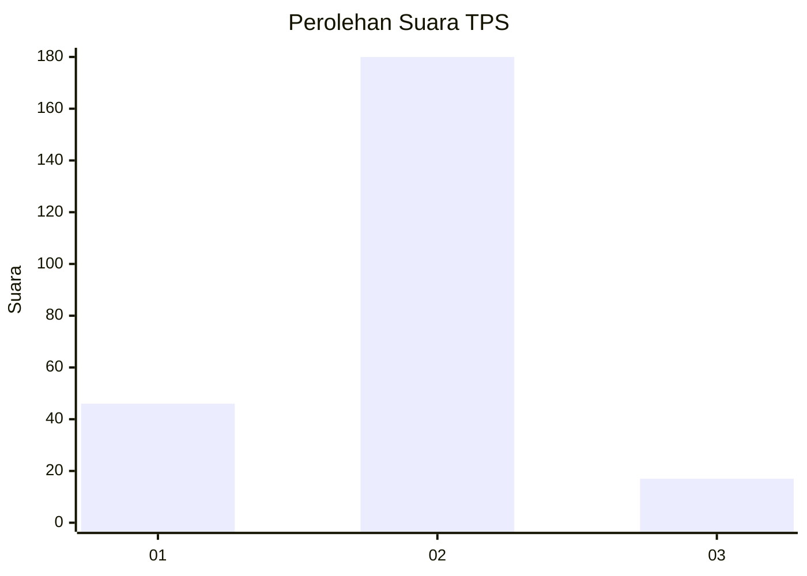
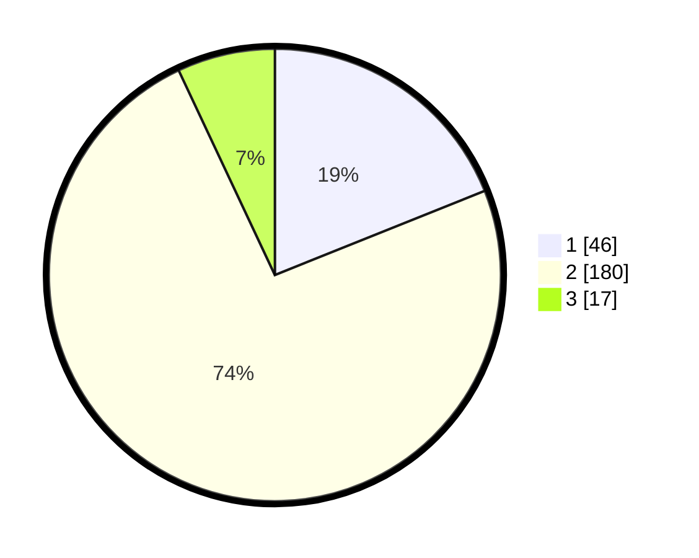

# Hasil

## Grafik

## Tabel

| No. | Nama Paslon    | Suara | Suara (raw) | Persentase |
|:--- |:-------------- | -----:| -----------:| ----------:|
| 1   | ANIES MUHAIMIN | 46    | [46][p-1]   | 18,93      |
| 2   | PRABOWO GIBRAN | 180   | [180][p-2]  | 74,07      |
| 3   | GANJAR MAHFUD  | 17    | [17][p-3]   | 7,00       |

[p-1]: https://github.com/gigit-pemilu/pemilu-2024/blob/main/pilpres/hitung-suara/sub/35-jawa-timur/sub/11-bondowoso/sub/02-tamanan/sub/2007-kalianyar/sub/010-tps/sub/paslon-1.txt
[p-2]: https://github.com/gigit-pemilu/pemilu-2024/blob/main/pilpres/hitung-suara/sub/35-jawa-timur/sub/11-bondowoso/sub/02-tamanan/sub/2007-kalianyar/sub/010-tps/sub/paslon-2.txt
[p-3]: https://github.com/gigit-pemilu/pemilu-2024/blob/main/pilpres/hitung-suara/sub/35-jawa-timur/sub/11-bondowoso/sub/02-tamanan/sub/2007-kalianyar/sub/010-tps/sub/paslon-3.txt

## Foto C Plano

https://sirekap-obj-formc.kpu.go.id/3b87/pemilu/ppwp/35/11/02/20/07/3511022007010-20240216-220815--cdad8d1f-8790-40a3-868f-8c4ac1f03baf.jpg

https://sirekap-obj-formc.kpu.go.id/3b87/pemilu/ppwp/35/11/02/20/07/3511022007010-20240216-221512--b038e44a-edb8-4e2d-8cd1-aa8820047b84.jpg

https://sirekap-obj-formc.kpu.go.id/3b87/pemilu/ppwp/35/11/02/20/07/3511022007010-20240216-221310--92983416-52ea-4f38-abaf-b09f8cad52f2.jpg

## Metadata

| Key        | Value               |
| ---------- | ------------------- |
| Time Stamp | 2024-02-24 22:31:28 |

