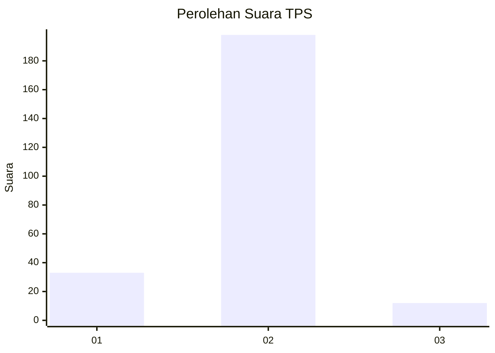
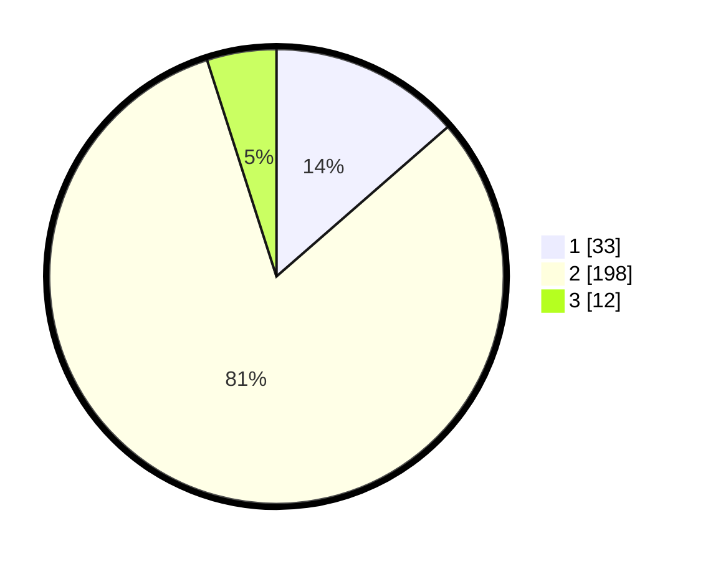

# Hasil

## Grafik

## Tabel

| No. | Nama Paslon    | Suara | Suara (raw) | Persentase |
|:--- |:-------------- | -----:| -----------:| ----------:|
| 1   | ANIES MUHAIMIN | 33    | [33][p-1]   | 13,58      |
| 2   | PRABOWO GIBRAN | 198   | [198][p-2]  | 81,48      |
| 3   | GANJAR MAHFUD  | 12    | [12][p-3]   | 4,94       |

[p-1]: https://github.com/gigit-pemilu/pemilu-2024/blob/main/pilpres/hitung-suara/sub/35-jawa-timur/sub/11-bondowoso/sub/02-tamanan/sub/2007-kalianyar/sub/014-tps/sub/paslon-1.txt
[p-2]: https://github.com/gigit-pemilu/pemilu-2024/blob/main/pilpres/hitung-suara/sub/35-jawa-timur/sub/11-bondowoso/sub/02-tamanan/sub/2007-kalianyar/sub/014-tps/sub/paslon-2.txt
[p-3]: https://github.com/gigit-pemilu/pemilu-2024/blob/main/pilpres/hitung-suara/sub/35-jawa-timur/sub/11-bondowoso/sub/02-tamanan/sub/2007-kalianyar/sub/014-tps/sub/paslon-3.txt

## Foto C Plano

https://sirekap-obj-formc.kpu.go.id/bb80/pemilu/ppwp/35/11/02/20/07/3511022007014-20240215-000351--906f4595-d483-48c2-86d5-06c48eafe0b9.jpg

https://sirekap-obj-formc.kpu.go.id/bb80/pemilu/ppwp/35/11/02/20/07/3511022007014-20240215-000531--27055c24-27ae-4dec-84c0-53f6930c0db2.jpg

https://sirekap-obj-formc.kpu.go.id/bb80/pemilu/ppwp/35/11/02/20/07/3511022007014-20240215-000802--facb4f37-219c-4183-bc28-600b91e37627.jpg

## Metadata

| Key        | Value               |
| ---------- | ------------------- |
| Time Stamp | 2024-02-16 10:00:28 |

